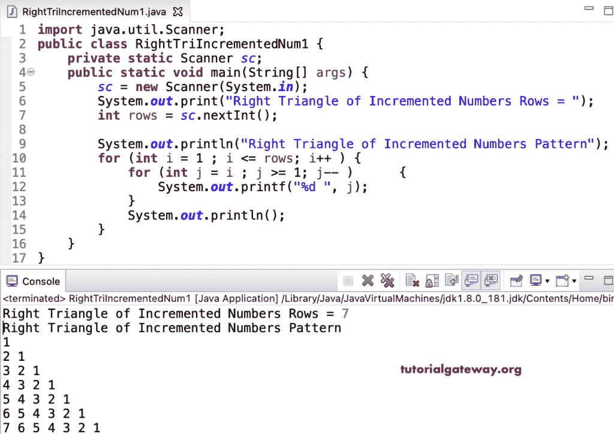

# Java 程序：打印递增数字的直角三角形

> 原文：<https://www.tutorialgateway.org/java-program-to-print-right-triangle-of-incremented-numbers/>

编写一个 Java 程序，使用 for 循环打印递增数字的直角三角形模式。

```java
import java.util.Scanner;

public class RightTriIncrementedNum1 {

	private static Scanner sc;

	public static void main(String[] args) {

		sc = new Scanner(System.in);	

		System.out.print("Right Triangle of Incremented Numbers Rows = ");
		int rows = sc.nextInt();

		System.out.println("Right Triangle of Incremented Numbers Pattern");

		for (int i = 1 ; i <= rows; i++ ) 
		{
			for (int j = i ; j >= 1; j-- ) 	
			{
				System.out.printf("%d ", j);
			}
			System.out.println();
		}
	}
}
```



这个 [Java 示例](https://www.tutorialgateway.org/learn-java-programs/)使用 while 循环以直角三角形模式显示递增的数字。

```java
import java.util.Scanner;

public class RightTriIncrementedNum2 {

	private static Scanner sc;

	public static void main(String[] args) {

		sc = new Scanner(System.in);	

		int i = 1, j; 

		System.out.print("Right Triangle of Incremented Numbers Rows = ");
		int rows = sc.nextInt();

		System.out.println("Right Triangle of Incremented Numbers Pattern");

		while (i <= rows ) 
		{
			j = i ;

			while( j >= 1 ) 	
			{
				System.out.printf("%d ", j);
				j--;
			}
			System.out.println();
			i++;
		}
	}
}
```

```java
Right Triangle of Incremented Numbers Rows = 9
Right Triangle of Incremented Numbers Pattern
1 
2 1 
3 2 1 
4 3 2 1 
5 4 3 2 1 
6 5 4 3 2 1 
7 6 5 4 3 2 1 
8 7 6 5 4 3 2 1 
9 8 7 6 5 4 3 2 1 
```

Java 程序使用 do while 循环打印递增数字的直角三角形图案。

```java
import java.util.Scanner;

public class RightTriIncrementedNum3 {

	private static Scanner sc;

	public static void main(String[] args) {

		sc = new Scanner(System.in);	

		System.out.print("Right Triangle of Incremented Numbers Rows = ");
		int rows = sc.nextInt();

		System.out.println("Right Triangle of Incremented Numbers Pattern");
		int i = 1, j; 

		do
		{
			j = i ;

			do	
			{
				System.out.printf("%d ", j);
			} while(--j >= 1 );

			System.out.println();

		} while (++i <= rows );
	}
}
```

```java
Right Triangle of Incremented Numbers Rows = 14
Right Triangle of Incremented Numbers Pattern
1 
2 1 
3 2 1 
4 3 2 1 
5 4 3 2 1 
6 5 4 3 2 1 
7 6 5 4 3 2 1 
8 7 6 5 4 3 2 1 
9 8 7 6 5 4 3 2 1 
10 9 8 7 6 5 4 3 2 1 
11 10 9 8 7 6 5 4 3 2 1 
12 11 10 9 8 7 6 5 4 3 2 1 
13 12 11 10 9 8 7 6 5 4 3 2 1 
14 13 12 11 10 9 8 7 6 5 4 3 2 1 
```