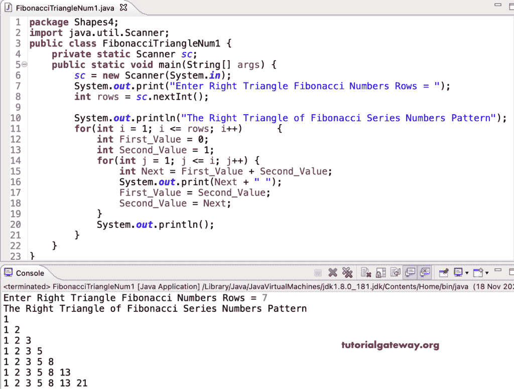

# Java 程序：打印斐波那契数列的直角三角形图案

> 原文：<https://www.tutorialgateway.org/java-program-to-print-right-triangle-of-fibonacci-series-numbers-pattern/>

写一个 Java 程序打印斐波那契数列的直角三角形，用于循环。

```java
package Shapes4;

import java.util.Scanner;

public class FibonacciTriangleNum1 {

	private static Scanner sc;

	public static void main(String[] args) {
		sc = new Scanner(System.in);

		System.out.print("Enter Right Triangle Fibonacci Numbers Rows = ");
		int rows = sc.nextInt();

		System.out.println("The Right Triangle of Fibonacci Series Numbers Pattern");

		for(int i = 1; i <= rows; i++)  
		{
			int First_Value = 0;
			int Second_Value = 1;
			for(int j = 1; j <= i; j++)
			{
				int Next = First_Value + Second_Value; 
				System.out.print(Next + " ");
                First_Value = Second_Value;
                Second_Value = Next;
			}
			System.out.println();
		}
	}
}
```



这个 [Java 程序](https://www.tutorialgateway.org/learn-java-programs/)使用 while 循环打印斐波那契数列模式中的直角三角形数字。

```java
package Shapes4;

import java.util.Scanner;

public class FibonacciTriangleNum2 {

	private static Scanner sc;

	public static void main(String[] args) {
		sc = new Scanner(System.in);

		System.out.print("Enter Right Triangle Fibonacci Numbers Rows = ");
		int rows = sc.nextInt();

		System.out.println("The Right Triangle of Fibonacci Series Numbers Pattern");

		int i, j, First_Value, Second_Value, Next;
		i = 1;

		while(i <= rows)  
		{
			First_Value = 0;
			Second_Value = 1;
			j = 1; 
			while(j <= i)
			{
				Next = First_Value + Second_Value; 
				System.out.print(Next + " ");
                First_Value = Second_Value;
                Second_Value = Next;
                j++;
			}
			System.out.println();
			i++;
		}
	}
}
```

```java
Enter Right Triangle Fibonacci Numbers Rows = 14
The Right Triangle of Fibonacci Series Numbers Pattern
1 
1 2 
1 2 3 
1 2 3 5 
1 2 3 5 8 
1 2 3 5 8 13 
1 2 3 5 8 13 21 
1 2 3 5 8 13 21 34 
1 2 3 5 8 13 21 34 55 
1 2 3 5 8 13 21 34 55 89 
1 2 3 5 8 13 21 34 55 89 144 
1 2 3 5 8 13 21 34 55 89 144 233 
1 2 3 5 8 13 21 34 55 89 144 233 377 
1 2 3 5 8 13 21 34 55 89 144 233 377 610 
```