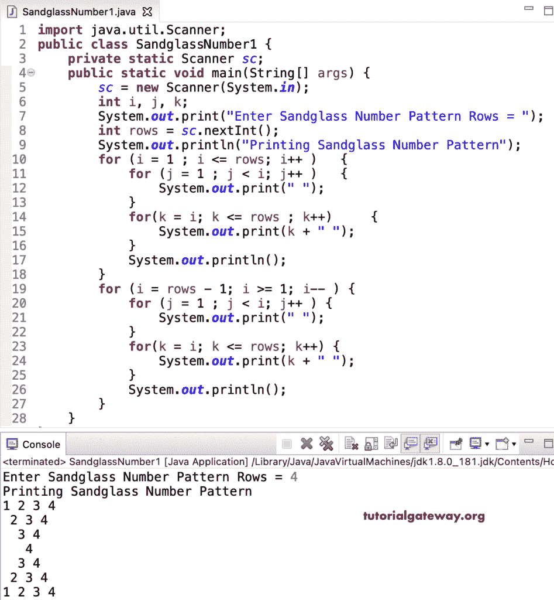

# Java 程序：打印数字的沙漏图案

> 原文：<https://www.tutorialgateway.org/java-program-to-print-sandglass-number-pattern/>

编写一个 Java 程序，使用 for 循环打印数字的沙漏图案。

```java
import java.util.Scanner;

public class SandglassNumber1 {

	private static Scanner sc;

	public static void main(String[] args) {
		sc = new Scanner(System.in);

		int i, j, k;

		System.out.print("Enter Sandglass Number Pattern Rows = ");
		int rows = sc.nextInt();

		System.out.println("Printing Sandglass Number Pattern");

		for (i = 1 ; i <= rows; i++ ) 
		{
			for (j = 1 ; j < i; j++ ) 
			{
				System.out.print(" ");
			}
			for(k = i; k <= rows ; k++) 
			{
				System.out.print(k + " ");
			}
			System.out.println();
		}

		for (i = rows - 1; i >= 1; i-- ) 
		{
			for (j = 1 ; j < i; j++ ) 
			{
				System.out.print(" ");
			}
			for(k = i; k <= rows; k++) 
			{
				System.out.print(k + " ");
			}
			System.out.println();
		}
	}
}
```



这个 [Java 示例](https://www.tutorialgateway.org/learn-java-programs/)使用 while 循环以沙漏模式显示数字。

```java
import java.util.Scanner;

public class SandglassNumber2 {

	private static Scanner sc;

	public static void main(String[] args) {
		sc = new Scanner(System.in);

		System.out.print("Enter Sandglass Number Pattern Rows = ");
		int rows = sc.nextInt();

		System.out.println("Printing Sandglass Number Pattern");
		int i = 1, j, k;

		while (i <= rows ) 
		{
			j = 1 ; 
			while(j < i ) 
			{
				System.out.print(" ");
				j++;
			}

			k = i;
			while( k <= rows ) 
			{
				System.out.print(k + " ");
				k++;
			}
			System.out.println();
			i++;
		}

		i = rows - 1;
		while( i >= 1 ) 
		{
			j = 1 ; 
			while (j < i ) 
			{
				System.out.print(" ");
				j++;
			}

			k = i;
			while(k <= rows) 
			{
				System.out.print(k + " ");
				k++;
			}
			System.out.println();
			i--;
		}
	}
}
```

```java
Enter Sandglass Number Pattern Rows = 6
Printing Sandglass Number Pattern
1 2 3 4 5 6 
 2 3 4 5 6 
  3 4 5 6 
   4 5 6 
    5 6 
     6 
    5 6 
   4 5 6 
  3 4 5 6 
 2 3 4 5 6 
1 2 3 4 5 6 
```

用 do while 循环打印数字的沙漏图案的 Java 程序。

```java
import java.util.Scanner;

public class SandglassNumber3 {

	private static Scanner sc;

	public static void main(String[] args) {
		sc = new Scanner(System.in);

		System.out.print("Enter Sandglass Number Pattern Rows = ");
		int rows = sc.nextInt();

		System.out.println("Printing Sandglass Number Pattern");
		int i = 1, j, k;

		do
		{
			j = 1 ; 
			do
			{
				System.out.print(" ");

			} while(j++ < i );

			k = i;
			do 
			{
				System.out.print(k + " ");

			} while( ++k <= rows );
			System.out.println();

		} while (++i <= rows );

		i = rows - 1;
		do
		{
			j = 1 ; 
			do
			{
				System.out.print(" ");

			} while (j++ < i );

			k = i;
			do
			{
				System.out.print(k + " ");

			} while(++k <= rows);
			System.out.println();

		} while( --i >= 1 ) ;
	}
}
```

```java
Enter Sandglass Number Pattern Rows = 9
Printing Sandglass Number Pattern
 1 2 3 4 5 6 7 8 9 
  2 3 4 5 6 7 8 9 
   3 4 5 6 7 8 9 
    4 5 6 7 8 9 
     5 6 7 8 9 
      6 7 8 9 
       7 8 9 
        8 9 
         9 
        8 9 
       7 8 9 
      6 7 8 9 
     5 6 7 8 9 
    4 5 6 7 8 9 
   3 4 5 6 7 8 9 
  2 3 4 5 6 7 8 9 
 1 2 3 4 5 6 7 8 9 
```