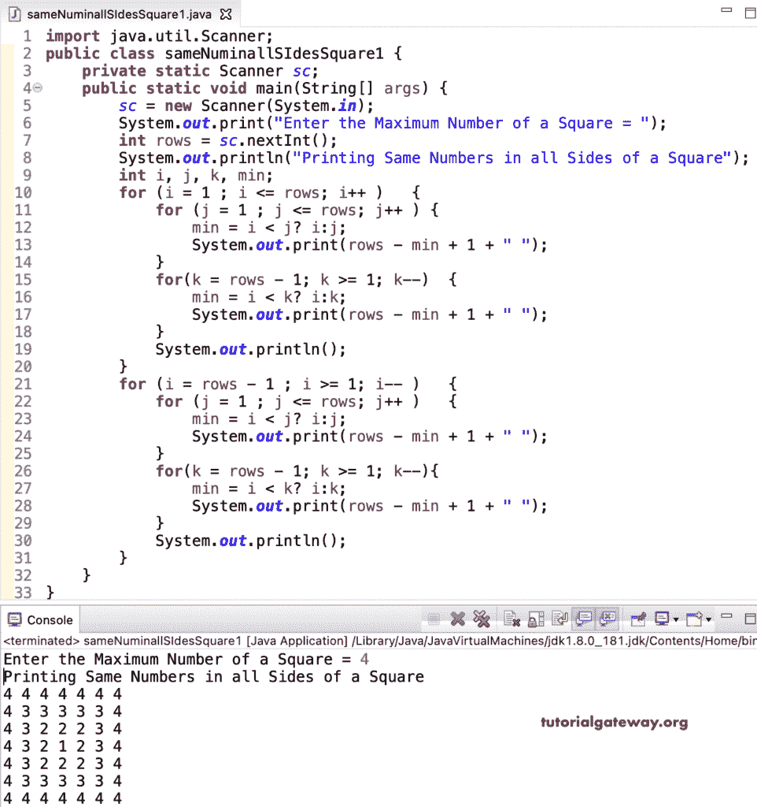

# Java 程序：在正方形的所有边上打印相同数字

> 原文：<https://www.tutorialgateway.org/java-program-to-print-same-numbers-on-all-sides-of-a-square/>

编写一个 Java 程序，使用 for 循环在正方形图案的所有边上打印相同的数字。

```java
import java.util.Scanner;

public class sameNuminallSIdesSquare1 {

	private static Scanner sc;

	public static void main(String[] args) {

		sc = new Scanner(System.in);	

		System.out.print("Enter the Maximum Number of a Square = ");
		int rows = sc.nextInt();

		System.out.println("Printing Same Numbers in all Sides of a Square");
		int i, j, k, min;

		for (i = 1 ; i <= rows; i++ ) 
		{
			for (j = 1 ; j <= rows; j++ ) 	
			{
				min = i < j? i:j;
				System.out.print(rows - min + 1 + " ");
			}
			for(k = rows - 1; k >= 1; k--)
			{
				min = i < k? i:k;
				System.out.print(rows - min + 1 + " ");
			}
			System.out.println();
		}

		for (i = rows - 1 ; i >= 1; i-- ) 
		{
			for (j = 1 ; j <= rows; j++ ) 	
			{
				min = i < j? i:j;
				System.out.print(rows - min + 1 + " ");
			}
			for(k = rows - 1; k >= 1; k--)
			{
				min = i < k? i:k;
				System.out.print(rows - min + 1 + " ");
			}
			System.out.println();
		}
	}
}
```



这个 [Java 示例](https://www.tutorialgateway.org/learn-java-programs/)使用 while 循环显示了所有边都有相同数字的正方形图案。

```java
import java.util.Scanner;

public class sameNuminallSIdesSquare2 {

	private static Scanner sc;

	public static void main(String[] args) {

		sc = new Scanner(System.in);	

		System.out.print("Enter the Maximum Number of a Square = ");
		int rows = sc.nextInt();

		System.out.println("Printing Same Numbers in all Sides of a Square");
		int i = 1, j, k, min;

		while (i <= rows ) 
		{
			j = 1 ;
			while( j <= rows ) 	
			{
				min = i < j? i:j;
				System.out.print(rows - min + 1 + " ");
				j++;
			}
			k = rows - 1;
			while( k >= 1)
			{
				min = i < k? i:k;
				System.out.print(rows - min + 1 + " ");
				 k--;
			}
			System.out.println();
			i++;
		}

		i = rows - 1 ; 
		while (i >= 1) 
		{
			j = 1 ;
			while( j <= rows ) 	
			{
				min = i < j? i:j;
				System.out.print(rows - min + 1 + " ");
				j++;
			}
			k = rows - 1;
			while( k >= 1)
			{
				min = i < k? i:k;
				System.out.print(rows - min + 1 + " ");
				 k--;
			}
			System.out.println();
			i--;
		}
	}
}
```

```java
Enter the Maximum Number of a Square = 7
Printing Same Numbers in all Sides of a Square
7 7 7 7 7 7 7 7 7 7 7 7 7 
7 6 6 6 6 6 6 6 6 6 6 6 7 
7 6 5 5 5 5 5 5 5 5 5 6 7 
7 6 5 4 4 4 4 4 4 4 5 6 7 
7 6 5 4 3 3 3 3 3 4 5 6 7 
7 6 5 4 3 2 2 2 3 4 5 6 7 
7 6 5 4 3 2 1 2 3 4 5 6 7 
7 6 5 4 3 2 2 2 3 4 5 6 7 
7 6 5 4 3 3 3 3 3 4 5 6 7 
7 6 5 4 4 4 4 4 4 4 5 6 7 
7 6 5 5 5 5 5 5 5 5 5 6 7 
7 6 6 6 6 6 6 6 6 6 6 6 7 
7 7 7 7 7 7 7 7 7 7 7 7 7 
```

Java 程序，使用 do while 循环在正方形的所有边上打印相同的数字。

```java
import java.util.Scanner;

public class sameNuminallSIdesSquare3 {

	private static Scanner sc;

	public static void main(String[] args) {

		sc = new Scanner(System.in);	

		System.out.print("Enter the Maximum Number of a Square = ");
		int rows = sc.nextInt();

		System.out.println("Printing Same Numbers in all Sides of a Square");
		int i = 1, j, k, min;

		do 
		{
			j = 1 ;
			do	
			{
				min = i < j? i:j;
				System.out.print(rows - min + 1 + " ");

			} while( ++j <= rows );

			k = rows - 1;
			do
			{
				min = i < k? i:k;
				System.out.print(rows - min + 1 + " ");

			} while( --k >= 1);

			System.out.println();

		} while (++i <= rows );

		i = rows - 1 ; 
		do
		{
			j = 1 ;
			do	
			{
				min = i < j? i:j;
				System.out.print(rows - min + 1 + " ");

			} while( ++j <= rows );

			k = rows - 1;
			do
			{
				min = i < k? i:k;
				System.out.print(rows - min + 1 + " ");

			} while( --k >= 1);

			System.out.println();

		} while (--i >= 1) ;
	}
}
```

```java
Enter the Maximum Number of a Square = 9
Printing Same Numbers in all Sides of a Square
9 9 9 9 9 9 9 9 9 9 9 9 9 9 9 9 9 
9 8 8 8 8 8 8 8 8 8 8 8 8 8 8 8 9 
9 8 7 7 7 7 7 7 7 7 7 7 7 7 7 8 9 
9 8 7 6 6 6 6 6 6 6 6 6 6 6 7 8 9 
9 8 7 6 5 5 5 5 5 5 5 5 5 6 7 8 9 
9 8 7 6 5 4 4 4 4 4 4 4 5 6 7 8 9 
9 8 7 6 5 4 3 3 3 3 3 4 5 6 7 8 9 
9 8 7 6 5 4 3 2 2 2 3 4 5 6 7 8 9 
9 8 7 6 5 4 3 2 1 2 3 4 5 6 7 8 9 
9 8 7 6 5 4 3 2 2 2 3 4 5 6 7 8 9 
9 8 7 6 5 4 3 3 3 3 3 4 5 6 7 8 9 
9 8 7 6 5 4 4 4 4 4 4 4 5 6 7 8 9 
9 8 7 6 5 5 5 5 5 5 5 5 5 6 7 8 9 
9 8 7 6 6 6 6 6 6 6 6 6 6 6 7 8 9 
9 8 7 7 7 7 7 7 7 7 7 7 7 7 7 8 9 
9 8 8 8 8 8 8 8 8 8 8 8 8 8 8 8 9 
9 9 9 9 9 9 9 9 9 9 9 9 9 9 9 9 9 
```