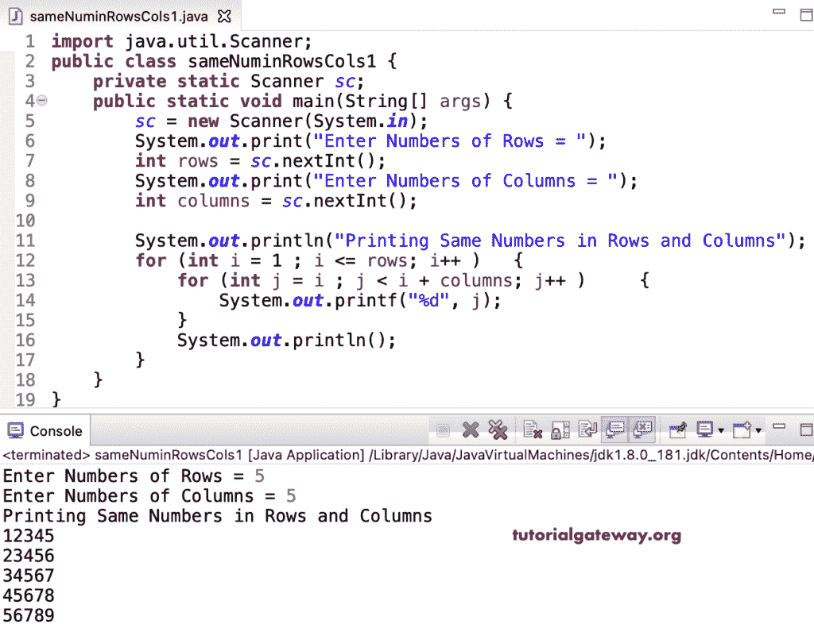

# Java 程序：在矩形行和列中打印相同数字

> 原文：<https://www.tutorialgateway.org/java-program-to-print-same-numbers-in-rectangle-rows-and-columns/>

编写一个 Java 程序，使用 for 循环以矩形行和列模式打印相同的数字。

```java
import java.util.Scanner;

public class sameNuminRowsCols1 {

	private static Scanner sc;

	public static void main(String[] args) {

		sc = new Scanner(System.in);	

		System.out.print("Enter Numbers of Rows = ");
		int rows = sc.nextInt();

		System.out.print("Enter Numbers of Columns = ");
		int columns = sc.nextInt();

		System.out.println("Printing Same Numbers in Rows and Columns");

		for (int i = 1 ; i <= rows; i++ ) 
		{
			for (int j = i ; j < i + columns; j++ ) 	
			{
				System.out.printf("%d", j);
			}
			System.out.println();
		}
	}
}
```



这个 [Java 示例](https://www.tutorialgateway.org/learn-java-programs/)使用 while 循环显示了行和列具有相同数字的矩形图案。

```java
import java.util.Scanner;

public class sameNuminRowsCols2 {

	private static Scanner sc;

	public static void main(String[] args) {

		sc = new Scanner(System.in);	
		int i = 1, j;

		System.out.print("Enter Numbers of Rows and Columns = ");
		int rows = sc.nextInt();
		int columns = sc.nextInt();

		System.out.println("Printing Same Numbers in Rows and Columns");

		while(i <= rows ) 
		{
			j = i ;

			while ( j < i + columns ) 	
			{
				System.out.printf("%d", j);
				j++;
			}

			System.out.println();
			i++;
		}
	}
}
```

```java
Enter Numbers of Rows and Columns = 4 4
Printing Same Numbers in Rows and Columns
1234
2345
3456
4567
```

Java 程序使用 do while 循环在矩形行和列中打印相同的数字。

```java
import java.util.Scanner;

public class sameNuminRowsCols3 {

	private static Scanner sc;

	public static void main(String[] args) {

		sc = new Scanner(System.in);	

		System.out.print("Enter Numbers of Rows and Columns = ");
		int rows = sc.nextInt();
		int columns = sc.nextInt();

		System.out.println("Printing Same Numbers in Rows and Columns");
		int i = 1, j;

		do
		{
			j = i ;

			do 	
			{
				System.out.printf("%d", j);

			} while ( ++j < i + columns );

			System.out.println();

		} while(++i <= rows );
	}
}
```

```java
Enter Numbers of Rows and Columns = 5 6
Printing Same Numbers in Rows and Columns
123456
234567
345678
456789
5678910
```