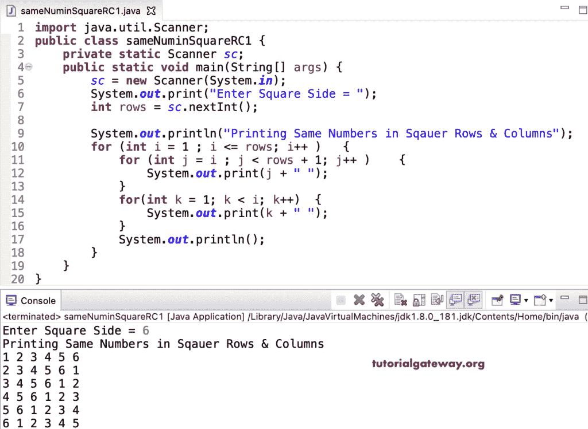

# Java 程序：在正方形行和方形列中打印相同数字

> 原文：<https://www.tutorialgateway.org/java-program-to-print-same-numbers-in-square-rows-and-columns/>

编写一个 Java 程序，使用 for 循环以正方形的行和列模式打印相同的数字。

```java
import java.util.Scanner;

public class sameNuminSquareRC1 {

	private static Scanner sc;

	public static void main(String[] args) {

		sc = new Scanner(System.in);	

		System.out.print("Enter Square Side = ");
		int rows = sc.nextInt();

		System.out.println("Printing Same Numbers in Rows & Columns of a Square");

		for (int i = 1 ; i <= rows; i++ ) 
		{
			for (int j = i ; j < rows + 1; j++ ) 	
			{
				System.out.print(j + " ");
			}
			for(int k = 1; k < i; k++)
			{
				System.out.print(k + " ");
			}
			System.out.println();
		}
	}
}
```



这个 [Java 示例](https://www.tutorialgateway.org/learn-java-programs/)使用 while 循环显示了行和列具有相同数字的正方形图案。

```java
import java.util.Scanner;

public class sameNuminSquareRC2 {

	private static Scanner sc;

	public static void main(String[] args) {

		sc = new Scanner(System.in);	

		System.out.print("Enter Square Side = ");
		int rows = sc.nextInt();

		System.out.println("Printing Same Numbers in Rows & Columns of a Square");
		int i = 1, j, k;

		while ( i <= rows) 
		{
			j = i;
			while( j < rows + 1 ) 	
			{
				System.out.print(j + " ");
				j++;
			}

			k = 1;
			while( k < i)
			{
				System.out.print(k + " ");
				k++;
			}
			System.out.println();
			i++;
		}
	}
}
```

```java
Enter Square Side = 9
Printing Same Numbers in Rows & Columns of a Square
1 2 3 4 5 6 7 8 9 
2 3 4 5 6 7 8 9 1 
3 4 5 6 7 8 9 1 2 
4 5 6 7 8 9 1 2 3 
5 6 7 8 9 1 2 3 4 
6 7 8 9 1 2 3 4 5 
7 8 9 1 2 3 4 5 6 
8 9 1 2 3 4 5 6 7 
9 1 2 3 4 5 6 7 8 
```