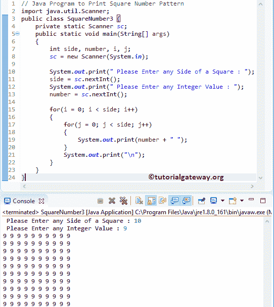

# Java 程序：打印数字的方形图案

> 原文：<https://www.tutorialgateway.org/java-program-to-print-square-number-pattern/>

编写一个 Java 程序，使用 For 循环和 While 循环打印数字的正方形图案。

## 用 For 循环打印数字的正方形图案的 Java 程序

这个 Java 程序允许输入正方形的任何一边(所有的边都是相等的)。接下来，这个 Java 程序显示一个 1 的平方数模式，直到它到达用户指定的行和列。

```java
// Java Program to Print Square Number Pattern using For loop
import java.util.Scanner;

public class SquareNumber1 {
	private static Scanner sc;
	public static void main(String[] args) 
	{
		int side, i, j;
		sc = new Scanner(System.in);

		System.out.print(" Please Enter any Side of a Square : ");
		side = sc.nextInt();	

		for(i = 0; i < side; i++)
		{
			for(j = 0; j < side; j++)
			{
				System.out.print("1 "); 
			}
			System.out.print("\n"); 
		}	
	}
}
```

使用 For 循环输出的 Java 平方数模式

```java
 Please Enter any Side of a Square : 12
1 1 1 1 1 1 1 1 1 1 1 1 
1 1 1 1 1 1 1 1 1 1 1 1 
1 1 1 1 1 1 1 1 1 1 1 1 
1 1 1 1 1 1 1 1 1 1 1 1 
1 1 1 1 1 1 1 1 1 1 1 1 
1 1 1 1 1 1 1 1 1 1 1 1 
1 1 1 1 1 1 1 1 1 1 1 1 
1 1 1 1 1 1 1 1 1 1 1 1 
1 1 1 1 1 1 1 1 1 1 1 1 
1 1 1 1 1 1 1 1 1 1 1 1 
1 1 1 1 1 1 1 1 1 1 1 1 
1 1 1 1 1 1 1 1 1 1 1 1 
```

首先 [For 循环](https://www.tutorialgateway.org/java-for-loop/)是从 1 迭代到用户输入端。接下来，我们使用[嵌套循环](https://www.tutorialgateway.org/nested-for-loop-in-java/)将 j 从 1 迭代到用户输入的值(边)

用户输入值:边= 8

第一次 For 循环–第一次迭代:For(I = 0；i < 8; i++)
条件为真。因此，它进入第二个 For 循环

第二次 For 循环–第一次迭代:For(j = 0；1 < 8; 0++)
条件为真。所以，1 里面的 [Java](https://www.tutorialgateway.org/java-tutorial/) 系统. out.println 打印出来了。

第二次 For 循环–第二次迭代:For(j = 1；1 < 8; 1++)
条件为真。所以，系统内部 1 . out . println 打印。

第二个 For 循环重复该过程，直到 j 达到 8。因为如果 j 是 8，条件就失败了，所以它从第二个循环退出。

第一次 For 循环–第二次迭代:For(I = 1；i < 8; 1++)
条件为真。因此，它进入第二个 For 循环。重复以上过程，直到我达到 8。

## 用 While 循环打印数字的正方形图案的 Java 程序

这个返回平方数模式的 Java 程序与上面的例子相同，但是我们使用的是 While 循环。

```java
// Java Program to Print Square Number Pattern using While loop
import java.util.Scanner;

public class SquareNumber2 {
	private static Scanner sc;
	public static void main(String[] args) 
	{
		int side, i = 0, j;
		sc = new Scanner(System.in);

		System.out.print(" Please Enter any Side of a Square : ");
		side = sc.nextInt();	

		while(i < side)
		{
			j = 0;
			while(j < side)
			{
				System.out.print("1"); 
				j++;
			}
			i++;
			System.out.print("\n"); 
		}	
	}
}
```

Java 方形数字图案使用[同时循环](https://www.tutorialgateway.org/java-while-loop/)输出

```java
 Please Enter any Side of a Square : 10
1111111111
1111111111
1111111111
1111111111
1111111111
1111111111
1111111111
1111111111
1111111111
1111111111
```

## Java 方形数字图案程序示例 3

该[程序](https://www.tutorialgateway.org/learn-java-programs/)允许用户输入任意整数值，然后以正方形模式打印该整数。

```java
// Java Program to Print Square Number Pattern
import java.util.Scanner;

public class SquareNumber3 {
	private static Scanner sc;
	public static void main(String[] args) 
	{
		int side, number, i, j;
		sc = new Scanner(System.in);

		System.out.print(" Please Enter any Side of a Square : ");
		side = sc.nextInt();	

		System.out.print(" Please Enter any Integer Value : ");
		number = sc.nextInt();

		for(i = 0; i < side; i++)
		{
			for(j = 0; j < side; j++)
			{
				System.out.print(number); 
			}
			System.out.print("\n"); 
		}	
	}
}
```

