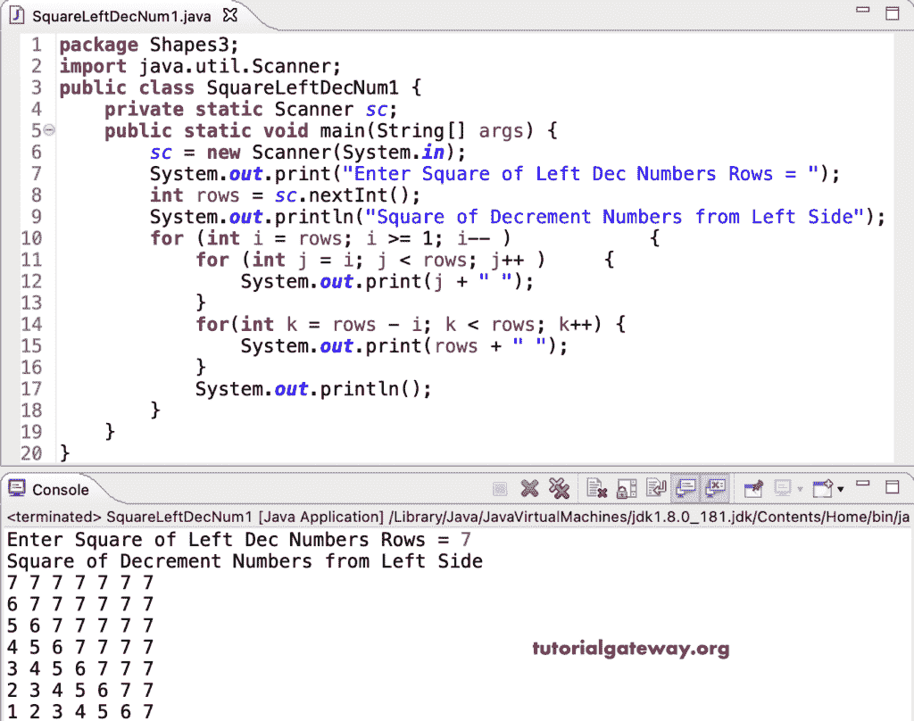

# Java 程序：打印左递减数字方形图案

> 原文：<https://www.tutorialgateway.org/java-program-to-print-square-of-left-decrement-numbers-pattern/>

编写一个 Java 程序，使用 for 循环打印左递减数字图案的平方。

```java
package Shapes3;

import java.util.Scanner;

public class SquareLeftDecNum1 {

	private static Scanner sc;

	public static void main(String[] args) {
		sc = new Scanner(System.in);

		System.out.print("Enter Square of Left Dec Numbers Rows = ");
		int rows = sc.nextInt();

		System.out.println("Square of Decrement Numbers from Left Side");

		for (int i = rows; i >= 1; i-- ) 
		{
			for (int j = i; j < rows; j++ ) 
			{
				System.out.print(j + " ");
			}
			for(int k = rows - i; k < rows; k++) 
			{
				System.out.print(rows + " ");
			}
			System.out.println();
		}
	}
}
```



这个 [Java 程序](https://www.tutorialgateway.org/learn-java-programs/)使用 while 循环从左手边显示递减数字的正方形图案。

```java
package Shapes3;

import java.util.Scanner;

public class SquareLeftDecNum2 {

	private static Scanner sc;

	public static void main(String[] args) {
		sc = new Scanner(System.in);

		System.out.print("Enter Square of Left Dec Numbers Rows = ");
		int rows = sc.nextInt();

		System.out.println("Square of Decrement Numbers from Left Side");
		int j, k, i = rows; 

		while(i >= 1) 
		{
			j = i; 
			while(j < rows) 
			{
				System.out.print(j + " ");
				j++;
			}

			k = rows - i;
			while(k < rows) 
			{
				System.out.print(rows + " ");
				k++;
			}

			System.out.println();
			i--;
		}
	}
}
```

```java
Enter Square of Left Dec Numbers Rows = 9
Square of Decrement Numbers from Left Side
9 9 9 9 9 9 9 9 9 
8 9 9 9 9 9 9 9 9 
7 8 9 9 9 9 9 9 9 
6 7 8 9 9 9 9 9 9 
5 6 7 8 9 9 9 9 9 
4 5 6 7 8 9 9 9 9 
3 4 5 6 7 8 9 9 9 
2 3 4 5 6 7 8 9 9 
1 2 3 4 5 6 7 8 9 
```