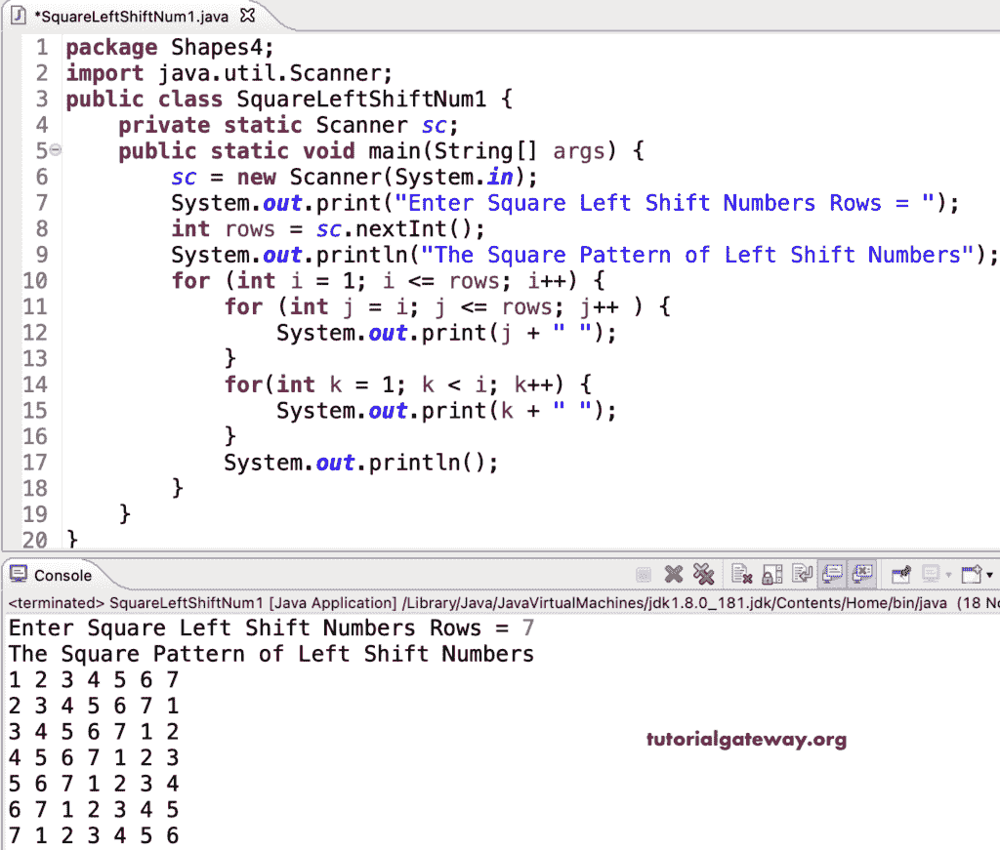

# Java 程序：打印数字的左移图案方块

> 原文：<https://www.tutorialgateway.org/java-program-to-print-square-of-left-shift-numbers-pattern/>

编写一个 Java 程序，使用 for 循环打印左移数字的平方模式。

```java
package Shapes4;

import java.util.Scanner;

public class SquareLeftShiftNum1 {

	private static Scanner sc;

	public static void main(String[] args) {
		sc = new Scanner(System.in);

		System.out.print("Enter Square Left Shift Numbers Rows = ");
		int rows = sc.nextInt();

		System.out.println("The Square Pattern of Left Shift Numbers");

		for (int i = 1; i <= rows; i++) 
		{
			for (int j = i; j <= rows; j++ ) 
			{
				System.out.print(j + " ");
			}
			for(int k = 1; k < i; k++) 
			{
				System.out.print(k + " ");
			}
			System.out.println();
		}
	}
}
```



打印左移数字的方形图案是编写 Java 程序的另一种方式。

```java
package Shapes4;

import java.util.Scanner;

public class SquareLeftShiftNum2 {

	private static Scanner sc;

	public static void main(String[] args) {
		sc = new Scanner(System.in);

		System.out.print("Enter Square Left Shift Numbers Rows = ");
		int rows = sc.nextInt();

		System.out.println("The Square Pattern of Left Shift Numbers");

		for (int i = 1; i <= rows; i++) 
		{
			int j = i;
			for(int k = 1; k <= rows; k++) 
			{
				System.out.print(j + " ");
				j++;

				if(j > rows)
				{
					j = 1;
				}
			}
			System.out.println();
		}
	}
}
```

```java
Enter Square Left Shift Numbers Rows = 16
The Square Pattern of Left Shift Numbers
1 2 3 4 5 6 7 8 9 10 11 12 13 14 15 16 
2 3 4 5 6 7 8 9 10 11 12 13 14 15 16 1 
3 4 5 6 7 8 9 10 11 12 13 14 15 16 1 2 
4 5 6 7 8 9 10 11 12 13 14 15 16 1 2 3 
5 6 7 8 9 10 11 12 13 14 15 16 1 2 3 4 
6 7 8 9 10 11 12 13 14 15 16 1 2 3 4 5 
7 8 9 10 11 12 13 14 15 16 1 2 3 4 5 6 
8 9 10 11 12 13 14 15 16 1 2 3 4 5 6 7 
9 10 11 12 13 14 15 16 1 2 3 4 5 6 7 8 
10 11 12 13 14 15 16 1 2 3 4 5 6 7 8 9 
11 12 13 14 15 16 1 2 3 4 5 6 7 8 9 10 
12 13 14 15 16 1 2 3 4 5 6 7 8 9 10 11 
13 14 15 16 1 2 3 4 5 6 7 8 9 10 11 12 
14 15 16 1 2 3 4 5 6 7 8 9 10 11 12 13 
15 16 1 2 3 4 5 6 7 8 9 10 11 12 13 14 
16 1 2 3 4 5 6 7 8 9 10 11 12 13 14 15 
```

这个 [Java 示例](https://www.tutorialgateway.org/learn-java-programs/)使用 while 循环从上到下显示左移数字的正方形模式。

```java
package Shapes4;

import java.util.Scanner;

public class SquareLeftShiftNum3 {

	private static Scanner sc;

	public static void main(String[] args) {
		sc = new Scanner(System.in);

		System.out.print("Enter Square Left Shift Numbers Rows = ");
		int rows = sc.nextInt();

		System.out.println("The Square Pattern of Left Shift Numbers");
		int i, j, k;
		i = 1; 

		while(i <= rows) 
		{
			j = i; 
			while(j <= rows) 
			{
				System.out.print(j + " ");
				j++;
			}

			k = 1; 
			while(k < i) 
			{
				System.out.print(k + " ");
				k++;
			}
			System.out.println();
			i++;
		}
	}
}
```

```java
Enter Square Left Shift Numbers Rows = 14
The Square Pattern of Left Shift Numbers
1 2 3 4 5 6 7 8 9 10 11 12 13 14 
2 3 4 5 6 7 8 9 10 11 12 13 14 1 
3 4 5 6 7 8 9 10 11 12 13 14 1 2 
4 5 6 7 8 9 10 11 12 13 14 1 2 3 
5 6 7 8 9 10 11 12 13 14 1 2 3 4 
6 7 8 9 10 11 12 13 14 1 2 3 4 5 
7 8 9 10 11 12 13 14 1 2 3 4 5 6 
8 9 10 11 12 13 14 1 2 3 4 5 6 7 
9 10 11 12 13 14 1 2 3 4 5 6 7 8 
10 11 12 13 14 1 2 3 4 5 6 7 8 9 
11 12 13 14 1 2 3 4 5 6 7 8 9 10 
12 13 14 1 2 3 4 5 6 7 8 9 10 11 
13 14 1 2 3 4 5 6 7 8 9 10 11 12 
14 1 2 3 4 5 6 7 8 9 10 11 12 13 
```