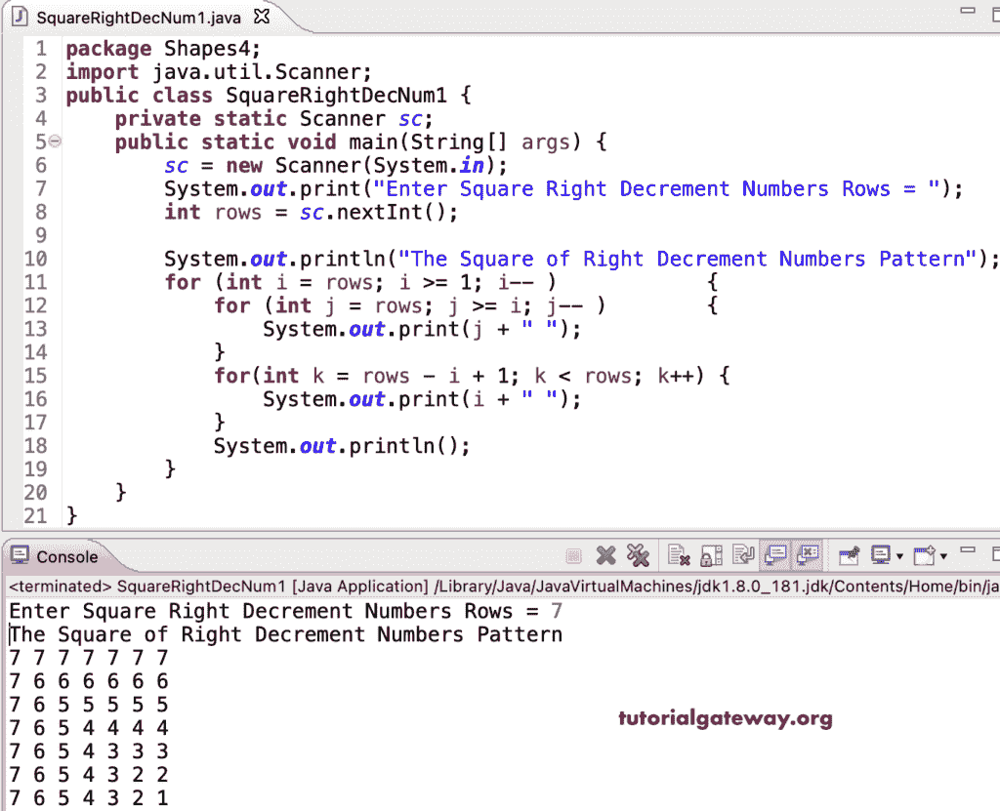

# Java 程序：打印右递减数字的方形图案

> 原文：<https://www.tutorialgateway.org/java-program-to-print-square-of-right-decrement-numbers-pattern/>

编写一个 Java 程序，使用 for 循环打印右边递减数字图案的平方。

```java
package Shapes4;

import java.util.Scanner;

public class SquareRightDecNum1 {

	private static Scanner sc;

	public static void main(String[] args) {
		sc = new Scanner(System.in);

		System.out.print("Enter Square Right Decrement Numbers Rows = ");
		int rows = sc.nextInt();

		System.out.println("The Square of Right Decrement Numbers Pattern");

		for (int i = rows; i >= 1; i-- ) 
		{
			for (int j = rows; j >= i; j-- ) 
			{
				System.out.print(j + " ");
			}
			for(int k = rows - i + 1; k < rows; k++) 
			{
				System.out.print(i + " ");
			}
			System.out.println();
		}
	}
}
```



这个 [Java 程序](https://www.tutorialgateway.org/learn-java-programs/)使用 while 循环打印右边递减数字的正方形图案。

```java
package Shapes4;

import java.util.Scanner;

public class SquareRightDecNum2 {

	private static Scanner sc;

	public static void main(String[] args) {
		sc = new Scanner(System.in);

		System.out.print("Enter Square Right Decrement Numbers Rows = ");
		int rows = sc.nextInt();

		System.out.println("The Square of Right Decrement Numbers Pattern");
		int i, j, k;
		i = rows; 

		while(i >= 1) 
		{
			j = rows; 
			while(j >= i) 
			{
				System.out.print(j + " ");
				j--;
			}
			k = rows - i + 1; 
			while(k < rows) 
			{
				System.out.print(i + " ");
				k++;
			}
			System.out.println();
			i--;
		}
	}
}
```

```java
Enter Square Right Decrement Numbers Rows = 8
The Square of Right Decrement Numbers Pattern
8 8 8 8 8 8 8 8 
8 7 7 7 7 7 7 7 
8 7 6 6 6 6 6 6 
8 7 6 5 5 5 5 5 
8 7 6 5 4 4 4 4 
8 7 6 5 4 3 3 3 
8 7 6 5 4 3 2 2 
8 7 6 5 4 3 2 1 
```