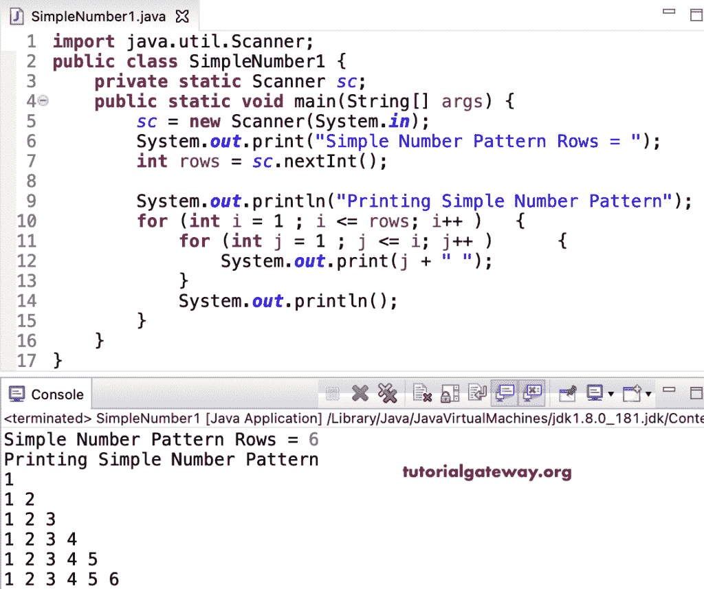

# Java 程序：打印简单数字图案

> 原文：<https://www.tutorialgateway.org/java-program-to-print-a-simple-number-pattern/>

编写一个 Java 程序，使用 for 循环打印一个简单的数字图案。

```java
import java.util.Scanner;

public class SimpleNumber1 {

	private static Scanner sc;

	public static void main(String[] args) {

		sc = new Scanner(System.in);	

		System.out.print("Simple Number Pattern Rows = ");
		int rows = sc.nextInt();

		System.out.println("Printing Simple Number Pattern");

		for (int i = 1 ; i <= rows; i++ ) 
		{
			for (int j = 1 ; j <= i; j++ ) 	
			{
				System.out.print(j + " ");
			}
			System.out.println();
		}
	}
}
```



这个 [Java 示例](https://www.tutorialgateway.org/learn-java-programs/)使用 while 循环以直角三角形图案显示数字。

```java
import java.util.Scanner;

public class SimpleNumber2 {

	private static Scanner sc;

	public static void main(String[] args) {

		sc = new Scanner(System.in);	

		int i = 1, j ; 

		System.out.print("Simple Number Pattern Rows = ");
		int rows = sc.nextInt();

		System.out.println("Printing Simple Number Pattern");

		while (i <= rows) 
		{
			j = 1 ;

			while ( j <= i) 	
			{
				System.out.print(j + " ");
				j++;
			}

			System.out.println();
			i++;
		}
	}
}
```

```java
Simple Number Pattern Rows = 9
Printing Simple Number Pattern
1 
1 2 
1 2 3 
1 2 3 4 
1 2 3 4 5 
1 2 3 4 5 6 
1 2 3 4 5 6 7 
1 2 3 4 5 6 7 8 
1 2 3 4 5 6 7 8 9 
```

Java 程序打印一个简单的数字图案使用 do while 循环。

```java
import java.util.Scanner;

public class SimpleNumber3 {

	private static Scanner sc;

	public static void main(String[] args) {

		sc = new Scanner(System.in);	

		System.out.print("Simple Number Pattern Rows = ");
		int rows = sc.nextInt();

		System.out.println("Printing Simple Number Pattern");
		int i = 1, j ; 

		do
		{
			j = 1 ;

			do	
			{
				System.out.print(j + " ");

			} while ( ++j <= i);

			System.out.println();

		} while (++i <= rows);
	}
}
```

```java
Simple Number Pattern Rows = 14
Printing Simple Number Pattern
1 
1 2 
1 2 3 
1 2 3 4 
1 2 3 4 5 
1 2 3 4 5 6 
1 2 3 4 5 6 7 
1 2 3 4 5 6 7 8 
1 2 3 4 5 6 7 8 9 
1 2 3 4 5 6 7 8 9 10 
1 2 3 4 5 6 7 8 9 10 11 
1 2 3 4 5 6 7 8 9 10 11 12 
1 2 3 4 5 6 7 8 9 10 11 12 13 
1 2 3 4 5 6 7 8 9 10 11 12 13 14 
```