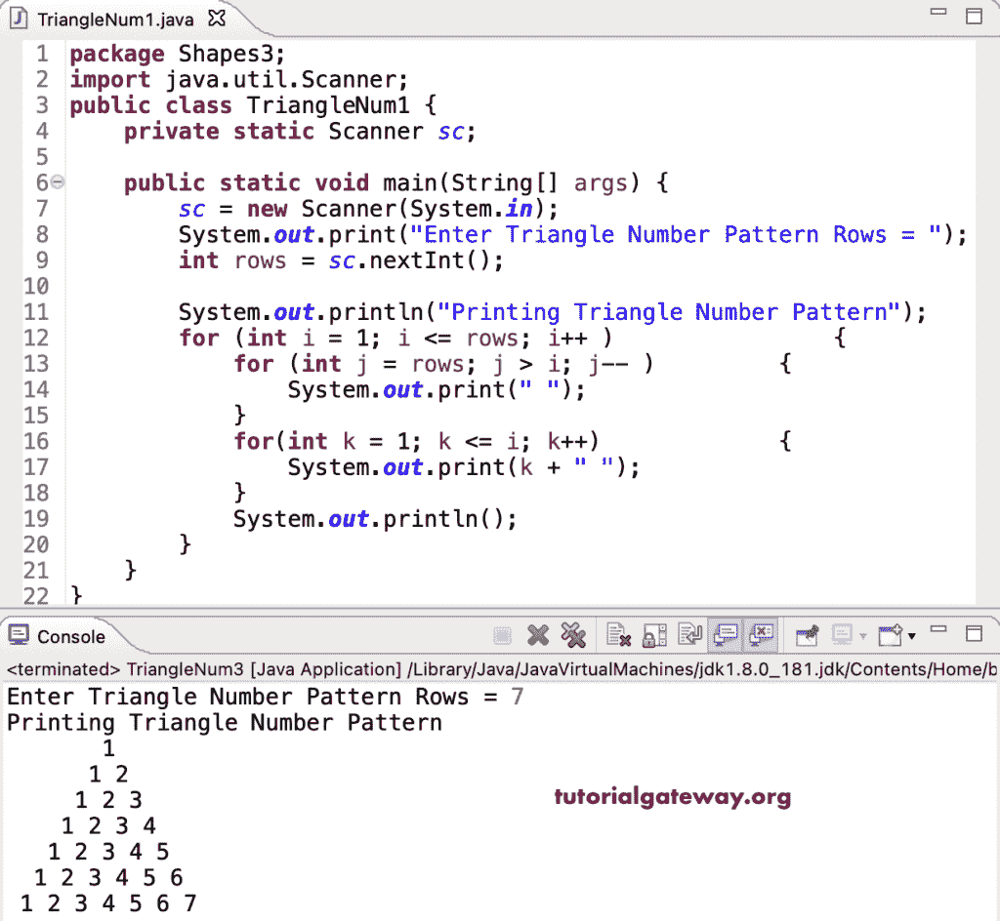

# Java 程序：打印数字的三角形图案

> 原文：<https://www.tutorialgateway.org/java-program-to-print-triangle-numbers-pattern/>

编写一个 Java 程序，使用 for 循环打印三角形数字图案。

```java
package Shapes3;

import java.util.Scanner;

public class TriangleNum1 {

	private static Scanner sc;

	public static void main(String[] args) {
		sc = new Scanner(System.in);

		System.out.print("Enter Triangle Number Pattern Rows = ");
		int rows = sc.nextInt();

		System.out.println("Printing Triangle Number Pattern");

		for (int i = 1; i <= rows; i++ ) 
		{
			for (int j = rows; j > i; j-- ) 
			{
				System.out.print(" ");
			}
			for(int k = 1; k <= i; k++) 
			{
				System.out.print(k + " ");
			}
			System.out.println();
		}
	}
}
```



这个 Java 程序使用 while 循环打印数字的三角形模式。

```java
package Shapes3;

import java.util.Scanner;

public class TriangleNum2 {

	private static Scanner sc;

	public static void main(String[] args) {
		sc = new Scanner(System.in);

		System.out.print("Enter Triangle Number Pattern Rows = ");
		int rows = sc.nextInt();

		System.out.println("Printing Triangle Number Pattern");
		int j, k, i = 1;

		while( i <= rows ) 
		{
			j = rows;
			while(j > i ) 
			{
				System.out.print(" ");
				j--;
			}

			k = 1;
			while(k <= i) 
			{
				System.out.print(k + " ");
				k++;
			}
			System.out.println();
			i++;
		}
	}
}
```

```java
Enter Triangle Number Pattern Rows = 8
Printing Triangle Number Pattern
       1 
      1 2 
     1 2 3 
    1 2 3 4 
   1 2 3 4 5 
  1 2 3 4 5 6 
 1 2 3 4 5 6 7 
1 2 3 4 5 6 7 8 
```

这个 [Java 示例](https://www.tutorialgateway.org/learn-java-programs/)使用 do while 循环来显示数字的三角形模式。

```java
package Shapes3;

import java.util.Scanner;

public class TriangleNum3 {

	private static Scanner sc;

	public static void main(String[] args) {
		sc = new Scanner(System.in);

		System.out.print("Enter Triangle Number Pattern Rows = ");
		int rows = sc.nextInt();

		System.out.println("Printing Triangle Number Pattern");
		int j, k, i = 1;

		do 
		{
			j = rows;
			do 
			{
				System.out.print(" ");

			} while(j-- > i );

			k = 1;
			do
			{
				System.out.print(k + " ");

			} while(++k <= i);
			System.out.println();

		} while(++i <= rows );
	}
}
```

```java
Enter Triangle Number Pattern Rows = 9
Printing Triangle Number Pattern
         1 
        1 2 
       1 2 3 
      1 2 3 4 
     1 2 3 4 5 
    1 2 3 4 5 6 
   1 2 3 4 5 6 7 
  1 2 3 4 5 6 7 8 
 1 2 3 4 5 6 7 8 9 
```