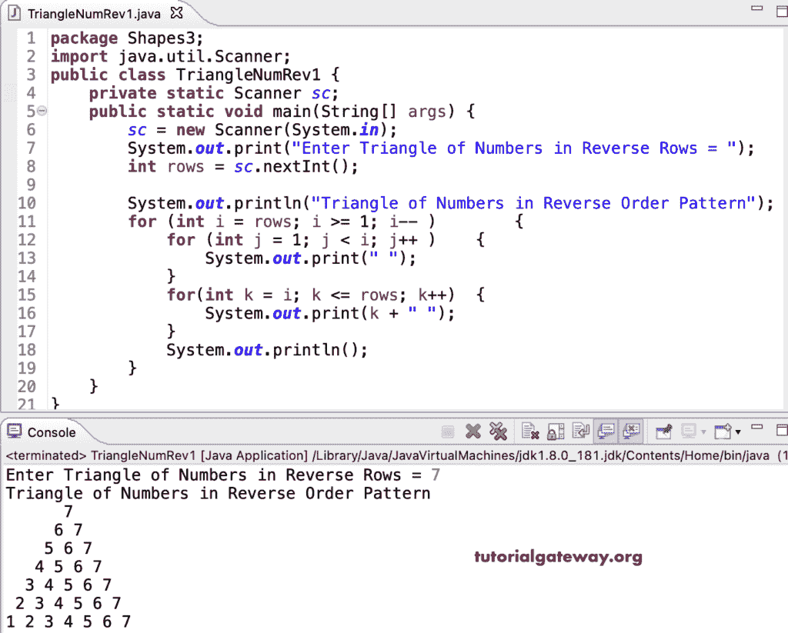

# Java 程序：打印数字的倒三角

> 原文：<https://www.tutorialgateway.org/java-program-to-print-triangle-of-numbers-in-reverse-pattern/>

编写一个 Java 程序，使用 for 循环以反向模式打印数字三角形。

```java
package Shapes3;

import java.util.Scanner;

public class TriangleNumRev1 {

	private static Scanner sc;

	public static void main(String[] args) {
		sc = new Scanner(System.in);

		System.out.print("Enter Triangle of Numbers in Reverse Rows = ");
		int rows = sc.nextInt();

		System.out.println("Triangle of Numbers in Reverse Order Pattern");

		for (int i = rows; i >= 1; i-- ) 
		{
			for (int j = 1; j < i; j++ ) 
			{
				System.out.print(" ");
			}
			for(int k = i; k <= rows; k++) 
			{
				System.out.print(k + " ");
			}
			System.out.println();
		}
	}
}
```



这个 Java 程序使用 while 循环以降序或逆序打印数字的三角形图案。

```java
package Shapes3;

import java.util.Scanner;

public class TriangleNumRev2 {

	private static Scanner sc;

	public static void main(String[] args) {
		sc = new Scanner(System.in);

		System.out.print("Enter Triangle of Numbers in Reverse Rows = ");
		int rows = sc.nextInt();

		System.out.println("Triangle of Numbers in Reverse Order Pattern");
		int j, k, i = rows;

		while(i >= 1 ) 
		{
			j = 1; 
			while(j < i) 
			{
				System.out.print(" ");
				j++;
			}

			k = i;
			while(k <= rows) 
			{
				System.out.print(k + " ");
				k++;
			}

			System.out.println();
			i--;
		}
	}
}
```

```java
Enter Triangle of Numbers in Reverse Rows = 9
Triangle of Numbers in Reverse Order Pattern
        9 
       8 9 
      7 8 9 
     6 7 8 9 
    5 6 7 8 9 
   4 5 6 7 8 9 
  3 4 5 6 7 8 9 
 2 3 4 5 6 7 8 9 
1 2 3 4 5 6 7 8 9 
```

这个 [Java 示例](https://www.tutorialgateway.org/learn-java-programs/)使用 do while 循环以三角形图案显示逆序或降序数字。

```java
package Shapes3;

import java.util.Scanner;

public class TriangleNumRev3 {

	private static Scanner sc;

	public static void main(String[] args) {
		sc = new Scanner(System.in);

		System.out.print("Enter Triangle of Numbers in Reverse Rows = ");
		int rows = sc.nextInt();

		System.out.println("Triangle of Numbers in Reverse Order Pattern");
		int j, k, i = rows;

		do
		{
			j = 1; 
			do 
			{
				System.out.print(" ");

			} while(j++ < i);

			k = i;
			do 
			{
				System.out.print(k + " ");

			} while(++k <= rows);

			System.out.println();

		} while(--i >= 1 ) ;
	}
}
```

```java
Enter Triangle of Numbers in Reverse Rows = 5
Triangle of Numbers in Reverse Order Pattern
     5 
    4 5 
   3 4 5 
  2 3 4 5 
 1 2 3 4 5 
```