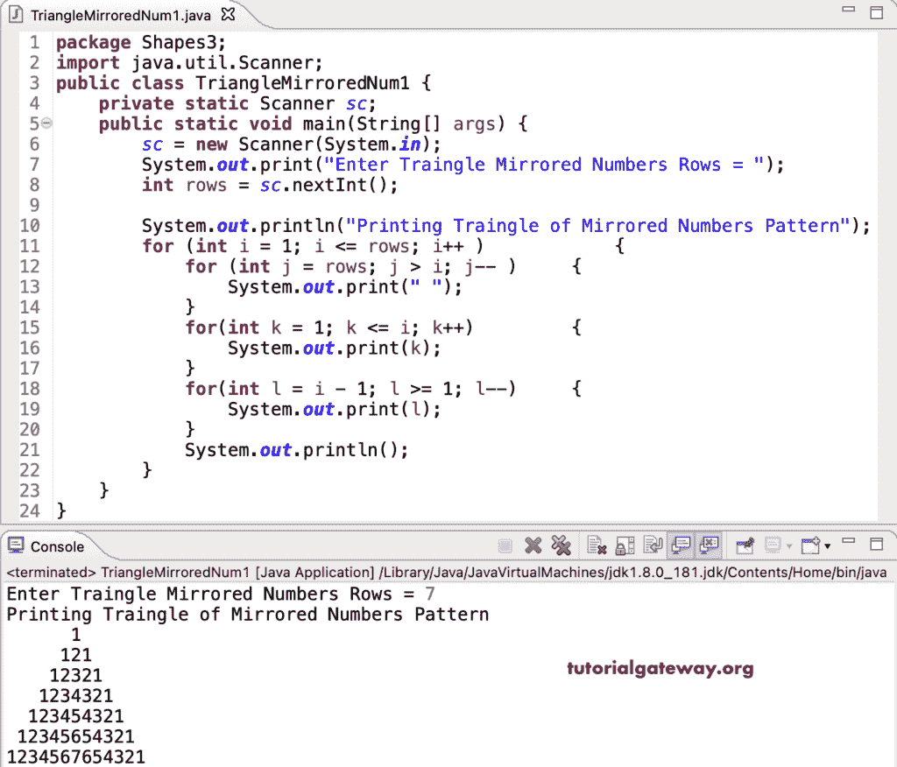

# Java 程序：打印镜像数字三角形图案

> 原文：<https://www.tutorialgateway.org/java-program-to-print-triangle-of-mirrored-numbers-pattern/>

编写一个 Java 程序，使用 for 循环打印镜像数字三角形模式。

```java
package Shapes3;

import java.util.Scanner;

public class TriangleMirroredNum1 {

	private static Scanner sc;

	public static void main(String[] args) {
		sc = new Scanner(System.in);

		System.out.print("Enter Traingle Mirrored Numbers Rows = ");
		int rows = sc.nextInt();

		System.out.println("Printing Traingle of Mirrored Numbers Pattern");

		for (int i = 1; i <= rows; i++ ) 
		{
			for (int j = rows; j > i; j-- ) 
			{
				System.out.print(" ");
			}
			for(int k = 1; k <= i; k++) 
			{
				System.out.print(k);
			}
			for(int l = i - 1; l >= 1; l--)
			{
				System.out.print(l);
			}
			System.out.println();
		}
	}
}
```



这个 Java 模式[示例](https://www.tutorialgateway.org/learn-java-programs/)使用 while 循环打印镜像数字的三角形。

```java
package Shapes3;

import java.util.Scanner;

public class TriangleMirroredNum2 {

	private static Scanner sc;

	public static void main(String[] args) {
		sc = new Scanner(System.in);

		System.out.print("Enter Traingle Mirrored Numbers Rows = ");
		int rows = sc.nextInt();

		System.out.println("Printing Traingle of Mirrored Numbers Pattern");
		int j, k, l, i = 1;

		while(i <= rows) 
		{
			j = rows;
			while(j > i) 
			{
				System.out.print(" ");
				j--;
			}

			k = 1; 
			while(k <= i) 
			{
				System.out.print(k);
				k++;
			}

			l = i - 1;
			while(l >= 1)
			{
				System.out.print(l);
				l--;
			}

			System.out.println();
			i++;
		}
	}
}
```

```java
Enter Traingle Mirrored Numbers Rows = 9
Printing Traingle of Mirrored Numbers Pattern
        1
       121
      12321
     1234321
    123454321
   12345654321
  1234567654321
 123456787654321
12345678987654321
```