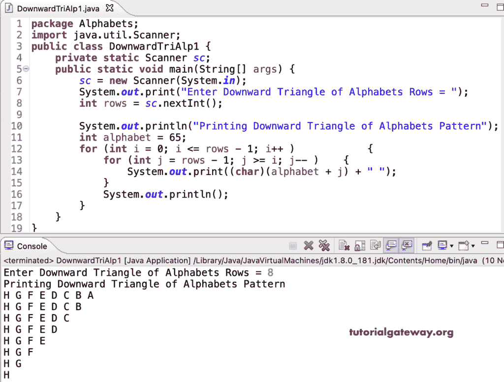

# Java 程序：打印字母的向下三角形图案

> 原文：<https://www.tutorialgateway.org/java-program-to-print-downward-triangle-alphabets-pattern/>

编写一个 Java 程序，使用 for 循环打印字母的向下的三角形图案。

```java
package Alphabets;

import java.util.Scanner;

public class DownwardTriAlp1 {

	private static Scanner sc;

	public static void main(String[] args) {

		sc = new Scanner(System.in);	

		System.out.print("Enter Downward Triangle of Alphabets Rows = ");
		int rows = sc.nextInt();

		System.out.println("Printing Downward Triangle of Alphabets Patternz");
		int alphabet = 65;

		for (int i = 0; i <= rows - 1; i++ ) 
		{
			for (int j = rows - 1; j >= i; j-- ) 	
			{
				System.out.print((char)(alphabet + j) + " ");
			}
			System.out.println();
		}
	}
}
```



这个 Java 示例使用 while 循环打印字母的向下三角形模式。

```java
package Alphabets;

import java.util.Scanner;

public class DownwardTriAlp2 {

	private static Scanner sc;

	public static void main(String[] args) {

		sc = new Scanner(System.in);	

		int i, j, rows, alphabet = 65;

		System.out.print("Enter Downward Triangle of Alphabets Rows = ");
		rows = sc.nextInt();

		System.out.println("Printing Downward Triangle of Alphabets Pattern\n");

		i = 0;
		while(i <= rows - 1 ) 
		{
			j = rows - 1;
			while(j >= i ) 	
			{
				System.out.print((char)(alphabet + j) + " ");
				j--;
			}
			System.out.println();
			i++;
		}
	}
}
```

```java
Enter Downward Triangle of Alphabets Rows = 14
Printing Downward Triangle of Alphabets Pattern

N M L K J I H G F E D C B A 
N M L K J I H G F E D C B 
N M L K J I H G F E D C 
N M L K J I H G F E D 
N M L K J I H G F E 
N M L K J I H G F 
N M L K J I H G 
N M L K J I H 
N M L K J I 
N M L K J 
N M L K 
N M L 
N M 
N
```

在这个 Java 模式[示例](https://www.tutorialgateway.org/learn-java-programs/)中，我们使用 do while 循环来显示字母的向下三角形模式。

```java
package Alphabets;

import java.util.Scanner;

public class DownwardTriAlp3 {

	private static Scanner sc;

	public static void main(String[] args) {

		sc = new Scanner(System.in);	

		int i, j, rows, alphabet = 65;

		System.out.print("Enter Downward Triangle of Alphabets Rows = ");
		rows = sc.nextInt();

		System.out.println("Printing Downward Triangle of Alphabets Pattern\n");

		i = 0;
		do
		{
			j = rows - 1;
			do 	
			{
				System.out.print((char)(alphabet + j) + " ");

			} while(--j >= i );
			System.out.println();

		} while(++i <= rows - 1 );
	}
}
```

```java
Enter Downward Triangle of Alphabets Rows = 17
Printing Downward Triangle of Alphabets Pattern

Q P O N M L K J I H G F E D C B A 
Q P O N M L K J I H G F E D C B 
Q P O N M L K J I H G F E D C 
Q P O N M L K J I H G F E D 
Q P O N M L K J I H G F E 
Q P O N M L K J I H G F 
Q P O N M L K J I H G 
Q P O N M L K J I H 
Q P O N M L K J I 
Q P O N M L K J 
Q P O N M L K 
Q P O N M L 
Q P O N M 
Q P O N 
Q P O 
Q P 
Q 
```