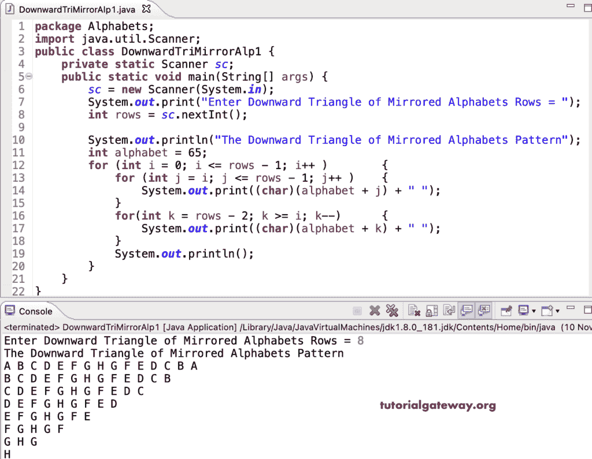

# Java 程序：打印字母的镜像向下三角形图案

> 原文：<https://www.tutorialgateway.org/java-program-to-print-downward-triangle-of-mirrored-alphabets-pattern/>

编写一个 Java 程序，使用 for 循环打印镜像字母的向下三角形图案。

```java
package Alphabets;

import java.util.Scanner;

public class DownwardTriMirrorAlp1 {

	private static Scanner sc;

	public static void main(String[] args) {

		sc = new Scanner(System.in);	

		System.out.print("Enter Downward Triangle of Mirrored Alphabets Rows = ");
		int rows = sc.nextInt();

		System.out.println("The Downward Triangle of Mirrored Alphabets Pattern");
		int alphabet = 65;

		for (int i = 0; i <= rows - 1; i++ ) 
		{
			for (int j = i; j <= rows - 1; j++ ) 	
			{
				System.out.print((char)(alphabet + j) + " ");
			}
			for(int k = rows - 2; k >= i; k--)
			{
				System.out.print((char)(alphabet + k) + " ");
			}
			System.out.println();
		}
	}
}
```



在这个 Java 模式[示例](https://www.tutorialgateway.org/learn-java-programs/)中，我们使用 while 循环来显示镜像字母的向下三角形图案。

```java
package Alphabets;

import java.util.Scanner;

public class DownwardTriMirrorAlp2 {

	private static Scanner sc;

	public static void main(String[] args) {

		sc = new Scanner(System.in);	

		System.out.print("Enter Downward Triangle of Mirrored Alphabets Rows = ");
		int rows = sc.nextInt();

		System.out.println("Printing Downward Triangle of Mirrored Alphabets Pattern\n");
		int alphabet = 65;
		int j, k, i = 0;

		while( i <= rows - 1 ) 
		{

			j = i;
			while(j <= rows - 1 ) 	
			{
				System.out.print((char)(alphabet + j) + " ");
				j++;
			}

			k = rows - 2;
			while(k >= i)
			{
				System.out.print((char)(alphabet + k) + " ");
				k--;
			}
			System.out.println();
			i++;
		}
	}
}
```

```java
Enter Downward Triangle of Mirrored Alphabets Rows = 15
Printing Downward Triangle of Mirrored Alphabets Pattern

A B C D E F G H I J K L M N O N M L K J I H G F E D C B A 
B C D E F G H I J K L M N O N M L K J I H G F E D C B 
C D E F G H I J K L M N O N M L K J I H G F E D C 
D E F G H I J K L M N O N M L K J I H G F E D 
E F G H I J K L M N O N M L K J I H G F E 
F G H I J K L M N O N M L K J I H G F 
G H I J K L M N O N M L K J I H G 
H I J K L M N O N M L K J I H 
I J K L M N O N M L K J I 
J K L M N O N M L K J 
K L M N O N M L K 
L M N O N M L 
M N O N M 
N O N 
O 
```