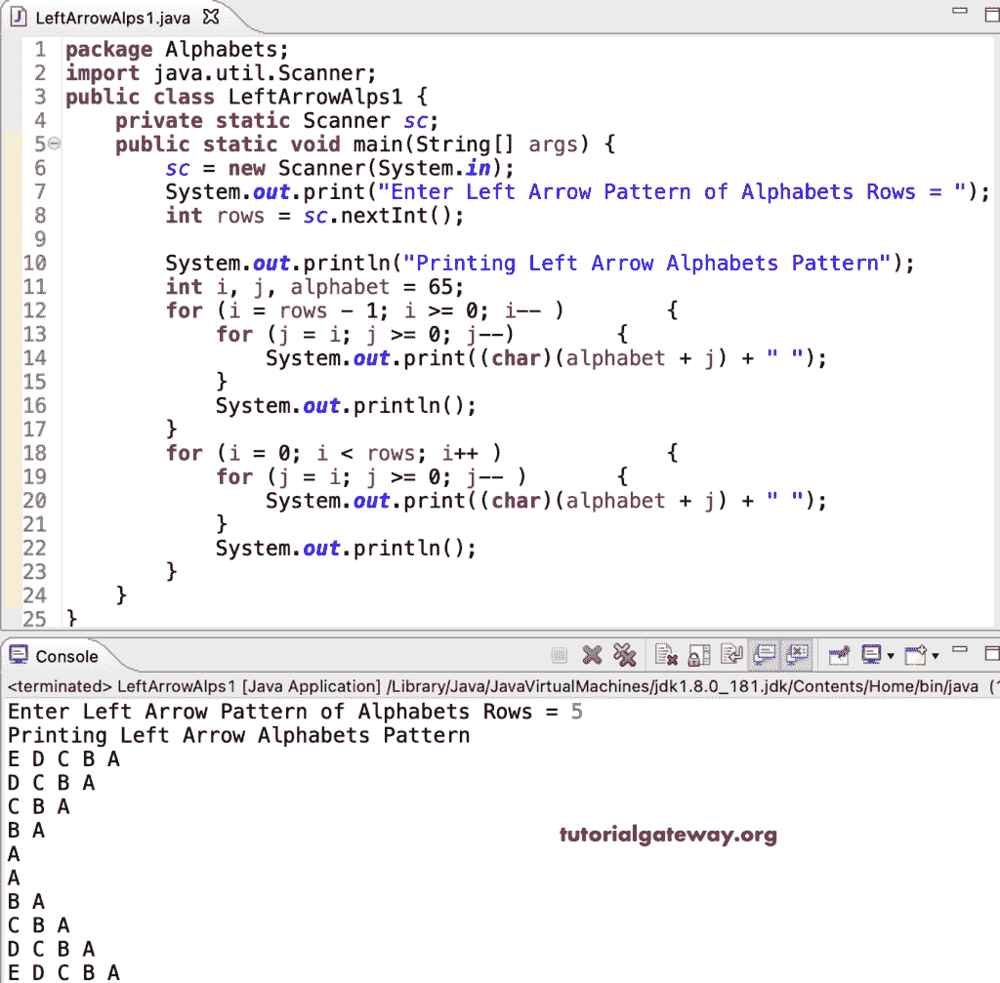

# Java 程序：打印字母的左箭头图案

> 原文：<https://www.tutorialgateway.org/java-program-to-print-left-arrow-alphabets-pattern/>

编写一个 Java 程序，使用 for 循环打印字母的左箭头图案。

```java
package Alphabets;

import java.util.Scanner;

public class LeftArrowAlps1 {

	private static Scanner sc;

	public static void main(String[] args) {

		sc = new Scanner(System.in);	

		System.out.print("Enter Left Arrow Pattern of Alphabets Rows = ");
		int rows = sc.nextInt();

		System.out.println("Printing Left Arrow Alphabets Pattern");
		int i, j, alphabet = 65;

		for (i = rows - 1; i >= 0; i-- ) 
		{
			for (j = i; j >= 0; j--) 
			{
				System.out.print((char)(alphabet + j) + " ");
			}
			System.out.println();
		}

		for (i = 0; i < rows; i++ ) 
		{
			for (j = i; j >= 0; j-- ) 
			{
				System.out.print((char)(alphabet + j) + " ");
			}
			System.out.println();
		}
	}
}
```



这个 Java 程序使用 while 循环打印字母表模式的左箭头。

```java
package Alphabets;

import java.util.Scanner;

public class LeftArrowAlps2 {

	private static Scanner sc;

	public static void main(String[] args) {

		sc = new Scanner(System.in);	

		System.out.print("Enter Left Arrow Pattern of Alphabets Rows = ");
		int rows = sc.nextInt();

		System.out.println("Printing Left Arrow Alphabets Pattern\n");
		int i, j, alphabet = 65;
		i = rows - 1;

		while( i >= 0) 
		{
			j = i;
			while(j >= 0) 
			{
				System.out.print((char)(alphabet + j) + " ");
				j--;
			}
			System.out.println();
			i--;
		}

		i = 0;
		while(i < rows ) 
		{
			j = i;
			while(j >= 0 ) 
			{
				System.out.print((char)(alphabet + j) + " ");
				j--;
			}
			System.out.println();
			i++;
		}
	}
}
```

```java
Enter Left Arrow Pattern of Alphabets Rows = 14
Printing Left Arrow Alphabets Pattern

N M L K J I H G F E D C B A 
M L K J I H G F E D C B A 
L K J I H G F E D C B A 
K J I H G F E D C B A 
J I H G F E D C B A 
I H G F E D C B A 
H G F E D C B A 
G F E D C B A 
F E D C B A 
E D C B A 
D C B A 
C B A 
B A 
A 
A 
B A 
C B A 
D C B A 
E D C B A 
F E D C B A 
G F E D C B A 
H G F E D C B A 
I H G F E D C B A 
J I H G F E D C B A 
K J I H G F E D C B A 
L K J I H G F E D C B A 
M L K J I H G F E D C B A 
N M L K J I H G F E D C B A 
```

这个 [Java 示例](https://www.tutorialgateway.org/learn-java-programs/)使用 do while 循环来显示字母的左箭头模式。

```java
package Alphabets;

import java.util.Scanner;

public class LeftArrowAlps3 {

	private static Scanner sc;

	public static void main(String[] args) {

		sc = new Scanner(System.in);	

		System.out.print("Enter Left Arrow Pattern of Alphabets Rows = ");
		int rows = sc.nextInt();

		System.out.println("Printing Left Arrow Alphabets Pattern\n");
		int i, j, alphabet = 65;
		i = rows - 1;

		do 
		{
			j = i;
			do 
			{
				System.out.print((char)(alphabet + j) + " ");

			} while(--j >= 0);
			System.out.println();

		} while(--i >= 0);

		i = 0;
		do 
		{
			j = i;
			do 
			{
				System.out.print((char)(alphabet + j) + " ");

			} while(--j >= 0 );
			System.out.println();

		} while(++i < rows );
	}
}
```

```java
Enter Left Arrow Pattern of Alphabets Rows = 16
Printing Left Arrow Alphabets Pattern

P O N M L K J I H G F E D C B A 
O N M L K J I H G F E D C B A 
N M L K J I H G F E D C B A 
M L K J I H G F E D C B A 
L K J I H G F E D C B A 
K J I H G F E D C B A 
J I H G F E D C B A 
I H G F E D C B A 
H G F E D C B A 
G F E D C B A 
F E D C B A 
E D C B A 
D C B A 
C B A 
B A 
A 
A 
B A 
C B A 
D C B A 
E D C B A 
F E D C B A 
G F E D C B A 
H G F E D C B A 
I H G F E D C B A 
J I H G F E D C B A 
K J I H G F E D C B A 
L K J I H G F E D C B A 
M L K J I H G F E D C B A 
N M L K J I H G F E D C B A 
O N M L K J I H G F E D C B A 
P O N M L K J I H G F E D C B A 
```