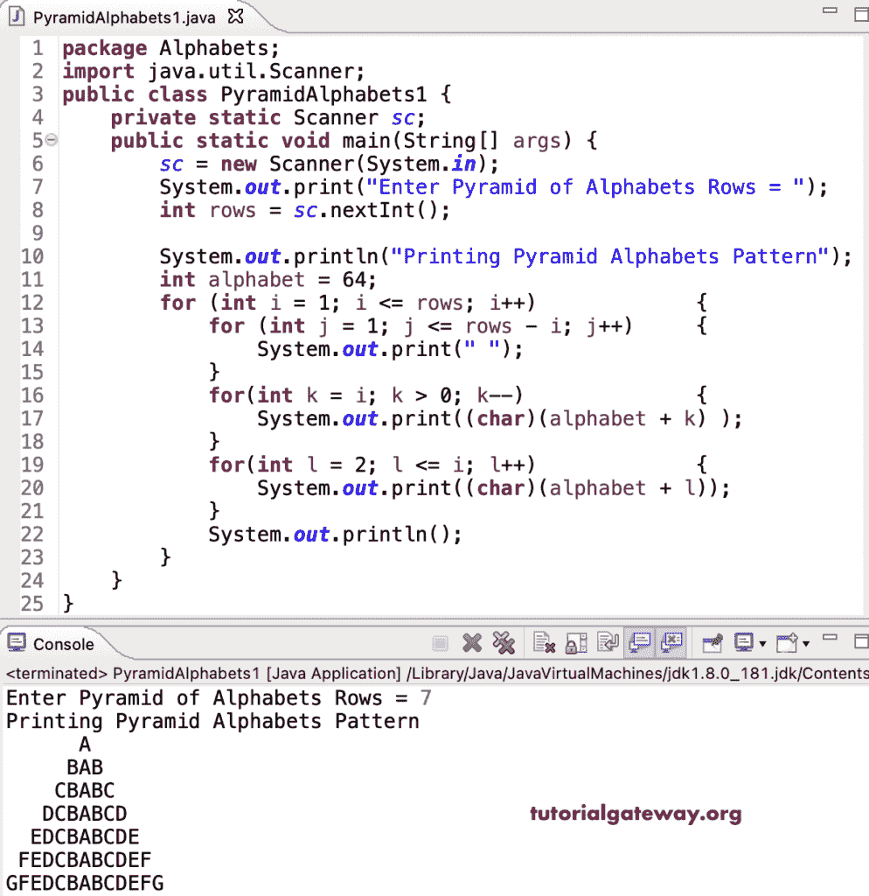

# Java 程序：打印金字塔字母图案

> 原文：<https://www.tutorialgateway.org/java-program-to-print-pyramid-alphabets-pattern/>

编写一个 Java 程序，使用 for 循环打印金字塔字母图案。

```java
package Alphabets;

import java.util.Scanner;

public class PyramidAlphabets1 {

	private static Scanner sc;

	public static void main(String[] args) {

		sc = new Scanner(System.in);	

		System.out.print("Enter Pyramid of Alphabets Rows = ");
		int rows = sc.nextInt();

		System.out.println("Printing Pyramid Alphabets Pattern");

		int alphabet = 64;

		for (int i = 1; i <= rows; i++) 
		{
			for (int j = 1; j <= rows - i; j++) 	
			{
				System.out.print(" ");
			}
			for(int k = i; k > 0; k--)
			{
				System.out.print((char)(alphabet + k) );
			}
			for(int l = 2; l <= i; l++)
			{
				System.out.print((char)(alphabet + l));
			}
			System.out.println();
		}
	}
}
```



这个 [Java 示例](https://www.tutorialgateway.org/learn-java-programs/)使用 while 循环打印字母的金字塔模式。

```java
package Alphabets;

import java.util.Scanner;

public class PyramidAlphabets2 {

	private static Scanner sc;

	public static void main(String[] args) {

		sc = new Scanner(System.in);	

		System.out.print("Enter Pyramid of Alphabets Rows = ");
		int rows = sc.nextInt();

		System.out.println("Printing Pyramid Alphabets Pattern");

		int i, j, k, l, alphabet = 64;
		i = 1;

		while( i <= rows) 
		{
			j = 1;
			while(j <= rows - i) 	
			{
				System.out.print(" ");
				j++;
			}

			k = i;
			while(k > 0)
			{
				System.out.print((char)(alphabet + k) );
				k--;
			}

			l = 2;
			while(l <= i)
			{
				System.out.print((char)(alphabet + l));
				l++;
			}
			System.out.println();
			i++;
		}
	}
}
```

```java
Enter Pyramid of Alphabets Rows = 15
Printing Pyramid Alphabets Pattern
              A
             BAB
            CBABC
           DCBABCD
          EDCBABCDE
         FEDCBABCDEF
        GFEDCBABCDEFG
       HGFEDCBABCDEFGH
      IHGFEDCBABCDEFGHI
     JIHGFEDCBABCDEFGHIJ
    KJIHGFEDCBABCDEFGHIJK
   LKJIHGFEDCBABCDEFGHIJKL
  MLKJIHGFEDCBABCDEFGHIJKLM
 NMLKJIHGFEDCBABCDEFGHIJKLMN
ONMLKJIHGFEDCBABCDEFGHIJKLMNO
```