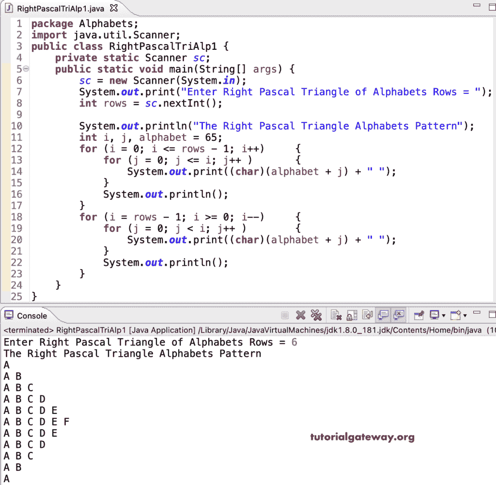

# Java 程序：打印直角三角形字母图案

> 原文：<https://www.tutorialgateway.org/java-program-to-print-right-pascals-triangle-alphabets-pattern/>

编写一个 Java 程序，使用 for 循环打印直角三角形字母图案。

```java
package Alphabets;

import java.util.Scanner;

public class RightPascalTriAlp1 {

	private static Scanner sc;

	public static void main(String[] args) {

		sc = new Scanner(System.in);	

		System.out.print("Enter Right Pascal Triangle of Alphabets Rows = ");
		int rows = sc.nextInt();

		System.out.println("The Right Pascal Triangle Alphabets Pattern");

		int i, j, alphabet = 65;

		for (i = 0; i <= rows - 1; i++) 
		{
			for (j = 0; j <= i; j++ ) 	
			{
				System.out.print((char)(alphabet + j) + " ");
			}
			System.out.println();
		}

		for (i = rows - 1; i >= 0; i--) 
		{
			for (j = 0; j < i; j++ ) 	
			{
				System.out.print((char)(alphabet + j) + " ");
			}
			System.out.println();
		}
	}
}
```



这个 Java 程序使用 while 循环打印字母的右帕斯卡三角形模式。

```java
package Alphabets;

import java.util.Scanner;

public class RightPascalTriAlp2 {

	private static Scanner sc;

	public static void main(String[] args) {

		sc = new Scanner(System.in);	

		System.out.print("Enter Right Pascal Triangle of Alphabets Rows = ");
		int rows = sc.nextInt();

		System.out.println("The Right Pascal Triangle Alphabets Pattern");

		int i, j, alphabet = 65;
		i = 0;

		while( i <= rows - 1) 
		{
			j = 0;
			while(j <= i ) 	
			{
				System.out.print((char)(alphabet + j) + " ");
				j++;
			}
			System.out.println();
			i++;
		}

		i = rows - 1;
		while( i >= 0) 
		{
			j = 0;
			while(j < i) 	
			{
				System.out.print((char)(alphabet + j) + " ");
				j++;
			}
			System.out.println();
			i--;
		}
	}
}
```

```java
Enter Right Pascal Triangle of Alphabets Rows = 13
The Right Pascal Triangle Alphabets Pattern
A 
A B 
A B C 
A B C D 
A B C D E 
A B C D E F 
A B C D E F G 
A B C D E F G H 
A B C D E F G H I 
A B C D E F G H I J 
A B C D E F G H I J K 
A B C D E F G H I J K L 
A B C D E F G H I J K L M 
A B C D E F G H I J K L 
A B C D E F G H I J K 
A B C D E F G H I J 
A B C D E F G H I 
A B C D E F G H 
A B C D E F G 
A B C D E F 
A B C D E 
A B C D 
A B C 
A B 
A 
```

这个 [Java 示例](https://www.tutorialgateway.org/learn-java-programs/)使用 do while 循环来显示字母图案的右帕斯卡三角形。

```java
package Alphabets;

import java.util.Scanner;

public class RightPascalTriAlp3 {

	private static Scanner sc;

	public static void main(String[] args) {

		sc = new Scanner(System.in);	

		System.out.print("Enter Right Pascal Triangle of Alphabets Rows = ");
		int rows = sc.nextInt();

		System.out.println("The Right Pascal Triangle Alphabets Pattern");

		int i, j, alphabet = 65;
		i = 0;

		do 
		{
			j = 0;
			do 	
			{
				System.out.print((char)(alphabet + j) + " ");

			} while(++j <= i );

			System.out.println();

		} while(++i <= rows - 1);

		i = rows - 1;
		do
		{
			j = 0;
			do 	
			{
				System.out.print((char)(alphabet + j) + " ");

			} while(++j < i);
			System.out.println();

		} while(--i >= 0);
	}
}
```

```java
Enter Right Pascal Triangle of Alphabets Rows = 15
The Right Pascal Triangle Alphabets Pattern
A 
A B 
A B C 
A B C D 
A B C D E 
A B C D E F 
A B C D E F G 
A B C D E F G H 
A B C D E F G H I 
A B C D E F G H I J 
A B C D E F G H I J K 
A B C D E F G H I J K L 
A B C D E F G H I J K L M 
A B C D E F G H I J K L M N 
A B C D E F G H I J K L M N O 
A B C D E F G H I J K L M N 
A B C D E F G H I J K L M 
A B C D E F G H I J K L 
A B C D E F G H I J K 
A B C D E F G H I J 
A B C D E F G H I 
A B C D E F G H 
A B C D E F G 
A B C D E F 
A B C D E 
A B C D 
A B C 
A B 
A 
A 
```