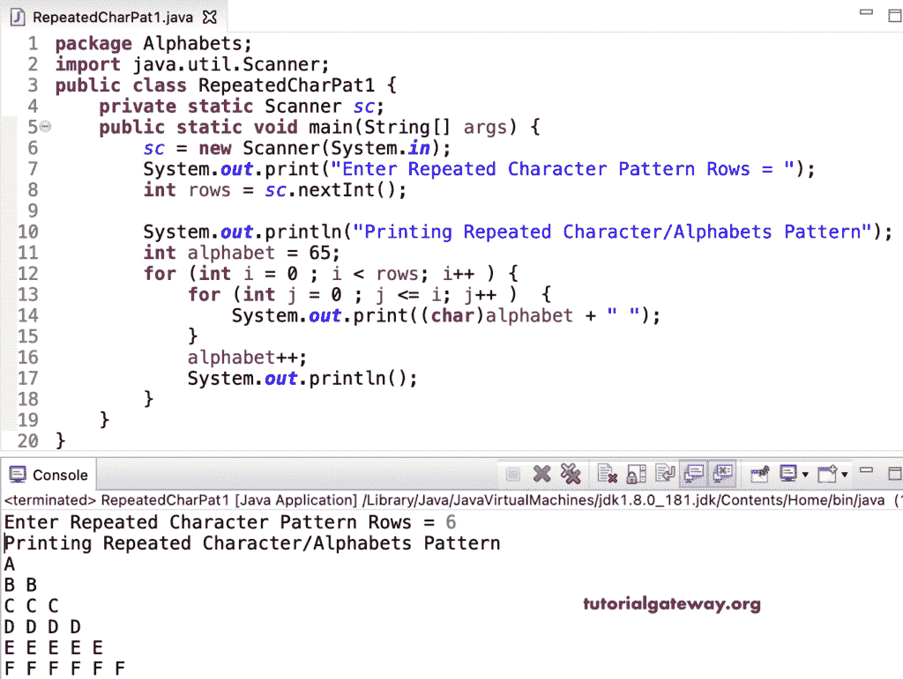

# Java 程序：打印重复字符模式

> 原文：<https://www.tutorialgateway.org/java-program-to-print-repeated-character-pattern/>

编写一个 Java 程序，使用 for 循环在每行模式中打印重复的字符模式或字母。

```java
package Alphabets;

import java.util.Scanner;

public class RepeatedCharPat1 {

	private static Scanner sc;

	public static void main(String[] args) {

		sc = new Scanner(System.in);	

		System.out.print("Enter Repeated Character Pattern Rows = ");
		int rows = sc.nextInt();

		System.out.println("Printing Repeated Character/Alphabets Pattern");
		int alphabet = 65;

		for (int i = 0 ; i < rows; i++ ) 
		{
			for (int j = 0 ; j <= i; j++ ) 	
			{
				System.out.print((char)alphabet + " ");
			}
			alphabet++;
			System.out.println();
		}
	}
}
```



这个 [Java 例子](https://www.tutorialgateway.org/learn-java-programs/)使用 while 循环显示每行重复字符的直角三角形模式。

```java
package Alphabets;

import java.util.Scanner;

public class RepeatedCharPat2 {

	private static Scanner sc;

	public static void main(String[] args) {

		sc = new Scanner(System.in);	

		System.out.print("Enter Repeated Character Pattern Rows = ");
		int rows = sc.nextInt();

		System.out.println("Printing Repeated Character/Alphabets Pattern");
		int i = 0, j, alphabet = 65;

		while(i < rows ) 
		{
			j = 0 ;
			while( j <= i ) 	
			{
				System.out.print((char)alphabet + " ");
				j++;
			}
			alphabet++;
			System.out.println();
			i++;
		}
	}
}
```

```java
Enter Repeated Character Pattern Rows = 8
Printing Repeated Character/Alphabets Pattern
A 
B B 
C C C 
D D D D 
E E E E E 
F F F F F F 
G G G G G G G 
H H H H H H H H 
```

Java 程序打印字母的重复的字符或图案使用 do while 循环。

```java
package Alphabets;

import java.util.Scanner;

public class RepeatedCharPat3 {

	private static Scanner sc;

	public static void main(String[] args) {

		sc = new Scanner(System.in);	

		System.out.print("Enter Repeated Character Pattern Rows = ");
		int rows = sc.nextInt();

		System.out.println("Printing Repeated Character/Alphabets Pattern");
		int i = 0, j, alphabet = 65;

		do 
		{
			j = 0 ;
			do	
			{
				System.out.print((char)alphabet + " ");

			} while( ++j <= i ) ;
			alphabet++;
			System.out.println();

		} while(++i < rows );
	}
}
```

```java
Enter Repeated Character Pattern Rows = 12
Printing Repeated Character/Alphabets Pattern
A 
B B 
C C C 
D D D D 
E E E E E 
F F F F F F 
G G G G G G G 
H H H H H H H H 
I I I I I I I I I 
J J J J J J J J J J 
K K K K K K K K K K K 
L L L L L L L L L L L L 
```