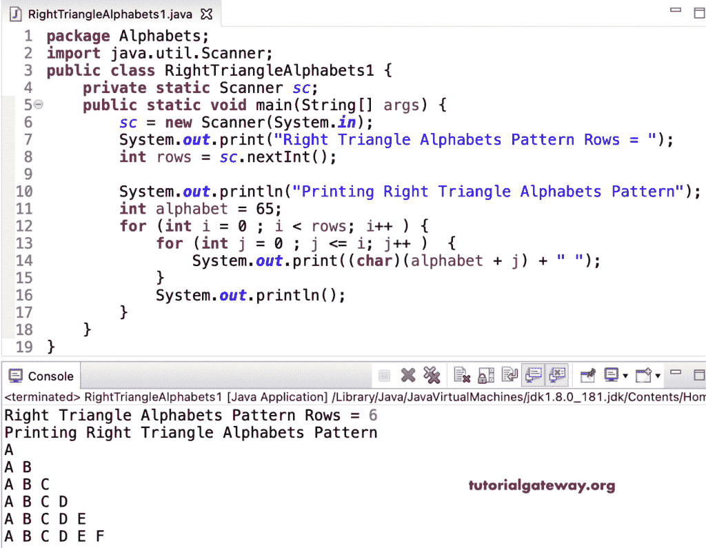

# Java 程序：打印直角三角形字母图案

> 原文：<https://www.tutorialgateway.org/java-program-to-print-right-triangle-alphabets-pattern/>

编写一个 Java 程序来打印直角三角形字母模式，用于循环。

```java
package Alphabets;

import java.util.Scanner;

public class RightTriangleAlphabets1 {

	private static Scanner sc;

	public static void main(String[] args) {

		sc = new Scanner(System.in);	

		System.out.print("Right Triangle Alphabets Pattern Rows = ");
		int rows = sc.nextInt();

		System.out.println("Printing Right Triangle Alphabets Pattern");
		int alphabet = 65;

		for (int i = 0 ; i < rows; i++ ) 
		{
			for (int j = 0 ; j <= i; j++ ) 	
			{
				System.out.print((char)(alphabet + j) + " ");
			}
			System.out.println();
		}
	}
}
```



这个 [Java 示例](https://www.tutorialgateway.org/learn-java-programs/)使用 while 循环以直角三角形模式显示字母。

```java
package Alphabets;

import java.util.Scanner;

public class RightTriangleAlphabets2 {

	private static Scanner sc;

	public static void main(String[] args) {

		sc = new Scanner(System.in);	

		System.out.print("Right Triangle Alphabets Pattern Rows = ");
		int rows = sc.nextInt();

		System.out.println("Printing Right Triangle Alphabets Pattern");
		int alphabet = 65, i = 0, j;

		while( i < rows ) 
		{
			j = 0 ; 
			while (j <= i ) 	
			{
				System.out.print((char)(alphabet + j) + " ");
				j++;
			}
			System.out.println();
			i++;
		}
	}
}
```

```java
Right Triangle Alphabets Pattern Rows = 9
Printing Right Triangle Alphabets Pattern
A 
A B 
A B C 
A B C D 
A B C D E 
A B C D E F 
A B C D E F G 
A B C D E F G H 
A B C D E F G H I 
```

Java 程序打印直角三角形字母模式使用 do while 循环。

```java
package Alphabets;

import java.util.Scanner;

public class RightTriangleAlphabets3 {

	private static Scanner sc;

	public static void main(String[] args) {

		sc = new Scanner(System.in);	

		System.out.print("Right Triangle Alphabets Pattern Rows = ");
		int rows = sc.nextInt();

		System.out.println("Printing Right Triangle Alphabets Pattern");
		int alphabet = 65, i = 0, j;

		do
		{
			j = 0 ; 
			do 	
			{
				System.out.print((char)(alphabet + j) + " ");

			} while (++j <= i) ;

			System.out.println();

		} while( ++i < rows );
	}
}
```

```java
Right Triangle Alphabets Pattern Rows = 14
Printing Right Triangle Alphabets Pattern
A 
A B 
A B C 
A B C D 
A B C D E 
A B C D E F 
A B C D E F G 
A B C D E F G H 
A B C D E F G H I 
A B C D E F G H I J 
A B C D E F G H I J K 
A B C D E F G H I J K L 
A B C D E F G H I J K L M 
A B C D E F G H I J K L M N 
```