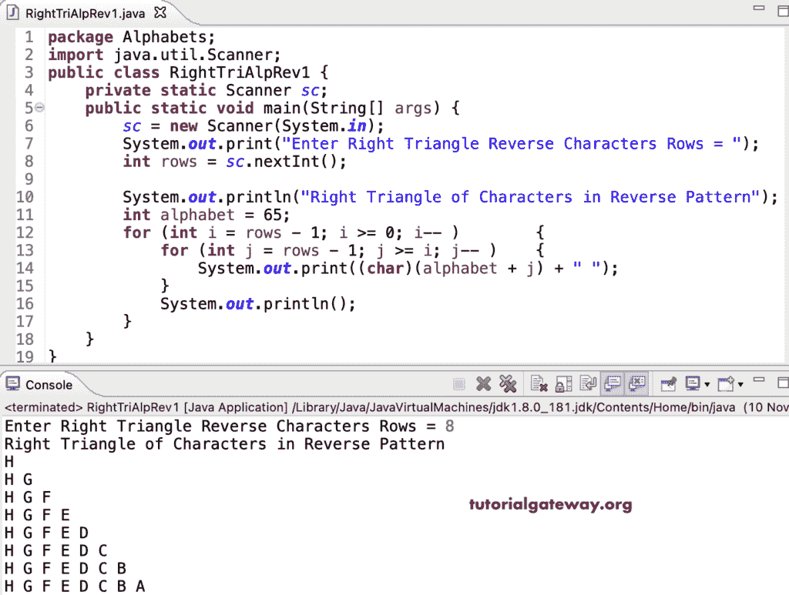

# Java 程序：反向打印字母的直角三角形

> 原文：<https://www.tutorialgateway.org/java-program-to-print-right-triangle-of-alphabets-in-reverse/>

编写一个 Java 程序，使用 for 循环以相反的模式打印字母的直角三角形。

```java
package Alphabets;

import java.util.Scanner;

public class RightTriAlpRev1 {

	private static Scanner sc;

	public static void main(String[] args) {

		sc = new Scanner(System.in);	

		System.out.print("Enter Right Triangle Reverse Characters Rows = ");
		int rows = sc.nextInt();

		System.out.println("Right Triangle of Characters in Reverse Pattern");
		int alphabet = 65;

		for (int i = rows - 1; i >= 0; i-- ) 
		{
			for (int j = rows - 1; j >= i; j-- ) 	
			{
				System.out.print((char)(alphabet + j) + " ");
			}
			System.out.println();
		}
	}
}
```



这个 Java 模式程序使用 while 循环以逆序或降序打印字母的直角三角形。

```java
package Alphabets;

import java.util.Scanner;

public class RightTriAlpRev2 {

	private static Scanner sc;

	public static void main(String[] args) {

		sc = new Scanner(System.in);	

		System.out.print("Enter Right Triangle Reverse Characters Rows = ");
		int rows = sc.nextInt();

		System.out.println("Right Triangle of Characters in Reverse Pattern");
		int alphabet = 65;
		int j, i = rows - 1;

		while( i >= 0) 
		{
			j = rows - 1;
			while(j >= i) 	
			{
				System.out.print((char)(alphabet + j) + " ");
				j--;
			}
			System.out.println();
			i--;
		}
	}
}
```

```java
Enter Right Triangle Reverse Characters Rows = 19
Right Triangle of Characters in Reverse Pattern
S 
S R 
S R Q 
S R Q P 
S R Q P O 
S R Q P O N 
S R Q P O N M 
S R Q P O N M L 
S R Q P O N M L K 
S R Q P O N M L K J 
S R Q P O N M L K J I 
S R Q P O N M L K J I H 
S R Q P O N M L K J I H G 
S R Q P O N M L K J I H G F 
S R Q P O N M L K J I H G F E 
S R Q P O N M L K J I H G F E D 
S R Q P O N M L K J I H G F E D C 
S R Q P O N M L K J I H G F E D C B 
S R Q P O N M L K J I H G F E D C B A 
```

这个 [Java 示例](https://www.tutorialgateway.org/learn-java-programs/)使用 do while 循环以相反的顺序显示字母的直角三角形模式。

```java
package Alphabets;

import java.util.Scanner;

public class RightTriAlpRev3 {

	private static Scanner sc;

	public static void main(String[] args) {

		sc = new Scanner(System.in);	

		System.out.print("Enter Right Triangle Reverse Characters Rows = ");
		int rows = sc.nextInt();

		System.out.println("Right Triangle of Characters in Reverse Pattern");
		int alphabet = 65;
		int j, i = rows - 1;

		do
		{
			j = rows - 1;
			do  	
			{
				System.out.print((char)(alphabet + j) + " ");

			} while(--j >= i);
			System.out.println();
		} while(--i >= 0);
	}
}
```

```java
Enter Right Triangle Reverse Characters Rows = 15
Right Triangle of Characters in Reverse Pattern
O 
O N 
O N M 
O N M L 
O N M L K 
O N M L K J 
O N M L K J I 
O N M L K J I H 
O N M L K J I H G 
O N M L K J I H G F 
O N M L K J I H G F E 
O N M L K J I H G F E D 
O N M L K J I H G F E D C 
O N M L K J I H G F E D C B 
O N M L K J I H G F E D C B A 
```