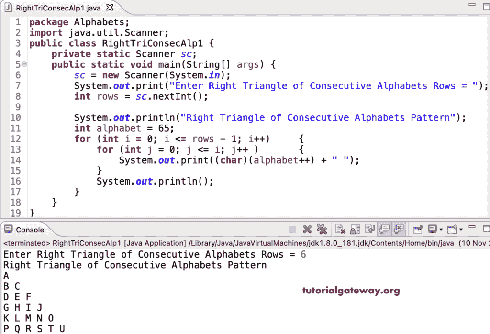

# Java 程序：打印连续字母直角三角形图案

> 原文：<https://www.tutorialgateway.org/java-program-to-print-right-triangle-of-consecutive-alphabets-pattern/>

编写一个 Java 程序，使用 for 循环打印字母的连续图案的直角三角形。

```java
package Alphabets;
import java.util.Scanner;

public class RightTriConsecAlp1 {

	private static Scanner sc;

	public static void main(String[] args) {

		sc = new Scanner(System.in);	

		System.out.print("Enter Right Triangle of Consecutive Alphabets Rows = ");
		int rows = sc.nextInt();

		System.out.println("Right Triangle of Consecutive Alphabets Pattern");
		int alphabet = 65;

		for (int i = 0; i <= rows - 1; i++) 
		{
			for (int j = 0; j <= i; j++ ) 	
			{
				System.out.print((char)(alphabet++) + " ");
			}
			System.out.println();
		}
	}
}
```



这个 Java 程序使用 while 循环打印连续字母的直角三角形模式。

```java
package Alphabets;

import java.util.Scanner;

public class RightTriConsecAlp2 {

	private static Scanner sc;

	public static void main(String[] args) {

		sc = new Scanner(System.in);	

		System.out.print("Enter Right Triangle of Consecutive Alphabets Rows = ");
		int rows = sc.nextInt();

		System.out.println("Right Triangle of Consecutive Alphabets Pattern");
		int alphabet = 65;

		int j, i = 0; 

		while(i <= rows - 1) 
		{
			j = 0;

			while(j <= i ) 	
			{
				System.out.print((char)(alphabet++) + " ");
				j++;
			}
			System.out.println();
			i++;
		}
	}
}
```

```java
Enter Right Triangle of Consecutive Alphabets Rows = 8
Right Triangle of Consecutive Alphabets Pattern
A 
B C 
D E F 
G H I J 
K L M N O 
P Q R S T U 
V W X Y Z [ \ 
] ^ _ ` a b c d 
```

这个 [Java 示例](https://www.tutorialgateway.org/learn-java-programs/)使用 do while 循环显示连续列字母的直角三角形模式。

```java
package Alphabets;

import java.util.Scanner;

public class RightTriConsecAlp3 {

	private static Scanner sc;

	public static void main(String[] args) {

		sc = new Scanner(System.in);	

		System.out.print("Enter Right Triangle of Consecutive Alphabets Rows = ");
		int rows = sc.nextInt();

		System.out.println("Right Triangle of Consecutive Alphabets Pattern");
		int alphabet = 65;

		int j, i = 0; 

		do
		{
			j = 0;

			do 	
			{
				System.out.print((char)(alphabet++) + " ");

			} while(++j <= i );

			System.out.println();

		} while(++i <= rows - 1);
	}
}
```

```java
Enter Right Triangle of Consecutive Alphabets Rows = 9
Right Triangle of Consecutive Alphabets Pattern
A 
B C 
D E F 
G H I J 
K L M N O 
P Q R S T U 
V W X Y Z [ \ 
] ^ _ ` a b c d 
e f g h i j k l m 
```