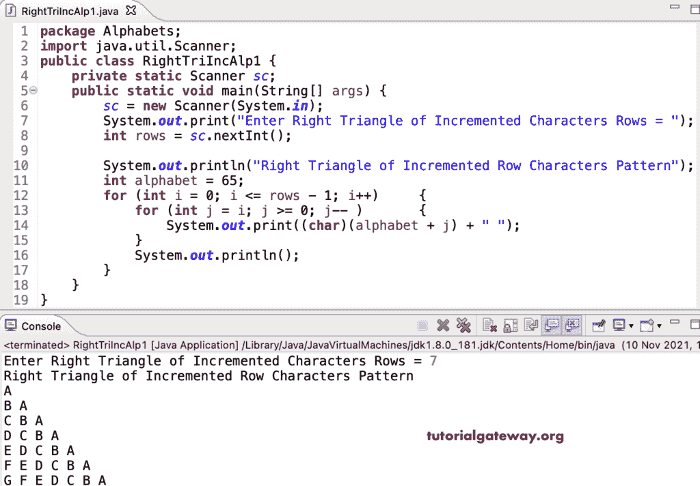

# Java 程序：打印字母的增量图案直角三角形

> 原文：<https://www.tutorialgateway.org/java-program-to-print-right-triangle-of-incremental-alphabets-pattern/>

编写一个 Java 程序，使用 for 循环打印字母的增量图案的直角三角形。

```java
package Alphabets;

import java.util.Scanner;

public class RightTriIncAlp1 {

	private static Scanner sc;

	public static void main(String[] args) {

		sc = new Scanner(System.in);	

		System.out.print("Enter Right Triangle of Incremented Characters Rows = ");
		int rows = sc.nextInt();

		System.out.println("Right Triangle of Incremented Row Characters Pattern");
		int alphabet = 65;

		for (int i = 0; i <= rows - 1; i++) 
		{
			for (int j = i; j >= 0; j-- ) 	
			{
				System.out.print((char)(alphabet + j) + " ");
			}
			System.out.println();
		}
	}
}
```



这个 Java 示例使用 while 循环打印递增字母或升序的直角三角形图案。

```java
package Alphabets;

import java.util.Scanner;

public class RightTriIncAlp2 {

	private static Scanner sc;

	public static void main(String[] args) {

		sc = new Scanner(System.in);	

		System.out.print("Enter Right Triangle of Incremented Characters Rows = ");
		int rows = sc.nextInt();

		System.out.println("Right Triangle of Incremented Row Characters Pattern");

		int i, j, alphabet = 65;

		i = 0;
		while(i <= rows - 1) 
		{
			j = i;
			while(j >= 0 ) 	
			{
				System.out.print((char)(alphabet + j) + " ");
				j--;
			}
			System.out.println();
			i++;
		}
	}
}
```

```java
Enter Right Triangle of Incremented Characters Rows = 13
Right Triangle of Incremented Row Characters Pattern
A 
B A 
C B A 
D C B A 
E D C B A 
F E D C B A 
G F E D C B A 
H G F E D C B A 
I H G F E D C B A 
J I H G F E D C B A 
K J I H G F E D C B A 
L K J I H G F E D C B A 
M L K J I H G F E D C B A 
```

这个 [Java 程序](https://www.tutorialgateway.org/learn-java-programs/)使用 do while 循环来显示递增字母的直角三角形图案。

```java
package Alphabets;

import java.util.Scanner;

public class RightTriIncAlp3 {

	private static Scanner sc;

	public static void main(String[] args) {

		sc = new Scanner(System.in);	

		System.out.print("Enter Right Triangle of Incremented Characters Rows = ");
		int rows = sc.nextInt();

		System.out.println("Right Triangle of Incremented Row Characters Pattern");

		int i, j, alphabet = 65;

		i = 0;
		do 
		{
			j = i;
			do 	
			{
				System.out.print((char)(alphabet + j) + " ");

			} while(--j >= 0 );

			System.out.println();

		} while(++i <= rows - 1);
	}
}
```

```java
Enter Right Triangle of Incremented Characters Rows = 16
Right Triangle of Incremented Row Characters Pattern
A 
B A 
C B A 
D C B A 
E D C B A 
F E D C B A 
G F E D C B A 
H G F E D C B A 
I H G F E D C B A 
J I H G F E D C B A 
K J I H G F E D C B A 
L K J I H G F E D C B A 
M L K J I H G F E D C B A 
N M L K J I H G F E D C B A 
O N M L K J I H G F E D C B A 
P O N M L K J I H G F E D C B A 
```