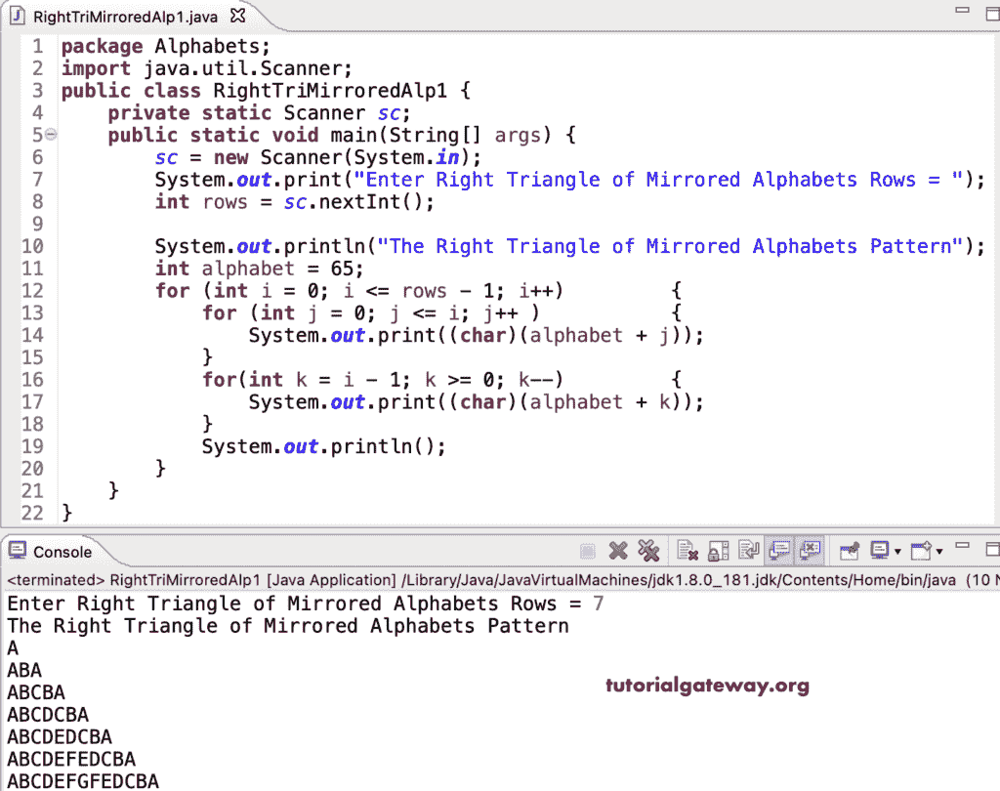

# Java 程序：打印镜像字母直角三角形图案

> 原文：<https://www.tutorialgateway.org/java-program-to-print-right-triangle-of-mirrored-alphabets-pattern/>

写一个 Java 程序来打印直角三角形的镜像字母图案，用于循环。

```java
package Alphabets;

import java.util.Scanner;

public class RightTriMirroredAlp1 {

	private static Scanner sc;

	public static void main(String[] args) {

		sc = new Scanner(System.in);	

		System.out.print("Enter Right Triangle of Mirrored Alphabets Rows = ");
		int rows = sc.nextInt();

		System.out.println("The Right Triangle of Mirrored Alphabets Pattern");

		int alphabet = 65;

		for (int i = 0; i <= rows - 1; i++) 
		{
			for (int j = 0; j <= i; j++ ) 	
			{
				System.out.print((char)(alphabet + j));
			}
			for(int k = i - 1; k >= 0; k--)
			{
				System.out.print((char)(alphabet + k));
			}
			System.out.println();
		}
	}
}
```



这个 [Java 示例](https://www.tutorialgateway.org/learn-java-programs/)使用 while 循环打印镜像字母图案的直角三角形。

```java
package Alphabets;

import java.util.Scanner;

public class RightTriMirroredAlp2 {

	private static Scanner sc;

	public static void main(String[] args) {

		sc = new Scanner(System.in);	

		System.out.print("Enter Right Triangle of Mirrored Alphabets Rows = ");
		int rows = sc.nextInt();

		System.out.println("The Right Triangle of Mirrored Alphabets Pattern");

		int alphabet = 65;
		int j, k, i = 0;

		while( i <= rows - 1) 
		{
			j = 0;
			while(j <= i ) 	
			{
				System.out.print((char)(alphabet + j));
				j++;
			}

			k = i - 1;
			while(k >= 0)
			{
				System.out.print((char)(alphabet + k));
				k--;
			}
			System.out.println();
			i++;
		}
	}
}
```

```java
Enter Right Triangle of Mirrored Alphabets Rows = 17
The Right Triangle of Mirrored Alphabets Pattern
A
ABA
ABCBA
ABCDCBA
ABCDEDCBA
ABCDEFEDCBA
ABCDEFGFEDCBA
ABCDEFGHGFEDCBA
ABCDEFGHIHGFEDCBA
ABCDEFGHIJIHGFEDCBA
ABCDEFGHIJKJIHGFEDCBA
ABCDEFGHIJKLKJIHGFEDCBA
ABCDEFGHIJKLMLKJIHGFEDCBA
ABCDEFGHIJKLMNMLKJIHGFEDCBA
ABCDEFGHIJKLMNONMLKJIHGFEDCBA
ABCDEFGHIJKLMNOPONMLKJIHGFEDCBA
ABCDEFGHIJKLMNOPQPONMLKJIHGFEDCBA
```