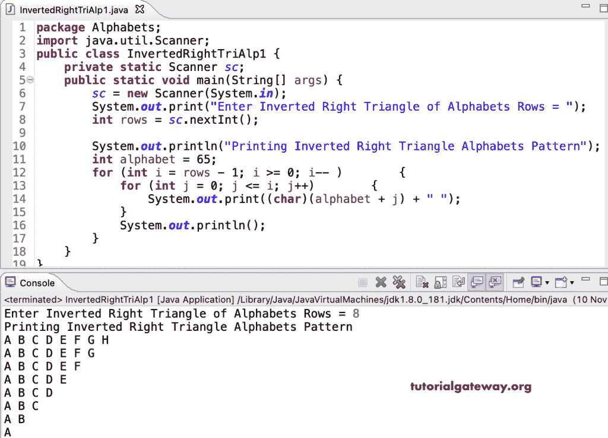

# Java 程序：打印字母的倒直角三角形图案

> 原文：<https://www.tutorialgateway.org/java-program-to-print-inverted-right-triangle-alphabets-pattern/>

写一个 Java 程序打印字母的倒直角三角形图案用于循环。

```java
package Alphabets;

import java.util.Scanner;

public class InvertedRightTriAlp1 {

	private static Scanner sc;

	public static void main(String[] args) {

		sc = new Scanner(System.in);	

		System.out.print("Enter Inverted Right Triangle of Alphabets Rows = ");
		int rows = sc.nextInt();

		System.out.println("Printing Inverted Right Triangle Alphabets Pattern");
		int alphabet = 65;

		for (int i = rows - 1; i >= 0; i-- ) 
		{
			for (int j = 0; j <= i; j++) 	
			{
				System.out.print((char)(alphabet + j) + " ");
			}
			System.out.println();
		}
	}
}
```



这个 Java 程序使用 while 循环打印字母的倒直角三角形模式。

```java
package Alphabets;

import java.util.Scanner;

public class InvertedRightTriAlp2 {

	private static Scanner sc;

	public static void main(String[] args) {

		sc = new Scanner(System.in);	

		System.out.print("Enter Inverted Right Triangle of Alphabets Rows = ");
		int rows = sc.nextInt();

		System.out.println("Printing Inverted Right Triangle Alphabets Pattern\n");
		int i, j, alphabet = 65;

		i = rows - 1;
		while (i >= 0 ) 
		{
			j = 0;
			while(j <= i) 	
			{
				System.out.print((char)(alphabet + j) + " ");
				j++;
			}
			System.out.println();
			i--;
		}
	}
}
```

```java
Enter Inverted Right Triangle of Alphabets Rows = 13
Printing Inverted Right Triangle Alphabets Pattern

A B C D E F G H I J K L M 
A B C D E F G H I J K L 
A B C D E F G H I J K 
A B C D E F G H I J 
A B C D E F G H I 
A B C D E F G H 
A B C D E F G 
A B C D E F 
A B C D E 
A B C D 
A B C 
A B 
A 
```

这个 [Java 示例](https://www.tutorialgateway.org/learn-java-programs/)使用 do while 循环显示字母的倒直角三角形模式。

```java
package Alphabets;

import java.util.Scanner;

public class InvertedRightTriAlp3 {

	private static Scanner sc;

	public static void main(String[] args) {

		sc = new Scanner(System.in);	

		System.out.print("Enter Inverted Right Triangle of Alphabets Rows = ");
		int rows = sc.nextInt();

		System.out.println("Printing Inverted Right Triangle Alphabets Pattern\n");
		int i, j, alphabet = 65;

		i = rows - 1;
		do 
		{
			j = 0;
			do	
			{
				System.out.print((char)(alphabet + j) + " ");

			} while(++j <= i);
			System.out.println();

		} while (--i >= 0 );
	}
}
```

```java
Enter Inverted Right Triangle of Alphabets Rows = 16
Printing Inverted Right Triangle Alphabets Pattern

A B C D E F G H I J K L M N O P 
A B C D E F G H I J K L M N O 
A B C D E F G H I J K L M N 
A B C D E F G H I J K L M 
A B C D E F G H I J K L 
A B C D E F G H I J K 
A B C D E F G H I J 
A B C D E F G H I 
A B C D E F G H 
A B C D E F G 
A B C D E F 
A B C D E 
A B C D 
A B C 
A B 
A
```