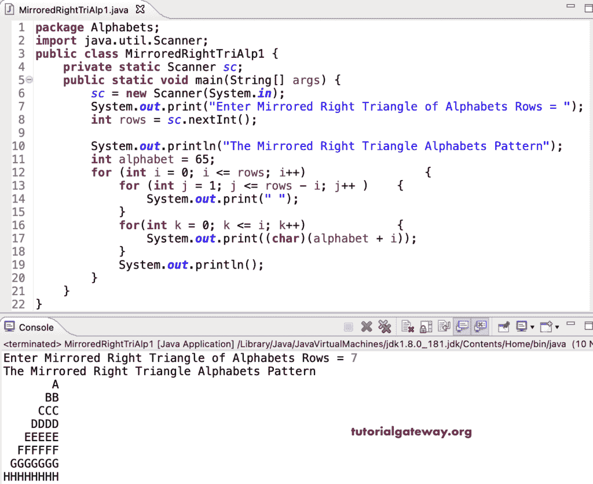

# Java 程序：打印镜像直角三角形字母图案

> 原文：<https://www.tutorialgateway.org/java-program-to-print-mirrored-right-triangle-alphabets-pattern/>

编写一个 Java 程序，使用 for 循环打印镜像直角三角形字母模式。

```java
package Alphabets;
import java.util.Scanner;

public class MirroredRightTriAlp1 {

	private static Scanner sc;

	public static void main(String[] args) {

		sc = new Scanner(System.in);	

		System.out.print("Enter Mirrored Right Triangle of Alphabets Rows = ");
		int rows = sc.nextInt();

		System.out.println("The Mirrored Right Triangle Alphabets Pattern");

		int alphabet = 65;

		for (int i = 0; i <= rows; i++) 
		{
			for (int j = 1; j <= rows - i; j++ ) 	
			{
				System.out.print(" ");
			}
			for(int k = 0; k <= i; k++)
			{
				System.out.print((char)(alphabet + i));
			}
			System.out.println();
		}
	}
}
```



这个 Java 程序使用 while 循环打印字母的镜像直角三角形模式。

```java
package Alphabets;

import java.util.Scanner;

public class MirroredRightTriAlp2 {

	private static Scanner sc;

	public static void main(String[] args) {

		sc = new Scanner(System.in);	

		System.out.print("Enter Mirrored Right Triangle of Alphabets Rows = ");
		int rows = sc.nextInt();

		System.out.println("The Mirrored Right Triangle Alphabets Pattern");

		int alphabet = 65;
		int j, k, i = 0; 

		while(i <= rows) 
		{
			j = 1;
			while(j <= rows - i ) 	
			{
				System.out.print(" ");
				j++;
			}

			k = 0;
			while( k <= i)
			{
				System.out.print((char)(alphabet + i));
				k++;
			}
			System.out.println();
			i++;
		}
	}
}
```

```java
Enter Mirrored Right Triangle of Alphabets Rows = 18
The Mirrored Right Triangle Alphabets Pattern
                  A
                 BB
                CCC
               DDDD
              EEEEE
             FFFFFF
            GGGGGGG
           HHHHHHHH
          IIIIIIIII
         JJJJJJJJJJ
        KKKKKKKKKKK
       LLLLLLLLLLLL
      MMMMMMMMMMMMM
     NNNNNNNNNNNNNN
    OOOOOOOOOOOOOOO
   PPPPPPPPPPPPPPPP
  QQQQQQQQQQQQQQQQQ
 RRRRRRRRRRRRRRRRRR
SSSSSSSSSSSSSSSSSSS
```

这个 [Java 示例](https://www.tutorialgateway.org/learn-java-programs/)使用 do while 循环来显示字母模式的直角三角形。

```java
package Alphabets;

import java.util.Scanner;

public class MirroredRightTriAlp3 {

	private static Scanner sc;

	public static void main(String[] args) {

		sc = new Scanner(System.in);	

		System.out.print("Enter Mirrored Right Triangle of Alphabets Rows = ");
		int rows = sc.nextInt();

		System.out.println("The Mirrored Right Triangle Alphabets Pattern");

		int alphabet = 65;
		int j, k, i = 0; 

		do
		{
			j = 1;
			do	
			{
				System.out.print(" ");

			} while(j++ <= rows - i );

			k = 0;
			do
			{
				System.out.print((char)(alphabet + i));

			} while( ++k <= i);
			System.out.println();

		} while(++i < rows);
	}
}
```

```java
Enter Mirrored Right Triangle of Alphabets Rows = 15
The Mirrored Right Triangle Alphabets Pattern
                A
               BB
              CCC
             DDDD
            EEEEE
           FFFFFF
          GGGGGGG
         HHHHHHHH
        IIIIIIIII
       JJJJJJJJJJ
      KKKKKKKKKKK
     LLLLLLLLLLLL
    MMMMMMMMMMMMM
   NNNNNNNNNNNNNN
  OOOOOOOOOOOOOOO
```