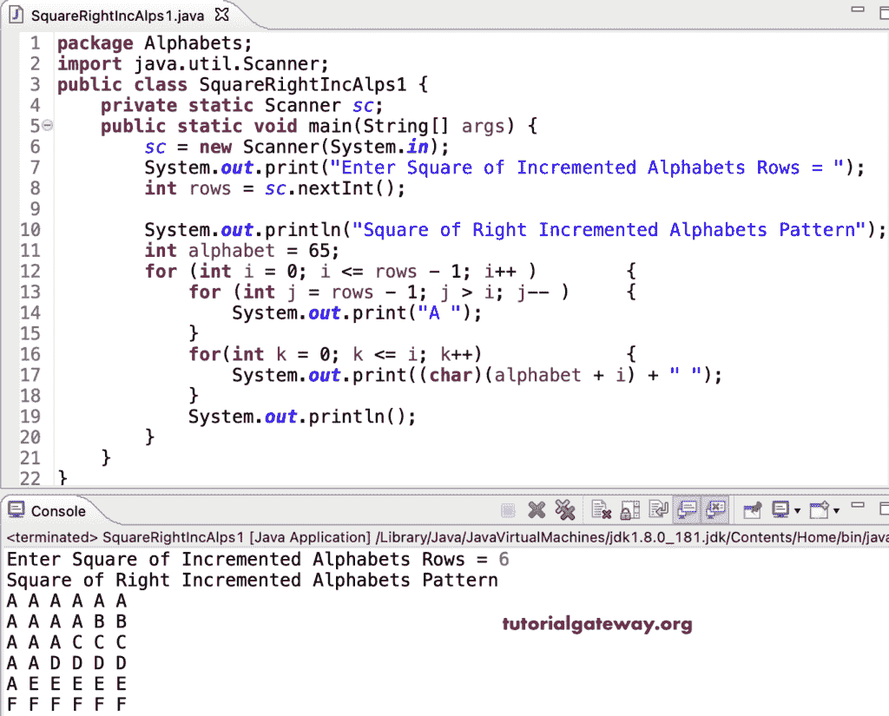

# Java 程序：打印右递增字母的方形图案

> 原文：<https://www.tutorialgateway.org/java-program-to-print-square-of-right-increment-alphabets-pattern/>

编写一个 Java 程序来打印字母的用于循环的直角增量图案的方块。

```java
package Alphabets;

import java.util.Scanner;

public class SquareRightIncAlps1 {

	private static Scanner sc;

	public static void main(String[] args) {

		sc = new Scanner(System.in);	

		System.out.print("Enter Square of Incremented Alphabets Rows = ");
		int rows = sc.nextInt();

		System.out.println("Square of Right Incremented Alphabets Pattern");
		int alphabet = 65;

		for (int i = 0; i <= rows - 1; i++ ) 
		{
			for (int j = rows - 1; j > i; j-- ) 	
			{
				System.out.print("A ");
			}
			for(int k = 0; k <= i; k++)
			{
				System.out.print((char)(alphabet + i) + " ");
			}
			System.out.println();
		}
	}
}
```



这个 [Java 程序](https://www.tutorialgateway.org/learn-java-programs/)使用 while 循环从右手边打印增量字母的正方形图案。

```java
package Alphabets;

import java.util.Scanner;

public class SquareRightIncAlps2 {

	private static Scanner sc;

	public static void main(String[] args) {

		sc = new Scanner(System.in);	

		System.out.print("Enter Square of Incremented Alphabets Rows = ");
		int rows = sc.nextInt();

		System.out.println("Square of Right Incremented Alphabets Pattern");
		int alphabet = 65;
		int j, k, i = 0;

		while(i <= rows - 1 ) 
		{
			j = rows - 1;
			while(j > i ) 	
			{
				System.out.print("A ");
				j--;
			}

			k = 0;
			while( k <= i)
			{
				System.out.print((char)(alphabet + i) + " ");
				k++;
			}
			System.out.println();
			i++;
		}
	}
}
```

```java
Enter Square of Incremented Alphabets Rows = 14
Square of Right Incremented Alphabets Pattern
A A A A A A A A A A A A A A 
A A A A A A A A A A A A B B 
A A A A A A A A A A A C C C 
A A A A A A A A A A D D D D 
A A A A A A A A A E E E E E 
A A A A A A A A F F F F F F 
A A A A A A A G G G G G G G 
A A A A A A H H H H H H H H 
A A A A A I I I I I I I I I 
A A A A J J J J J J J J J J 
A A A K K K K K K K K K K K 
A A L L L L L L L L L L L L 
A M M M M M M M M M M M M M 
N N N N N N N N N N N N N N 
```