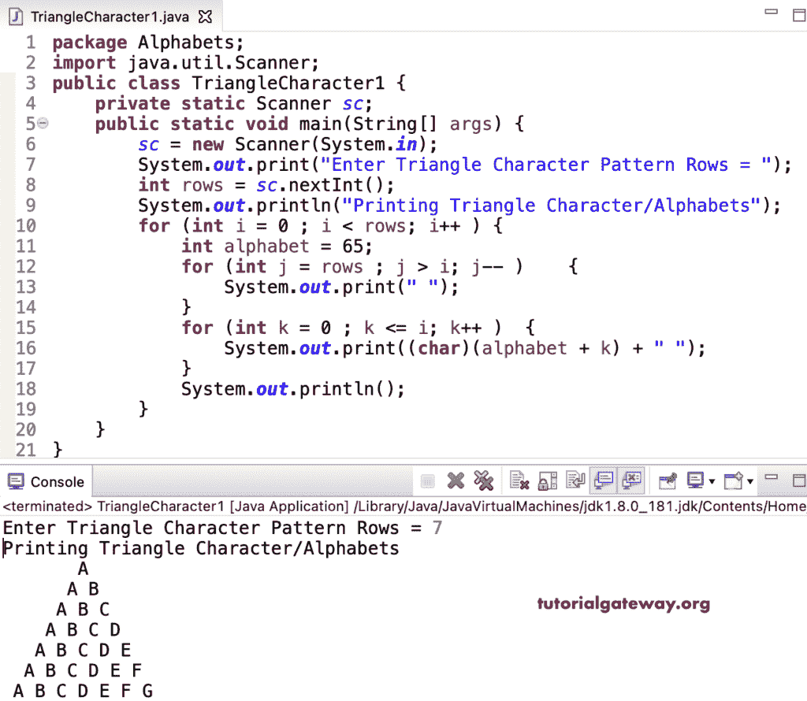

# Java 程序：打印三角形字母图案

> 原文：<https://www.tutorialgateway.org/java-program-to-print-triangle-alphabets-pattern/>

编写一个 Java 程序来打印三角形字母图案，用于循环。

```java
package Alphabets;

import java.util.Scanner;

public class TriangleCharacter1 {

	private static Scanner sc;

	public static void main(String[] args) {

		sc = new Scanner(System.in);	

		System.out.print("Enter Triangle Character Pattern Rows = ");
		int rows = sc.nextInt();

		System.out.println("Printing Triangle Character/Alphabets Pattern");

		for (int i = 0 ; i < rows; i++ ) 
		{
			int alphabet = 65;
			for (int j = rows ; j > i; j-- ) 	
			{
				System.out.print(" ");
			}
			for (int k = 0 ; k <= i; k++ ) 	
			{
				System.out.print((char)(alphabet + k) + " ");
			}
			System.out.println();
		}
	}
}
```



这个 [Java 示例](https://www.tutorialgateway.org/learn-java-programs/)使用 while 循环以三角形模式显示字母。

```java
package Alphabets;

import java.util.Scanner;

public class TriangleCharacter2 {

	private static Scanner sc;

	public static void main(String[] args) {

		sc = new Scanner(System.in);	
		int alphabet, i = 0, j, k;

		System.out.print("Enter Triangle Character Pattern Rows = ");
		int rows = sc.nextInt();

		System.out.println("Printing Triangle Character/Alphabets Pattern");

		while(i < rows ) 
		{
			alphabet = 65;
			j = rows ;

			while(j > i ) 	
			{
				System.out.print(" ");
				j--;
			}

			k = 0 ;
			while( k <= i ) 	
			{
				System.out.print((char)(alphabet + k) + " ");
				k++;
			}
			System.out.println();
			i++;
		}
	}
}
```

```java
Enter Triangle Character Pattern Rows = 9
Printing Triangle Character/Alphabets Pattern
         A 
        A B 
       A B C 
      A B C D 
     A B C D E 
    A B C D E F 
   A B C D E F G 
  A B C D E F G H 
 A B C D E F G H I 
```

Java 程序打印三角形字母图案使用 do while 循环。

```java
package Alphabets;

import java.util.Scanner;

public class TriangleCharacter3 {

	private static Scanner sc;

	public static void main(String[] args) {

		sc = new Scanner(System.in);	
		int alphabet, i = 0, j, k;

		System.out.print("Enter Triangle Character Pattern Rows = ");
		int rows = sc.nextInt();

		System.out.println("Printing Triangle Character/Alphabets Pattern");

		do
		{
			alphabet = 65;
			j = rows ;

			do 	
			{
				System.out.print(" ");

			} while(--j > i );

			k = 0 ;
			do	
			{
				System.out.print((char)(alphabet + k) + " ");

			} while( ++k <= i );

			System.out.println();

		} while(++i < rows );
	}
}
```

```java
Enter Triangle Character Pattern Rows = 14
Printing Triangle Character/Alphabets Pattern
              A 
             A B 
            A B C 
           A B C D 
          A B C D E 
         A B C D E F 
        A B C D E F G 
       A B C D E F G H 
      A B C D E F G H I 
     A B C D E F G H I J 
    A B C D E F G H I J K 
   A B C D E F G H I J K L 
  A B C D E F G H I J K L M 
 A B C D E F G H I J K L M N 
```