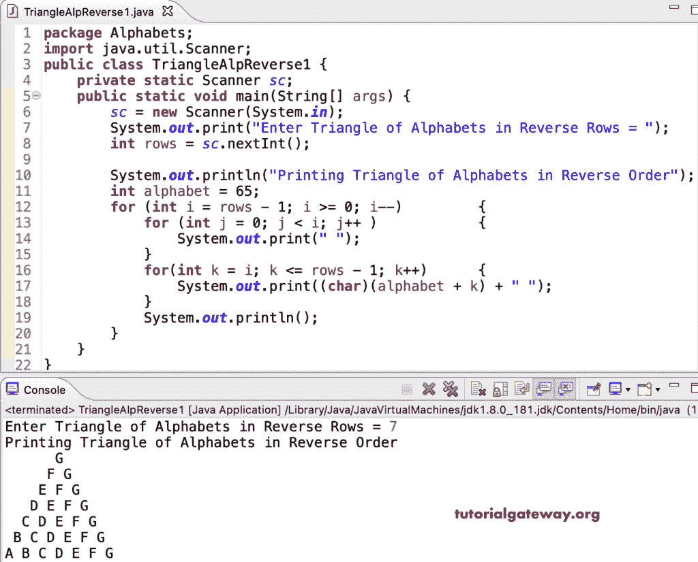

# Java 程序：打印字母的倒三角

> 原文：<https://www.tutorialgateway.org/java-program-to-print-triangle-of-alphabets-in-reverse-pattern/>

编写一个 Java 程序，使用 for 循环以反向模式打印字母三角形。

```java
package Alphabets;
import java.util.Scanner;

public class TriangleAlpReverse1 {

	private static Scanner sc;

	public static void main(String[] args) {

		sc = new Scanner(System.in);	

		System.out.print("Enter Triangle of Alphabets in Reverse Rows = ");
		int rows = sc.nextInt();

		System.out.println("Printing Triangle of Alphabets in Reverse Order");

		int alphabet = 65;

		for (int i = rows - 1; i >= 0; i--) 
		{
			for (int j = 0; j < i; j++ ) 	
			{
				System.out.print(" ");
			}
			for(int k = i; k <= rows - 1; k++)
			{
				System.out.print((char)(alphabet + k) + " ");
			}
			System.out.println();
		}
	}
}
```



Java 程序，使用 while 循环以相反的顺序打印字母的三角形图案。

```java
package Alphabets;

import java.util.Scanner;

public class TriangleAlpReverse2 {

	private static Scanner sc;

	public static void main(String[] args) {

		sc = new Scanner(System.in);	

		System.out.print("Enter Triangle of Alphabets in Reverse Rows = ");
		int rows = sc.nextInt();

		System.out.println("Printing Triangle of Alphabets in Reverse Order");

		int i, j, k, alphabet = 65;

		i = rows - 1;
		while(i >= 0) 
		{

			j = 0;
			while( j < i ) 	
			{
				System.out.print(" ");
				j++;
			}

			k = i;
			while(k <= rows - 1)
			{
				System.out.print((char)(alphabet + k) + " ");
				k++;
			}

			System.out.println();
			i--;
		}
	}
}
```

```java
Enter Triangle of Alphabets in Reverse Rows = 13
Printing Triangle of Alphabets in Reverse Order
            M 
           L M 
          K L M 
         J K L M 
        I J K L M 
       H I J K L M 
      G H I J K L M 
     F G H I J K L M 
    E F G H I J K L M 
   D E F G H I J K L M 
  C D E F G H I J K L M 
 B C D E F G H I J K L M 
A B C D E F G H I J K L M 
```

这个 Java 模式[示例](https://www.tutorialgateway.org/learn-java-programs/)使用 do while 循环以降序或逆序打印字母三角形。

```java
package Alphabets;

import java.util.Scanner;

public class TriangleAlpReverse3 {

	private static Scanner sc;

	public static void main(String[] args) {

		sc = new Scanner(System.in);	

		System.out.print("Enter Triangle of Alphabets in Reverse Rows = ");
		int rows = sc.nextInt();

		System.out.println("Printing Triangle of Alphabets in Reverse Order");

		int i, j, k, alphabet = 65;

		i = rows - 1;
		do 
		{

			j = 0;
			do	
			{
				System.out.print(" ");

			} while( j++ < i ) ;

			k = i;
			do
			{
				System.out.print((char)(alphabet + k) + " ");

			} while(++k <= rows - 1);

			System.out.println();

		} while(--i >= 0);
	}
}
```

```java
Enter Triangle of Alphabets in Reverse Rows = 16
Printing Triangle of Alphabets in Reverse Order
                P 
               O P 
              N O P 
             M N O P 
            L M N O P 
           K L M N O P 
          J K L M N O P 
         I J K L M N O P 
        H I J K L M N O P 
       G H I J K L M N O P 
      F G H I J K L M N O P 
     E F G H I J K L M N O P 
    D E F G H I J K L M N O P 
   C D E F G H I J K L M N O P 
  B C D E F G H I J K L M N O P 
 A B C D E F G H I J K L M N O P 
```