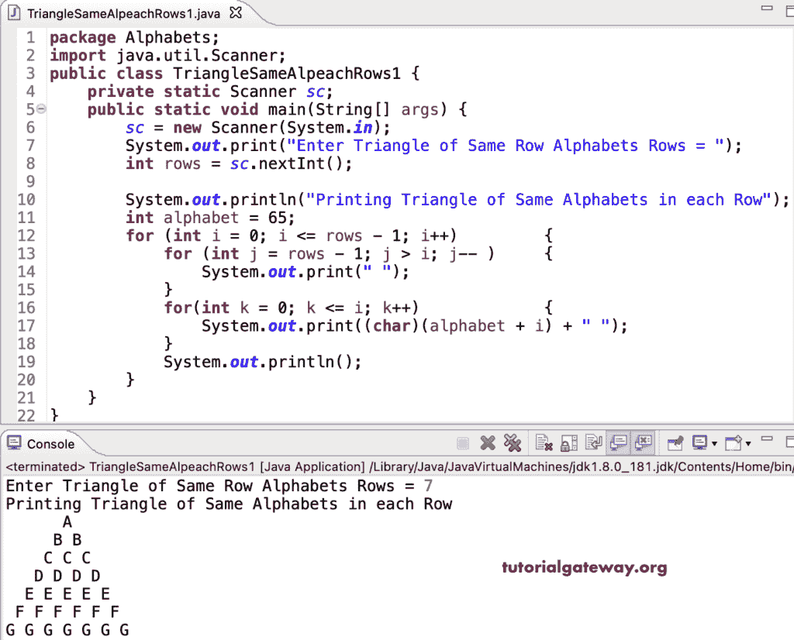

# Java 程序：打印相同字母的三角形图案

> 原文：<https://www.tutorialgateway.org/java-program-to-print-triangle-of-same-alphabets-pattern/>

编写一个 Java 程序，使用 for 循环打印字母的每行中相同图案的三角形。

```java
package Alphabets;
import java.util.Scanner;

public class TriangleSameAlpeachRows1 {

	private static Scanner sc;

	public static void main(String[] args) {

		sc = new Scanner(System.in);	

		System.out.print("Enter Triangle of Same Row Alphabets Rows = ");
		int rows = sc.nextInt();

		System.out.println("Printing Triangle of Same Alphabets in each Row");

		int alphabet = 65;

		for (int i = 0; i <= rows - 1; i++) 
		{
			for (int j = rows - 1; j > i; j-- ) 	
			{
				System.out.print(" ");
			}
			for(int k = 0; k <= i; k++)
			{
				System.out.print((char)(alphabet + i) + " ");
			}
			System.out.println();
		}
	}
}
```



这个 Java 程序使用 while 循环在每行打印相同字母表的三角形。

```java
package Alphabets;

import java.util.Scanner;

public class TriangleSameAlpeachRows2 {

	private static Scanner sc;

	public static void main(String[] args) {

		sc = new Scanner(System.in);	

		System.out.print("Enter Triangle of Same Row Alphabets Rows = ");
		int rows = sc.nextInt();

		System.out.println("Printing Triangle of Same Alphabets in each Row");

		int i, j, k, alphabet = 65;

		i = 0;
		while( i <= rows - 1) 
		{
			j = rows - 1;
			while(j > i ) 	
			{
				System.out.print(" ");
				j--;
			}

			k = 0;
			while(k <= i)
			{
				System.out.print((char)(alphabet + i) + " ");
				k++;
			}

			System.out.println();
			i++;
		}
	}
}
```

```java
Enter Triangle of Same Row Alphabets Rows = 14
Printing Triangle of Same Alphabets in each Row
             A 
            B B 
           C C C 
          D D D D 
         E E E E E 
        F F F F F F 
       G G G G G G G 
      H H H H H H H H 
     I I I I I I I I I 
    J J J J J J J J J J 
   K K K K K K K K K K K 
  L L L L L L L L L L L L 
 M M M M M M M M M M M M M 
N N N N N N N N N N N N N N 
```

这个 Java [模式](https://www.tutorialgateway.org/learn-java-programs/)示例使用 do while 循环在三角形图案的每一行中显示相同的字母表。

```java
package Alphabets;

import java.util.Scanner;

public class TriangleSameAlpeachRows3 {

	private static Scanner sc;

	public static void main(String[] args) {

		sc = new Scanner(System.in);	

		System.out.print("Enter Triangle of Same Row Alphabets Rows = ");
		int rows = sc.nextInt();

		System.out.println("Printing Triangle of Same Alphabets in each Row");

		int i, j, k, alphabet = 65;

		i = 0;
		do
		{
			j = rows - 1;
			do 	
			{
				System.out.print(" ");

			} while(j-- > i );

			k = 0;
			do
			{
				System.out.print((char)(alphabet + i) + " ");

			} while(++k <= i);

			System.out.println();

		} while( ++i <= rows - 1) ;
	}
}
```

```java
Enter Triangle of Same Row Alphabets Rows = 16
Printing Triangle of Same Alphabets in each Row
                A 
               B B 
              C C C 
             D D D D 
            E E E E E 
           F F F F F F 
          G G G G G G G 
         H H H H H H H H 
        I I I I I I I I I 
       J J J J J J J J J J 
      K K K K K K K K K K K 
     L L L L L L L L L L L L 
    M M M M M M M M M M M M M 
   N N N N N N N N N N N N N N 
  O O O O O O O O O O O O O O O 
 P P P P P P P P P P P P P P P P 
```