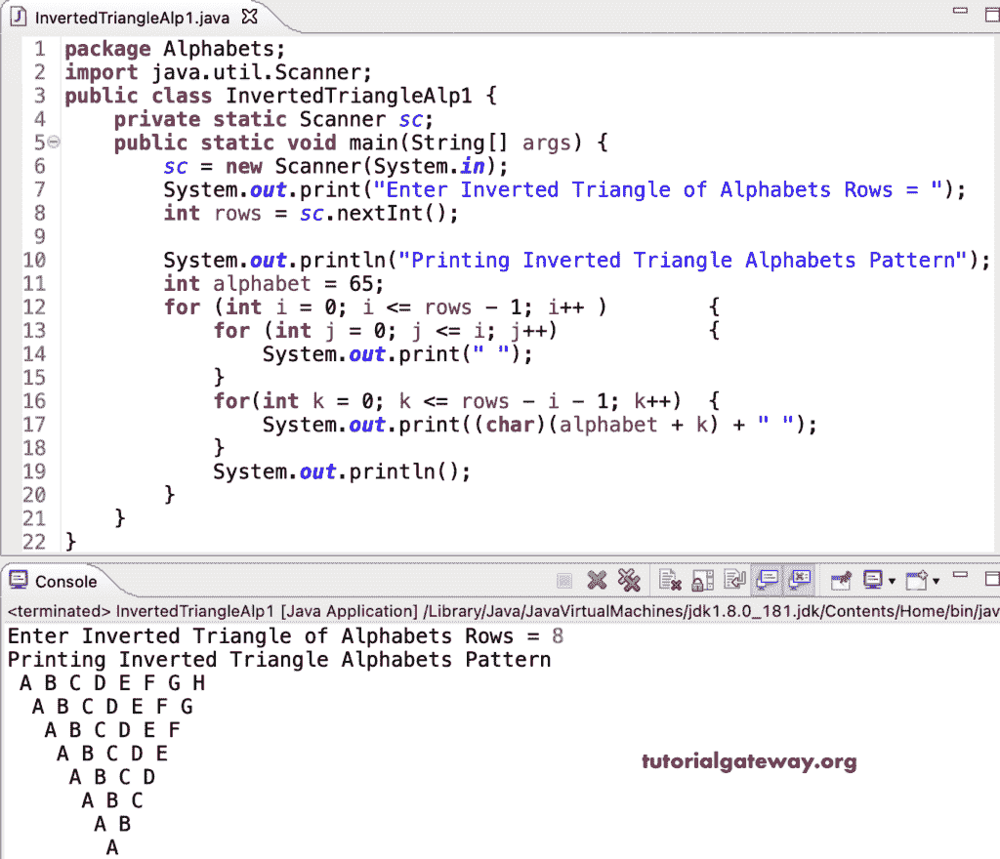

# Java 程序：打印字母的倒三角图案

> 原文：<https://www.tutorialgateway.org/java-program-to-print-inverted-triangle-alphabets-pattern/>

写一个 Java 程序打印字母的倒三角图案用于循环。

```java
package Alphabets;

import java.util.Scanner;

public class InvertedTriangleAlp1 {

	private static Scanner sc;

	public static void main(String[] args) {

		sc = new Scanner(System.in);	

		System.out.print("Enter Inverted Triangle of Alphabets Rows = ");
		int rows = sc.nextInt();

		System.out.println("Printing Inverted Triangle Alphabets Pattern");
		int alphabet = 65;

		for (int i = 0; i <= rows - 1; i++ ) 
		{
			for (int j = 0; j <= i; j++) 	
			{
				System.out.print(" ");
			}
			for(int k = 0; k <= rows - i - 1; k++)
			{
				System.out.print((char)(alphabet + k) + " ");
			}
			System.out.println();
		}
	}
}
```



这个 [Java 示例](https://www.tutorialgateway.org/learn-java-programs/)使用 while 循环打印字母的倒三角模式。

```java
package Alphabets;

import java.util.Scanner;

public class InvertedTriangleAlp2 {

	private static Scanner sc;

	public static void main(String[] args) {

		sc = new Scanner(System.in);	

		System.out.print("Enter Inverted Triangle of Alphabets Rows = ");
		int rows = sc.nextInt();

		System.out.println("Printing Inverted Triangle Alphabets Pattern\n");
		int i, j, k, alphabet = 65;

		i = 0;

		while(i <= rows - 1 ) 
		{

			j = 0;
			while(j <= i) 	
			{
				System.out.print(" ");
				j++;
			}

			k = 0;
			while(k <= rows - i - 1)
			{
				System.out.print((char)(alphabet + k) + " ");
				k++;
			}
			System.out.println();
			i++;
		}
	}
}
```

```java
Enter Inverted Triangle of Alphabets Rows = 15
Printing Inverted Triangle Alphabets Pattern

 A B C D E F G H I J K L M N O 
  A B C D E F G H I J K L M N 
   A B C D E F G H I J K L M 
    A B C D E F G H I J K L 
     A B C D E F G H I J K 
      A B C D E F G H I J 
       A B C D E F G H I 
        A B C D E F G H 
         A B C D E F G 
          A B C D E F 
           A B C D E 
            A B C D 
             A B C 
              A B 
               A 
```

这个 Java 程序使用 do while 循环显示字母的倒三角模式。

```java
package Alphabets;

import java.util.Scanner;

public class InvertedTriangleAlp3 {

	private static Scanner sc;

	public static void main(String[] args) {

		sc = new Scanner(System.in);	

		System.out.print("Enter Inverted Triangle of Alphabets Rows = ");
		int rows = sc.nextInt();

		System.out.println("Printing Inverted Triangle Alphabets Pattern\n");
		int i, j, k, alphabet = 65;

		i = 0;

		do 
		{

			j = 0;
			do 	
			{
				System.out.print(" ");

			} while(j++ <= i);

			k = 0;
			do
			{
				System.out.print((char)(alphabet + k) + " ");

			} while(++k <= rows - i - 1);

			System.out.println();

		} while(++i <= rows - 1 );
	}
}
```

```java
Enter Inverted Triangle of Alphabets Rows = 17
Printing Inverted Triangle Alphabets Pattern

  A B C D E F G H I J K L M N O P Q 
   A B C D E F G H I J K L M N O P 
    A B C D E F G H I J K L M N O 
     A B C D E F G H I J K L M N 
      A B C D E F G H I J K L M 
       A B C D E F G H I J K L 
        A B C D E F G H I J K 
         A B C D E F G H I J 
          A B C D E F G H I 
           A B C D E F G H 
            A B C D E F G 
             A B C D E F 
              A B C D E 
               A B C D 
                A B C 
                 A B 
                  A 
```