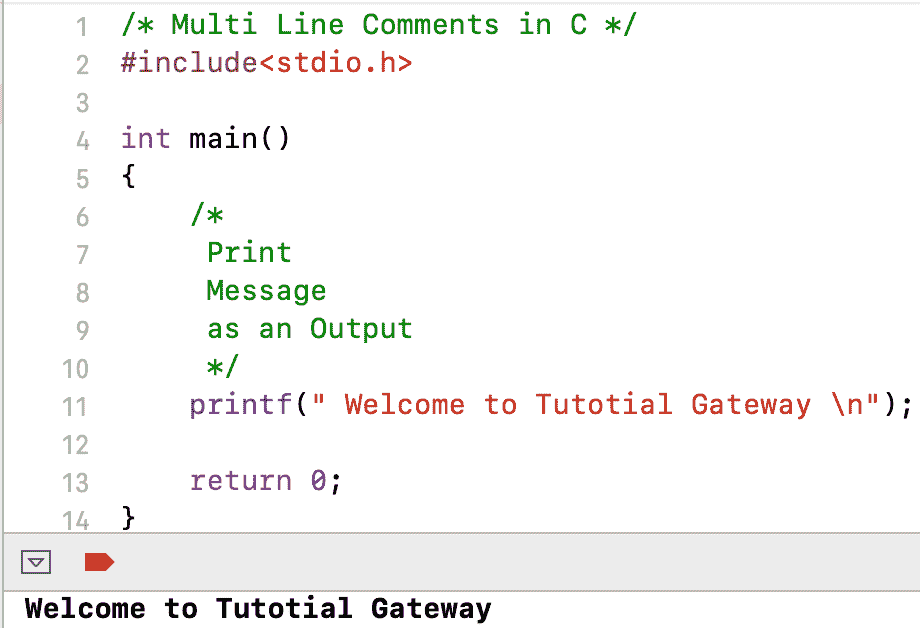

# C 中的注释

> 原文：<https://www.tutorialgateway.org/comments-in-c/>

C 语言中的注释是为了提供一条关于代码的信息。注释可以帮助其他程序员理解程序流程。在 C 语言中，有两种类型的注释选项，它们是单行和多行。

## 单行注释示例

单行注释以两个正斜杠(//)开始。在这个[程序](https://www.tutorialgateway.org/c-programming-examples/)中，我们显示你好世界作为 [C 语言](https://www.tutorialgateway.org/c-programming/)输出。这里，我们使用了一条线。

```
#include<stdio.h>

int main()
{
    // Printing Hello World Message as Output
    printf(" Hello World! \n");

    return 0;
}
```

```
 Hello World! 
```

## 多行注释示例

多行注释位于/*…………*/之间。使用这个斜杠和星号写一个多行。

```
#include<stdio.h>

int main()
{
    /*
     Print
     Message
     as an Output
     */
    printf(" Welcome to Tutorial Gateway \n");

    return 0;
}
```

