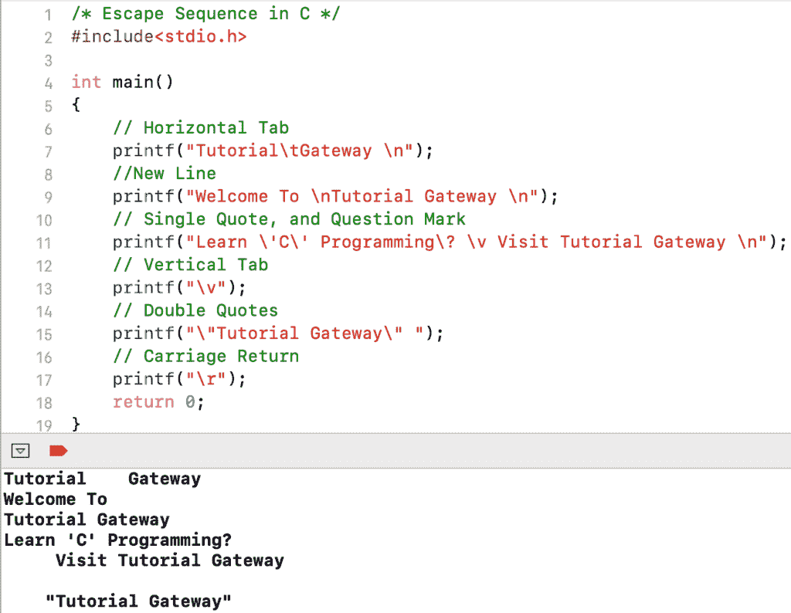

# C 语言转义序列

> 原文：<https://www.tutorialgateway.org/escape-sequence-in-c/>

C 语言中的转义序列用于格式化输出。最常用的转义字符是\n(用于生成换行符)。

C 语言中可用转义序列的列表。

| 特性 | 操作 |
| \a | 警报或嘟嘟声 |
| \b | 退格 |
| \f | 换页 |
| \n | 换行 |
| \r | 回车 |
| \t | 横表 |
| \v | 垂直标签 |
| \\ | 反斜线符号 |
| \' | 单引号 |
| \" | 双引号 |
| \? | 问号 |
| \nnn | 八进制数 |
| \xhh | 十六进制数 |
| \0 | 空 |

## C 示例中的转义序列

在这个[程序](https://www.tutorialgateway.org/c-programming-examples/)中，我们使用了 printf 语句中的一些转义序列字符。借此，我们可以展示它们的功能，以及如何在 [C 语言](https://www.tutorialgateway.org/c-programming/)中使用它们。

```c
#include<stdio.h>

int main()
{
    // Horizontal Tab
    printf("Tutorial\tGateway \n");
    //New Line
    printf("Welcome To \nTutorial Gateway \n");
    // Single Quote, and Question Mark
    printf("Learn \'C\' Programming\? \v Visit Tutorial Gateway \n");
    // Vertical Tab
    printf("\v");
    // Double Quotes
    printf("\"Tutorial Gateway\" ");
    // Carriage Return
    printf("\r");
    return 0;
}
```

