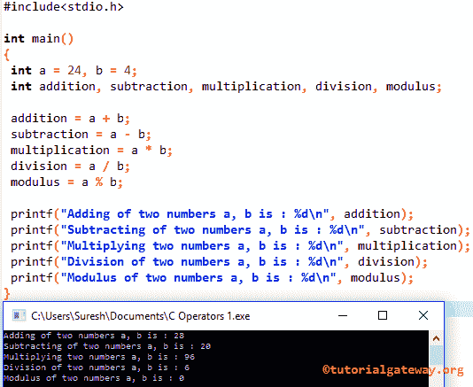

# 编程运算符

> 原文:[https://www.tutorialgateway.org/c-programming-operators/](https://www.tutorialgateway.org/c-programming-operators/)

编程运算符是用于执行数学和逻辑运算的符号。您可以对单个值或变量使用 C 运算符。下表将通过一个例子向您展示可用的 C 编程运算符列表。

| 编程运算符 | 描述 |
| [算术](https://www.tutorialgateway.org/arithmetic-operators-in-c/) | 用于执行基本的数学计算，如加法、减法、乘法、除法和模数。 |
| [关系](https://www.tutorialgateway.org/relational-operators-in-c/) | 关系运算符主要用于[循环](https://www.tutorialgateway.org/for-loop-in-c-programming/ "For Loop in C")或 [If 语句](https://www.tutorialgateway.org/if-statement-in-c/ "C If Statement")。用这些来检查两个变量之间的关系。如果关系为真，则返回 1。否则，它将返回值 0。 |
| [逻辑](https://www.tutorialgateway.org/logical-operators-in-c/ "LOGICAL OPERATORS IN C") | 用于组合两个或多个条件，并使用逻辑 AND (&&)、OR (&#124;&#124;)和 NOT(！). |
| [分配](https://www.tutorialgateway.org/assignment-operators-in-c/ "ASSIGNMENT OPERATORS IN C") | 用于将值赋给声明的变量。= (Equals)是分配结果最常用的方法。 |
| [增量&减量](https://www.tutorialgateway.org/increment-and-decrement-operators-in-c/ "INCREMENT & DECREMENT OPERATORS IN C") | 将数值增加或减少 1。++用于将现有变量值增加 1。减量运算符––用于将现有值减 1。 |
| [逐位](https://www.tutorialgateway.org/bitwise-operators-in-c/) | 按位运算符对于执行位级操作非常有用。首先，十进制值将转换成一个比特序列(二进制值)，即 0001、1011 等。这将对这些位起作用，比如将它们向右向左移动，等等。 |
| [有条件](https://www.tutorialgateway.org/conditional-operator-in-c/ "CONDITIONAL OPERATOR IN C") | 条件运算符也称为三元运算符。我们在决策过程中使用它们的真假。根据表达式结果，该运算符返回语句。 |
| 审裁处 | 它在查找结构大小和数组大小时非常有用。 |

## 编程算术运算符示例

在这个例子中，我们将使用两个变量来执行 C 编程语言中的各种算术运算

```
#include<stdio.h>

int main()
{
 int a = 24, b = 4;
 int addition, subtraction, multiplication, division, modulus;

 addition = a + b; 
 subtraction = a - b; 
 multiplication = a * b; 
 division = a / b; 
 modulus = a % b; 

 printf("Adding of two numbers a, b is : %d\n", addition);
 printf("Subtracting of two numbers a, b is : %d\n", subtraction);
 printf("Multiplying two numbers a, b is : %d\n", multiplication);
 printf("Division of two numbers a, b is : %d\n", division);
 printf("Modulus of two numbers a, b is : %d\n", modulus);

}
```



## 关系示例

在这个例子中，我们将使用两个变量 a 和 b 在[编程](https://www.tutorialgateway.org/c-programming/)中执行各种关系操作。

```
#include <stdio.h>

main()
{
  int a = 35;
  int b = 16;

  printf("%d >  %d: %d \n", a, b, a > b);
  printf("%d >= %d: %d \n", a, b, a >= b);
  printf("%d <= %d: %d \n", a, b, a <= b);
  printf("%d <  %d: %d \n", a, b, a < b);
  printf("%d == %d: %d \n", a, b, a == b);
  printf("%d != %d: %d \n", a, b, a != b);

}
```

```
35 >  16: 1 
35 >= 16: 1 
35 <= 16: 0 
35 <  16: 0 
35 == 16: 0 
35 != 16: 1 
```

对于这个例子，我们使用两个变量 x 和 Total。他们将向您展示 C 编程语言中所有赋值运算符的工作功能

```
#include <stdio.h>

int main()
{
 int x = 5;
 int Total = 25;

 printf("%d \n", Total += x );
 printf("%d \n", Total -= x );
 printf("%d \n", Total *= x );
 printf("%d \n", Total /= x );
 printf("%d \n", Total %= x );

 return 0;
}
```

```
30 
25 
125 
25 
0 
```