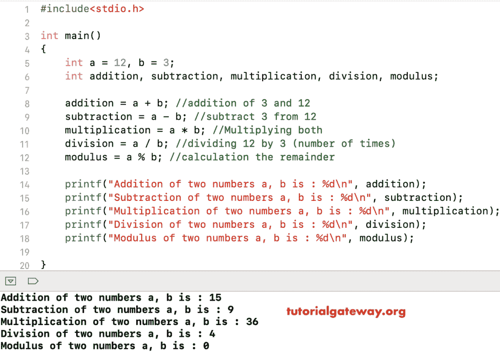

# C 语言中的算术运算符

> 原文:[https://www.tutorialgateway.org/arithmetic-operators-in-c/](https://www.tutorialgateway.org/arithmetic-operators-in-c/)

算术运算符是 C 程序设计运算符的一部分，用于执行算术运算，包括加法、减法、乘法、除法和模数等运算符。

C 语言中所有这些算术运算符都是二进制运算符，这意味着它们对两个操作数进行运算。下表用例子展示了 C 程序设计中的所有算术运算符。

| 算术运算符 | 操作 | 例子 |
| + | 添加 | 10 + 2 = 12 |
| – | 减法 | 10 – 2 = 8 |
| * | 增加 | 10 * 2 = 20 |
| / | 分开 | 10 / 2 = 5 |
| % | 模数–它返回除法后的余数 | 10 % 2 = 0(此处余数为零)。如果是 10 % 3，那么就是 1。 |

## C 示例中的算术运算符

在 c 程序的这个算术运算符中，我们使用了两个变量 a 和 b，它们的值是 12 和 3。

我们将使用这两个变量来执行[编程](https://www.tutorialgateway.org/c-programming/)语言中存在的各种算术运算

```
/* Program to Perform Arithmetic Operations in C */

#include<stdio.h>

int main()
{
 int a = 12, b = 3;
 int addition, subtraction, multiplication, division, modulus;

 addition = a + b; //addition of 3 and 12
 subtraction = a - b; //subtract 3 from 12
 multiplication = a * b; //Multiplying both
 division = a / b; //dividing 12 by 3 (number of times)
 modulus = a % b; //calculation the remainder

 printf("Addition of two numbers a, b is : %d\n", addition);
 printf("Subtraction of two numbers a, b is : %d\n", subtraction);
 printf("Multiplication of two numbers a, b is : %d\n", multiplication);
 printf("Division of two numbers a, b is : %d\n", division);
 printf("Modulus of two numbers a, b is : %d\n", modulus);

}
```



注意:当我们使用 c 除法(/)运算符时，结果将完全取决于它所属的数据类型。

例如，如果数据类型是整数，那么 c 中的除法算术运算符将通过取整该值(5 / 2 = 2)来产生整数值。如果您想要正确的结果，那么将数据类型更改为 float。不要困惑，让我们再看一个例子，以便更好地理解

## 使用浮点的算术运算符

对于 c 示例程序中的算术运算符，我们使用了两个变量 a 和 b，它们的值是 7 和 3。我们将使用这两个变量来显示我们在对 Int 和 Float 数据类型执行算术运算时通常面临的问题。

```
/* C Program to Perform Division and Modulus on Float data type */

#include<stdio.h> 

int main()
{
 int a = 7, b = 3;
 int integerdiv, modulus;
 float floatdiv;

 integerdiv = a / b; // dividing 7 by 3
 modulus = a % b; // calculation the remainder
 floatdiv = (float)a / b; // Converting int to float

 printf("Division of two numbers a, b is : %d\n", integerdiv);
 printf("Modulus of two numbers a, b is : %d\n", modulus);

 printf("---------Correct Results is------- \n");
 printf("Division of two numbers a, b is : %f\n", floatdiv);

}
```

```
Division of two numbers a, b is : 2
Modulus of two numbers a, b is : 1
---------Correct Results is------- 
Division of two numbers a, b is : 2.333333
```

在 c 示例中的上述算术运算符中，如果您注意到结果，对于相同的计算，我们得到了两个不同的结果。因为对于第一个结果，a 和 b 都是整数，输出也是整数(integerdiv)。所以编译器忽略小数点后的项，显示答案 2 而不是 2.3333，a % b 是 1，因为余数是 1。

接下来，我们将输出数据类型更改为 float (floatdiv)，并将结果转换为 float 以获得我们想要的结果。使用 c [运算符](https://www.tutorialgateway.org/c-programming-operators/)中的除法时，请小心(这里类型铸造起主要作用)