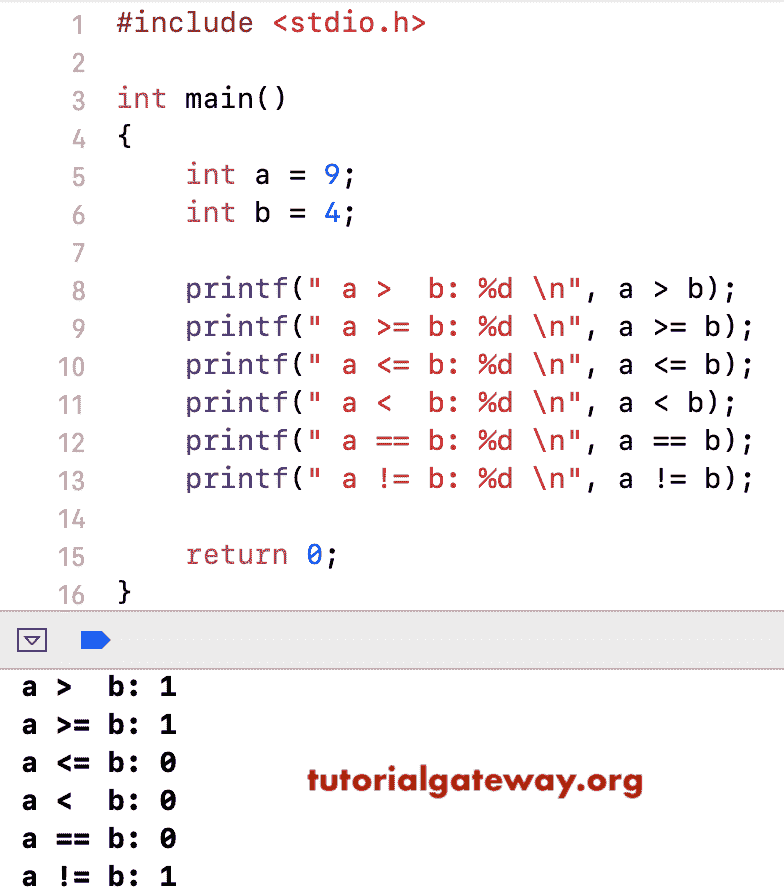

# C 语言关系运算符

> 原文：<https://www.tutorialgateway.org/relational-operators-in-c/>

关系运算符是运算符的一部分，主要用于 If 条件或循环中。C 语言中的关系运算符常用来检查两个变量之间的关系。如果关系为真，则返回值 1。否则，它将返回值 0。

下表用例子展示了 C 语言中的所有关系运算符。

| C 语言中的关系运算符 | 使用 | 描述 | 例子 |
| > | a > b | a 大于 b | 7 > 3 返回真(1) |
| < | a < b | a 小于 b | 7 < 3 返回假(0) |
| >= | a >= c | a 大于或等于 c | 7 >= 3 返回真(1) |
| <= | a <= c | a 小于或等于 c | 7 <= 3 返回假(0) |
| == | a == b | a 等于 b | 7 == 3 返回假(0) |
| ！= | a！= c | a 不等于 c | 7 != 3 返回真(1) |

## C 示例中的关系运算符

这个程序帮助你实际理解 C 关系运算符。

对于这个 [C 语言](https://www.tutorialgateway.org/c-programming/)的例子，我们使用了两个变量 a 和 b，它们的值是 9 和 4。我们将使用这两个变量来执行各种关系操作。

```
/* C Relational Operations on integers */

# include <stdio.h>

int main()
{
  int a = 9;
  int b = 4;

  printf(" a >  b: %d \n", a > b);
  printf("a >= b: %d \n", a >= b);
  printf("a <= b: %d \n", a <= b);
  printf("a <  b: %d \n", a < b);
  printf("a == b: %d \n", a == b);
  printf("a != b: %d \n", a != b);

}
```

在这个关系运算符的例子中，我们对照每个关系运算符检查了 a 和 b 的值。这里 1 表示真，0 表示假



## 如果条件下的关系运算符

这个[运算符](https://www.tutorialgateway.org/c-programming-operators/)的例子帮助你理解在 [If 条件](https://www.tutorialgateway.org/if-statement-in-c/)中如何使用 C 语言的关系运算符。对于这个例子[程序](https://www.tutorialgateway.org/c-programming-examples/)，我们使用了两个变量 x 和 y，它们的值是 10 和 25。我们将在`if`语句中使用这两个变量，使用==关系运算符来检查条件。但是，您可以使用 c 语言中的任何关系运算符作为条件。

```
# include <stdio.h>

void main()
{
  int x = 10;
  int y = 25;

  if (x == y)
   {
     printf(" x is equal to y \n" );
   }

  else
   {
     printf(" x is not equal to y \n" );
   }

}
```

```
 x is not equal to y 
```

如果 x 恰好等于 y，将执行第一个 printf 语句

```
 printf(" x is equal to y \n" );
```

当 x 不等于 y 时，执行第二个 c printf 语句。

```
printf(" x is not equal to y \n" );
```

这里 x 不等于 25，所以打印第二条语句。请在 [`for`循环](https://www.tutorialgateway.org/for-loop-in-c-programming/)、 [`while`循环](https://www.tutorialgateway.org/while-loop-in-c/)和[`while`循环](https://www.tutorialgateway.org/do-while-loop-in-c/)中尝试这些关系运算符。