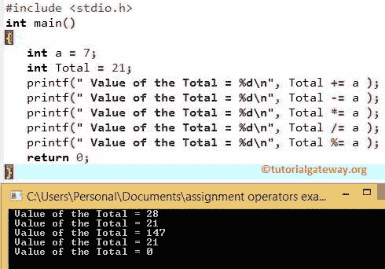

# C 语言赋值运算符

> 原文：<https://www.tutorialgateway.org/assignment-operators-in-c/>

C 语言中的赋值运算符是 C 语言编程符的一部分，对于给声明的变量赋值非常有用。Equals (=)运算符是 c 语言中最常用的赋值运算符。例如:

```c
int i = 10;
```

下表用一个例子显示了 C 语言中的所有赋值运算符。

| 赋值运算符 | 例子 | 说明 |
| = | x = 25 | 值 25 分配给 x |
| += | x += 25 | 这与 x = x + 25 相同 |
| -= | x -= 25 | 这与 x = x–25 相同 |
| *= | y *= 25 | 这与 y = y * 25 相同 |
| /= | y /= 25 | 这与 y = y / 25 相同 |
| %= | y%= 25 | 这与 y = y % 25 相同 |

## C 示例中的赋值运算符

在这个 C 赋值运算符程序中，我们使用了两个整数变量 a，Total，它们的值是 7 和 21。接下来，我们将使用这两个变量向您展示 C 语言中所有赋值运算符的工作功能

```c
# include <stdio.h>

int main()
{
 int a = 7;
 int Total = 21;

 printf(" Value of the Total = %d \n", Total += a );
 printf(" Value of the Total = %d \n", Total -= a );
 printf(" Value of the Total = %d \n", Total *= a );
 printf(" Value of the Total = %d \n", Total /= a );
 printf(" Value of the Total = %d \n", Total %= a );

 return 0;
}
```



第一个 printf 语句将对 a 和 Total 执行 [C 语言](https://www.tutorialgateway.org/c-programming/)赋值操作，然后显示结果输出。让我们看看这个 [C 程序](https://www.tutorialgateway.org/c-programming-examples/)中的 [C 语言选项](https://www.tutorialgateway.org/c-programming-operators/)功能

Total += a 表示
Total = Total + a = 21 + 7 = 28

总计-= a = >总计-a = 28-7 = 21

总计*= a = >总计* a = 21 * 7 = 147

总计/= a = >总计/ a = 147 / 7 = 21

总计% = a = > 21% 7 = 0(21/7 的余数为= 0)