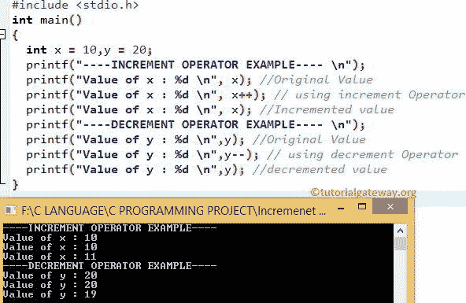

# C 语言中的递增和递减运算符

> 原文：<https://www.tutorialgateway.org/increment-and-decrement-operators-in-c/>

C 中的递增和递减运算符是一些运算符，用于将值增加或减少 1。例如，增量运算符++用于将现有变量值增加 1 (x = x + 1)。递减运算符––用于将现有值减 1(x = x–1)。

C 语言中递增和递减运算符的语法是:

*   增量运算符:++x 或 x++
*   递减运算符:–x 或 x–

## C 示例中的递增和递减运算符

让我们看一个递增和递减运算符的例子，以获得更好的想法！

```
#include <stdio.h> 

int main()
{
 int x = 10,y = 20;

 printf("----INCREMENT OPERATOR EXAMPLE---- \n");
 printf("Value of x : %d \n", x); //Original Value
 printf("Value of x : %d \n", x++); // Using increment Operator
 printf("Value of x : %d \n", x); //Incremented value

 printf("----DECREMENT OPERATOR EXAMPLE---- \n");
 printf("Value of y : %d \n", y); //Original Value
 printf("Value of y : %d \n", y--); // using decrement Operator
 printf("Value of y : %d \n", y); //decremented value

 return 0;
}
```



在第 7 行，我们使用了增量运算符。所以首先返回 X 的值(即 10)，然后 X 值递增 1。

第 8 行:我们再次调用了 X 值；它显示 11，因为该值已经更新。减量运算符也是如此。

## C 语言中的前缀和后缀

如果您观察上面的 C 前缀和后缀语法，我们可以在操作数之前或之后分配 C 递增和递减运算符。当++或——用在像:+++x、–x 这样的操作数之前时，我们称之为前缀，如果++或——用在像:x++或 x 这样的操作数之后，我们称之为后缀。

让我们探索 C 语言中递增和递减运算符的前缀和后缀

1.  +++I(预增量):它甚至在将 I 的值赋给变量 I 之前就将 I 的值递增。
2.  i++(后递增):运算符将首先返回变量值(即 I 值)，然后只有 I 值递增 1。
3.  –I(预递减):它甚至会在将 I 的值赋给变量 I 之前就将其递减
4.  I –(后递减):运算符首先返回变量值(即 I 值)，然后只有 I 值递减 1。

### C 示例中的前缀和后缀

这个程序展示了如何在 c 语言中使用递增和递减运算符作为前缀和后缀

```
/* C Prefix and Postfix */

#include<stdio.h> 

int main()
{

 int x = 10,y = 20, a = 5, b= 4;

 printf("---- PRE INCREMENT OPERATOR EXAMPLE---- \n");
 printf("Value of x : %d \n", x); //Original Value
 printf("Value of x : %d \n", ++x); // using Pre increment Operator
 printf("Value of x Incremented : %d \n", x); //Incremented value

 printf("----POST INCREMENT OPERATOR EXAMPLE---- \n");
 printf("Value of y : %d \n", y); //Original Value
 printf("Value of y : %d \n", y++); // using Post increment Operator
 printf("Value of Incremented y : %d \n", y); //Incremented value

 printf("----PRE DECREMENT OPERATOR EXAMPLE---- \n");
 printf("Value of a : %d \n", a); //Original Value
 printf("Value of a : %d \n", --a); // using Pre decrement Operator
 printf("Value of decremented y : %d \n", a); //decremented value

 printf("----POST DECREMENT OPERATOR EXAMPLE---- \n");
 printf("Value of b : %d \n", b); //Original Value
 printf("Value of b : %d \n", b--); // using Post decrement Operator
 printf("Value of decremented b : %d \n", b); //decremented value

 return 0;
 }
```

前缀和后缀输出

```
---- PRE INCREMENT OPERATOR EXAMPLE---- 
Value of x : 10 
Value of x : 11 
Value of x Incremented : 11 
----POST INCREMENT OPERATOR EXAMPLE---- 
Value of y : 20 
Value of y : 20 
Value of Incremented y : 21 
----PRE DECREMENT OPERATOR EXAMPLE---- 
Value of a : 5 
Value of a : 4 
Value of decremented y : 4 
----POST DECREMENT OPERATOR EXAMPLE---- 
Value of b : 4 
Value of b : 4 
Value of decremented b : 3 
```

虽然 C 在`for`循环、While 和 Do-`while`循环中使用了递增和递减运算符，但我们没有给出一个例子。因为现在理解循环概念还为时过早。试着理解 C 语言中前缀和后缀的概念，这个[运算符](https://www.tutorialgateway.org/c-programming-operators/)帮助你理解`if`语句， [For Loop](https://www.tutorialgateway.org/for-loop-in-c-programming/) ， [While](https://www.tutorialgateway.org/while-loop-in-c/) 和 [Do-While](https://www.tutorialgateway.org/do-while-loop-in-c/) loop [程序](https://www.tutorialgateway.org/c-programming-examples/)语法在 [C 语言编程](https://www.tutorialgateway.org/c-programming/)中很容易