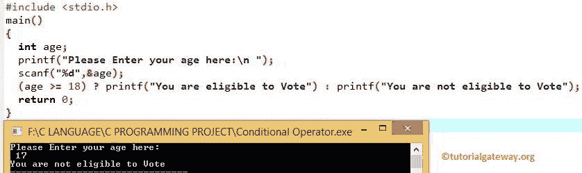

# C 语言中的条件运算符

> 原文:[https://www.tutorialgateway.org/conditional-operator-in-c/](https://www.tutorialgateway.org/conditional-operator-in-c/)

C 语言中的条件算子，也叫三元算子，用于决策过程。C 编程条件运算符返回的语句取决于给定的表达式结果。

C 编程中三元运算符的基本语法如下所示:

```
Test_expression ? statement1: statement2
```

从以上 C 语法中的条件运算符可知，如果给定的测试条件为真，则返回 statement1，如果为假，则返回 statement2。

## C 示例中的条件运算符

在这个[程序](https://www.tutorialgateway.org/c-programming-examples/)中，我们使用条件运算符来查找该人是否有资格投票。c 程序中的三元运算符允许用户输入年龄，并将用户输入的整数值赋给年龄变量。

如果用户输入的值为 18 或以上， [C 编程](https://www.tutorialgateway.org/c-programming/)将打印？符号“你有资格投票”。

如果用户输入低于 18，将打印第二条语句(在:符号之后)。“你没有资格投票”。

```
#include<stdio.h> 

int main()
{
  int age;

  printf(" Please Enter your age here: \n ");
  scanf(" %d ", &age);

 (age >= 18) ? printf(" You are eligible to Vote ") :
               printf(" You are not eligible to Vote ");

 return 0;
}
```



让我们尝试用一个不同的值来解释条件[运算符](https://www.tutorialgateway.org/c-programming-operators/)。

```
Please Enter your age here: 
19
You are eligible to Vote
```