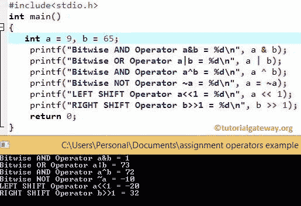

# C 语言按位运算符

> 原文：<https://www.tutorialgateway.org/bitwise-operators-in-c/>

C 语言中的按位运算符是一些运算符，用于执行位操作。所有十进制值将转换为二进制值(位序列，即 0100、1100、1000、1001 等。).接下来，C 中的按位运算符将对这些位进行操作，例如将它们从左向右移动或将位值从 0 转换为 1 等。

下表举例说明了 C 语言中不同的按位运算符及其含义。例如，考虑 x = 6 和 y = 8，它们的二进制形式的值是:x = 0110 和 y = 1000

| C 语言中的按位运算符 | 运算符含义 | 例子 |
| & | 按位“与” | X & Y = 0000 |
| &# 124; | 按位“或” | X &# 124; Y = 1110 |
| ^ | 按位异或 | X ^ Y = 1110 |
| ~ | 补充 | ~X = 00001001 (Not 运算符将所有 0 转换为 1。) |
| << | 左移位 | X << 1 = 00001100(位将向左移动 1 步。如果我们使用 2 或 3，那么它们会相应地移动) |
| >> | 右移 | Y >> 1 = 00000100 |

让我们看看 C 语言中按位运算符背后的真值表

| x | y | x & y | X &# 124; y | x ^ y |
| Zero | Zero | Zero | Zero | Zero |
| Zero | one | Zero | one | one |
| one | Zero | Zero | one | one |
| one | one | one | one | Zero |

## C 示例中的按位运算符

让我们看一个例子来更好地理解 C 语言中的按位运算符。在这个程序中，我们使用了两个变量 a 和 b，它们的值是 9 和 65。接下来，我们将使用这两个变量向您展示各种操作。

在这个程序中，我们声明了 2 个整数 a 和 b，并赋值 9 和 65。9 = 0001001 和 65 = 1000001 的二进制形式。下面的 printf 语句将对 a 和 b 执行按位运算，然后它们将显示[程序](https://www.tutorialgateway.org/c-programming-examples/)输出

```
# include <stdio.h>

int main()
{
 int a = 9, b = 65;

 printf(" Bitwise AND Operator a&b = %d \n", a & b);
 printf(" Bitwise OR Operator a|b = %d \n", a | b);
 printf(" Bitwise EXCLUSIVE OR Operator a^b = %d \n", a ^ b);
 printf(" Bitwise NOT Operator ~a = %d \n", a = ~a);

 printf(" LEFT SHIFT Operator a<<1 = %d \n", a << 1);
 printf(" RIGHT SHIFT Operator b>>1 = %d \n", b >> 1);

 return 0;
}
```



让我们看看 [C 语言](https://www.tutorialgateway.org/c-programming/)中这个[运算符](https://www.tutorialgateway.org/c-programming-operators/)背后的计算。

c 位与运算= a & b
0001001&1000001 = 000001 = 1

c 按位 OR 运算= a | | b
0001001 | | 1000001 = 1001001 = 73

接下来，异或运算= a ^ b
0001001 ^ 1000001 = 1001000 = 72

左移操作= b > > 1
1000001>>1 = 0100000 = 32