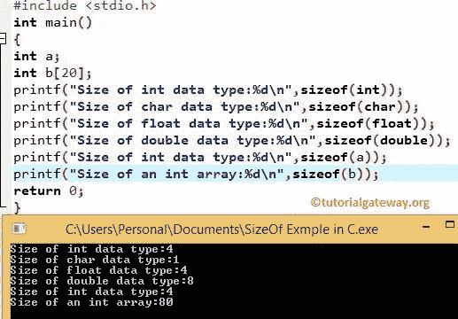

# `sizeof`运算符

> 原文：<https://www.tutorialgateway.org/c-sizeof-operator/>

C`sizeof`运算符是最有用的运算符之一，用于查找数组大小、结构大小，并根据结果进行计算。

C`sizeof`运算符返回声明的变量或数据类型的大小(字节数)。让我们看一个 [C 语言](https://www.tutorialgateway.org/c-programming/)的例子，以便更好的理解

## 运算符的大小示例

在这个[运算符](https://www.tutorialgateway.org/c-programming-operators/)示例程序中，我们将使用 size of 运算符检查整数、浮点、字符、双精度和字符数组的大小。

```
# include <stdio.h>

int main()
{
  int a;
  int b[20];

  printf(" Size of int data type:%d \n ", sizeof(int) );
  printf(" Size of char data type:%d \n ", sizeof(char) );
  printf(" Size of float data type:%d \n ", sizeof(float) );
  printf(" Size of double data type:%d \n ", sizeof(double) );

  printf(" Size of int data type:%d \n ", sizeof(a) ); 
  printf(" Size of an int array:%d \n ", sizeof(b) );

  return 0;
}
```



sizeof(b)的结果:虽然我们将 b 的大小声明为 20，但它将输出显示为 80。因为 b 数组将存储 20 个整数成员。并且每个整数成员需要 4 字节的空间(意味着每个整数成员需要 20 * 4 字节。)