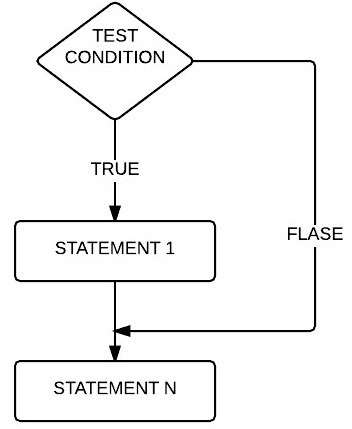
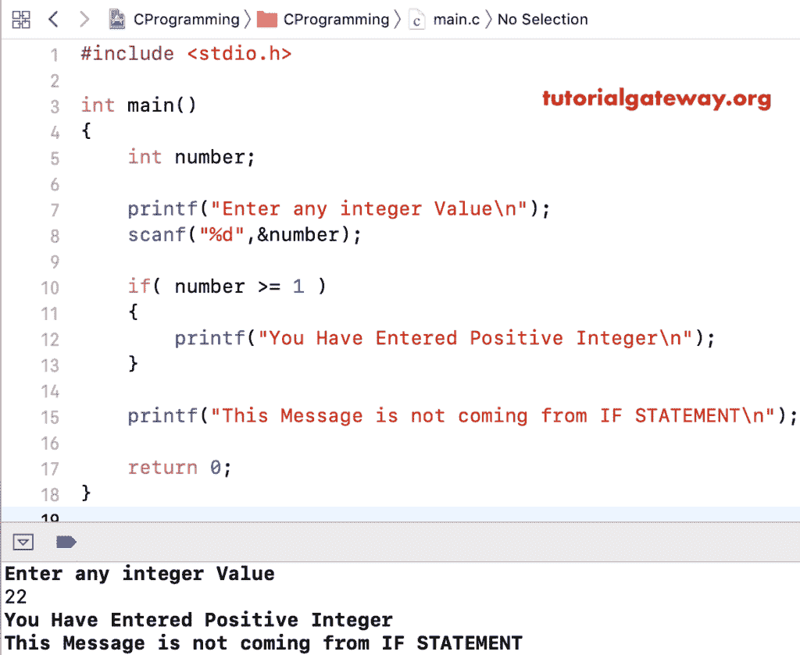

# C 语言中的`if`语句

> 原文:[https://www.tutorialgateway.org/if-statement-in-c/](https://www.tutorialgateway.org/if-statement-in-c/)

C 语言中的`if`语句是实时编程中最有用的决策表达式之一。如果语句允许编译器首先测试条件，然后，根据结果，它将执行语句。测试条件是否为真，那么只有 if 条件内的语句由 C 编译器执行。

## C 语法中的`if`语句

C 语言中`if`语句的基本语法结构很简单:

```
// If statement in C Syntax
if (test condition)
{

  Statement1;
  Statement2;
  Statement3;
  ………….
  ………….
  Statementn;
}
```

从上面的代码来看，If 子句中的测试条件是否为真，那么代码块(Statement1，Statement2，Statement3，…。，Statementn)将被执行。否则，所有这些行将会跳过。

## C 示例中的`if`语句

这个示例程序使用 C 语言中的`if`语句检查正数

```
/* If Statement in C Programming Example */
#include <stdio.h>

int main()
{

 int number;

 printf("Enter any integer Value\n");
 scanf("%d",&number);

 if( number >= 1 )
 {
   printf("You Have Entered Positive Integer\n");
 }

 return 0;
}
```

对于单次打印功能， [C 语言](https://www.tutorialgateway.org/c-programming/)不需要花括号。但是对于多行代码，这是强制性的。在`if`语句后面使用花括号总是一种好的做法。

```
Enter any integer Value
22
You Have Entered Positive Integer
```

当您查看上述 if 条件时，存储在数字变量中的值大于或等于 0。这就是它在花括号({})内打印(print 函数)的原因。

从上面的例子来看，当条件失败时会发生什么？(数量< 1)。

```
Enter any integer Value
-22
Program ended with exit code: 0
```

它什么也不打印，因为在 if 块之后我们没有任何东西可以打印。希望你对结果感到困惑，让我们看看流程图

##`if`语句流程图

C 语言中`if`语句的流程图如下:



测试条件是否为真，STATEMENT1 执行，后面跟着 STATEMENTN。当条件为假时，STATEMENTN 执行，因为它不在 if 块中。与条件结果无关。

```
#include <stdio.h>

int main()
{
 int number;

 printf("Enter any integer Value\n");
 scanf("%d",&number);

 if( number >= 1 )
 {
   printf("You Have Entered Positive Integer\n");
 }

 printf("This Message is not coming from IF STATEMENT\n");

 return 0;
}
```



从上面的输出可以看出，它打印了两个 printf 函数，因为 22 大于 1。让我们尝试负值来故意使条件失效。

```
Enter any integer Value
-13
This Message is not coming from IF STATEMENT
```

如果条件(数字< 1)在这里失败，它不会从 If 条件块中打印任何内容。所以，它只写了一个 printf，在块之外。