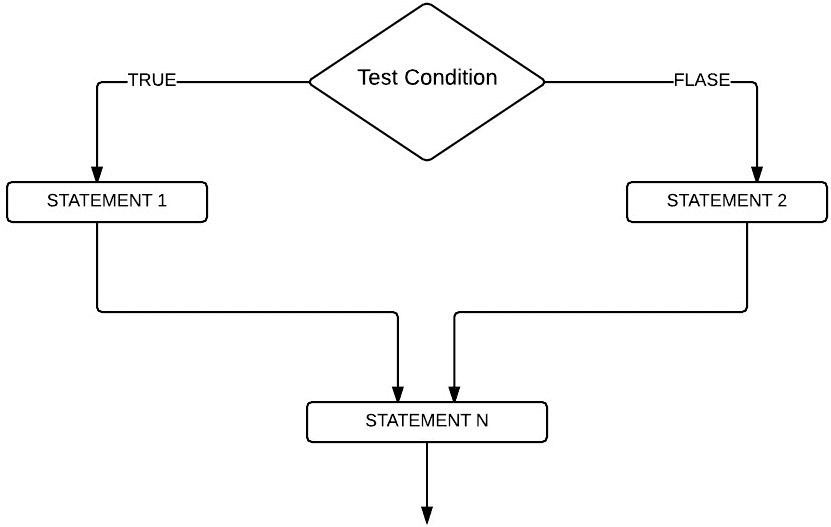
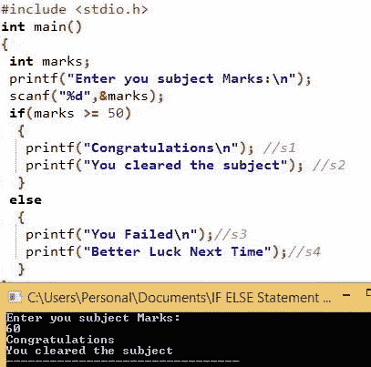

# C 语言`if-else`函数语句

> 原文：<https://www.tutorialgateway.org/if-else-statement-in-c/>

C 语言中的`if-else`语句是 If 的扩展(我们在前面的文章中讨论过)。我们已经看到了 If 条件，它将只在给定条件为真时执行语句。当条件为假时，它不会执行代码。

在现实世界中，当条件失败时，执行一些东西是很好的。为此，请使用`if-else`语句。这里，else 块将在条件失败时执行代码块。让我们看看 C 语言中 If Else 的语法:

## C 语法中的`if-else`语句:

C 语言中`if-else`语句的基本语法如下:

```c
if (Test condition)
{
  //If the condition is TRUE then these will be executed
  True statements;
}

else
{
  //If the condition is FALSE then these will be executed
  False statements;
}
```

当上述结构中存在的测试条件被评估为真时，将执行真代码块。当条件为假时，将执行假代码块。

C



中的`if-else`语句流程图

## C 示例中的`if-else`语句

在这个程序中，我们将放置 4 条不同的打印线。如果条件为真，我们将打印两行。而当条件为假时，[程序](https://www.tutorialgateway.org/c-programming/)会再打印 2。

```c
# include<stdio.h> 

int main()
{
 int marks;

 printf("Enter you subject Marks:\n");
 scanf("%d",&marks);

 if(marks >= 50)
  {
    printf("Congratulations\n"); //s1 
    printf("You cleared the subject"); //s2
  }

 else
  {
    printf("You Failed\n");//s3
    printf("Better Luck Next Time");//s4
  }
 return 0;
}
```

分析:用户输入他的标记，如果标记大于或等于 50，那么 s1、s2 将被打印。例如，如果标记小于 50，则 s3 和 s4 将打印为输出。

输出 1:让我们输入 60 作为标记。意思是，表达为真



让我们输入 30 作为标记。条件评估为假

```c
Enter you subject Marks:
30
You Failed
Better Luck Next Time
```