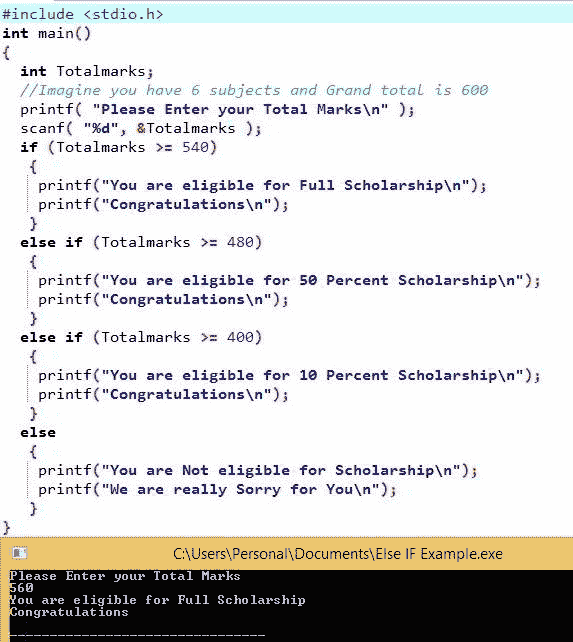

# C 语言中的`else if`语句

> 原文：<https://www.tutorialgateway.org/else-if-statement-in-c/>

C 语言中的`else if`语句很有用，但我们必须测试几个条件。除了 C 语言中的`else if`语句，我们还可以利用嵌套`if`语句来完成同样的任务。然而，随着条件总数的增加，代码的复杂性将进一步增加。

C 语言中的`else if`语句通过顺序执行来有效地处理多个语句。Javac 将检查第一个条件。如果条件结果为真，则该块中的语句将运行。如果结果为假，Javac 验证下一个(否则为条件)等等。

## C 语法中的`else if`语句

C 语言中`else if`语句的语法如下:

```
if (condition 1)
          statements 1
else if (condition 2)
          statements 2
else if (condition 3)
          statements 3
      ...........
else if (condition n)
          statements n
else
    default statements
```

在某些情况下，条件 1 和条件 2 都为真，例如:

x= 20，y=10

条件 1:x > y//真

条件二:x！= y//真

在这些情况下，将执行条件 1 下的代码。因为否则如果条件只有在前面的 IF 或`else if`语句失败时才会执行。

### 流程图中的否则如果语句

C 语言中“否则”语句后面的程序流程图


## C 示例中的`else if`语句

在这个 C else if 程序中，用户被要求输入他们总共六个科目的分数。使用这个否则如果陈述，我们将决定这个人是否有资格获得奖学金

```
/* Example for Else If Statement in C Language */

# include <stdio.h> 

int main() 
{
 int Totalmarks; 

 //Imagine you have 6 subjects and Grand total is 600 
 printf("Please Enter your Total Marks\n" ); 
 scanf( "%d", &Totalmarks ); 

 if (Totalmarks >= 540) 
  {
    printf("You are eligible for Full Scholarship\n");
    printf("Congratulations\n");
  } 
 else if (Totalmarks >= 480) 
  {
    printf("You are eligible for 50 Percent Scholarship\n");
    printf("Congratulations\n");
  } 
 else if (Totalmarks >= 400) 
  {
    printf("You are eligible for 10 Percent Scholarship\n");
    printf("Congratulations\n");
  } 
 else 
  {
    printf("You are Not eligible for Scholarship\n");
    printf("We are really Sorry for You\n");
  }
}
```

输出 1:对于这个否则，如果在 c 示例中，我们将提供 Totalmarks = 570。如果条件为真，首先在这里。也请参考 [C 嵌套`if`语句](https://www.tutorialgateway.org/nested-if-in-c/)一文。



输出 2:这是为了演示 C`else if`语句。我们输入的 Totalmarks = 490 表示第一个 IF 条件为 FALSE。它将检查 else if (Totalmarks >= 480)，该值为真，以便 [C Programming](https://www.tutorialgateway.org/c-programming/) 打印该块内的代码。虽然如果(Totalmarks > = 400)条件为真，但是 Javac 不会检查该条件。

```
Please Enter your Total Marks
490
You are eligible for 50 Percent Scholarship
Congratulations
```

第三个输出:总标记为 401-第一个 if 条件，否则 IF(总标记> = 480)为假。接下来，它将检查 else if(总标记> = 401)，这是真的。所以它会打印这个代码块。

```
Please Enter your Total Marks
401
You are eligible for 10 Percent Scholarship
Congratulations
```

输出 4:让我输入总分= 380。它指示所有中频条件失败。因此，它在一个 else 块中打印语句。

```
Please Enter your Total Marks
380
You are Not eligible for Scholarship
We are really Sorry for You
```