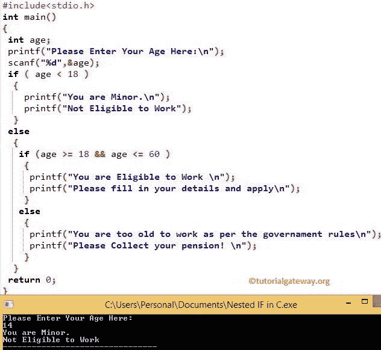

# C 语言嵌套`if`

> 原文：<https://www.tutorialgateway.org/nested-if-in-c/>

C 语言中的嵌套`if`是将`if`语句放在另一个`if`语句中。如果你想检查条件中的条件，嵌套在 C 语言中是很有帮助的。`if-else`语句根据表达式结果打印不同的语句(真、假)。有时，当条件为真时，我们必须进一步检查。在这些情况下，我们可以使用这些 C 嵌套`if`语句，但是在使用时要小心。

例如，每个人都有资格工作，如果他是 18 岁或以上，否则他没有资格。然而，公司不会给每个人一份工作。因此，我们使用另一个`if`语句，在 C 语言中也称为嵌套`if`语句，来检查他的学历或任何特定的公司要求。

## C 语法中的嵌套`if`

C 语言语法中的嵌套`if`是

```c
if ( test condition 1)
{

   //If the test condition 1 is TRUE then these it will check for test condition 2
   if ( test condition 2)
   {
    //If the test condition 2 is TRUE, these statements execute
    Test condition 2 True statements;
   }

   else
   {
    //If the c test condition 2 is FALSE, then these statements execute
    Test condition 2 False statements;
   }

else
{
 //If the test condition 1 is FALSE then these statements will be executed
 Test condition 1 False statements;
}
```

### C 语言中嵌套`if`的流程图

嵌套`if`语句的流程图是


如果测试条件 1 为假，将执行状态 ENT3。当测试条件 1 为真时，则 [C 语言](https://www.tutorialgateway.org/c-programming/)将检查测试条件 2。如果是真的，ENT1 将执行其他州 ENT2。请参考 [C`if-else`语句](https://www.tutorialgateway.org/if-else-statement-in-c/)和 [C`if`语句](https://www.tutorialgateway.org/if-statement-in-c/)文章。

## C 语言示例中的嵌套`if`

在这个嵌套的 If in c 程序中，用户可以输入他的年龄，我们将把它存储在变量 age 中。如果年龄小于 18 岁，我们将打印两份报表。

如果条件失败，我们将再检查一个条件(嵌套`if`)，如果成功，我们将打印一些东西。当嵌套条件失败时，我们打印一些其他的东西。

```c
#include <stdio.h>

int main()
{
 int age;

 printf("Please Enter Your Age Here:\n");
 scanf("%d",&age);

 if ( age < 18 )
 {
  printf("You are Minor.\n");
  printf("Not Eligible to Work");
 }
 else
 {

  if (age >= 18 && age <= 60 ) 
   { 
    printf("You are Eligible to Work \n"); 
    printf("Please fill in your details and apply\n"); 
   } 
  else 
   { 
    printf("You are too old to work as per the Government rules\n");
    printf("Please Collect your pension! \n");
   }
 }

 return 0;
}
```

在这个嵌套的例子中，如果一个人的年龄小于 18 岁，他就没有资格工作。如果年龄大于或等于 18，则第一个条件失败，它将检查 else 语句。

在 Else 语句中，还有另一个 if 条件叫做 c 中的嵌套`if`。

*   在本例中，嵌套的`if`语句检查大于或等于 18 岁且小于或等于 60 岁的人的年龄。当条件为真时，他就可以申请这份工作。
*   如果条件是假的，那么声明——他太老了，不能按照政府的规定工作。

输出 1:输入年龄= 14 岁。意思是第一如果条件为真



第二输出:年龄= 27 岁。第一个“如果”条件为“假”。这里，嵌套`if`条件为真

```c
Please Enter Your Age Here:
27
You are Eligible to Work 
Please fill in your details and apply
```

产出 3:年龄为 61 岁。这里的意思是如果条件和嵌套`if`条件都失败了

```c
Please Enter Your Age Here:
61
You are too old to work as per the Government rules
Please Collect your pension! 
```