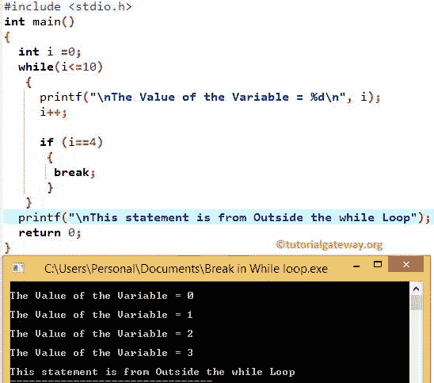

# C 语言中的`break`语句

> 原文：<https://www.tutorialgateway.org/break-statement-in-c/>

C 语言中的`break`语句对于退出任何循环都非常有用，例如`for`循环、`while`循环和 Do While。在执行这些循环时，如果 C 编译器在其中找到`break`语句，那么循环将停止运行代码并立即退出循环。

在任何编程语言中，中断和`continue`语句是用来改变程序流程的两个重要关键字。

循环对于执行特定代码块 n 次直到测试条件为假非常有用。在某些情况下，我们必须在不执行所有语句的情况下终止循环。在这些情况下，我们可以在 C 语言中使用 break 和`continue`语句。

## C 语言中的`break`语句

例如，我们在循环内部有五行代码，当某个条件为 True 时，我们希望退出循环；否则，它必须执行它们。在这些情况下，我们可以将`break`语句放在 If 条件中。如果条件为真，编译器将在 c 中执行`break`语句。这意味着`break`语句将从循环中完全退出控制器。否则，它将运行所有代码行。

这个`break`语句背后的基本语法如下所示:

```
break;
```

## C 示例中的`break`语句

在[切换情况](https://www.tutorialgateway.org/switch-case-in-c/)中，`break`语句是最关键的。如果不使用 break，编译器将不会从`switch-case`中退出。我们想分享两个例子来显示`for`循环和`while`循环中 C`break`语句的工作功能

### 循环内部的 c `break`语句

在这个程序中，我们将使用循环内部的 C`break`语句退出迭代。

```
#include <stdio.h>

int main()
{
 int i;

 for(i=10;i>0; i--)
 {
  if(i==6)
   {
     printf("\n Coming out from for loop Where i = %d\n", i);
     break;
   }
  printf(" %d  ",i);
 }

}
```

c 输出中断

```
 10   9   8   7  
 Coming out from for loop Where i = 6
```

首先，我们将 I 的值初始化为:i =10。接下来，我们使用减量操作符将该值减 1。如果您觉得代码难以理解，请访问我们的文章:[对于 C 语言](https://www.tutorialgateway.org/for-loop-in-c-programming/)

在`for`循环中，我们放置 [If 条件](https://www.tutorialgateway.org/if-statement-in-c/)来测试 I 是否等于 6。如果条件为假，它将跳过`break`语句，并输出该数字(在我们的例子中为 10，9，8，7)。

如果该条件为真，将执行`break`语句，迭代将在该数字处停止，而不打印另一个 printf : printf(" %d "，I)；

###`while`循环中的`break`语句

在这个程序中，我们将使用 c`while`循环中的中断来退出迭代。

```
#include <stdio.h>

int main()
{
 int i =0;

 while(i<=10)
  {
    printf("\n The Value of the Variable = %d \n", i);
    i++;

    if (i==4)
    {
      break;
    }
  }
 printf("\n This statement is from Outside the while Loop ");

 return 0;
}
```



在这个例子中，我们将 I 的值初始化为:i = 0。在`while`循环中，我们检查 I 是否小于或等于 10。请访问[在 C](https://www.tutorialgateway.org/while-loop-in-c/) 、[在](https://www.tutorialgateway.org/do-while-loop-in-c/)和[时做，继续](https://www.tutorialgateway.org/continue-statement-in-c/) [C 语言](https://www.tutorialgateway.org/c-programming/)中的文章。

在里面，我们放置 if 条件来测试 I 是否等于 4。

*   如果条件为假，它将跳过`break`语句。接下来，它输出这个数字(在我们的例子中是 0，1，2，3)。
*   如果该条件为真，将执行`break`语句。这意味着迭代将在该数字处停止，而不打印另一个`printf()`函数。