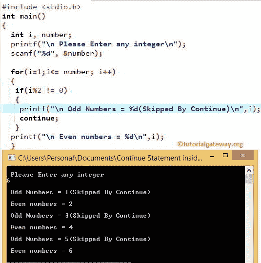

# C `continue`语句

> 原文：<https://www.tutorialgateway.org/continue-statement-in-c/>

C 语言中的`continue`语句是另一个控制循环流的语句。这个 C`continue`语句用在`for`循环、`while`循环和`do-while`循环中。在执行这些循环时，如果编译器在其中找到`continue`语句，那么循环将停止当前迭代，并从头开始新的迭代。

C 示例中的`continue`语句，我们在循环中有 10 条语句。当某个条件为真时，我们希望跳过执行第二个 5 行(statement6 —statement10)，否则它必须执行循环中的所有 10 行。在这些情况下，我们将条件放在第 5 个语句之后，然后是这个 C`continue`语句。如果条件为真，则它将停止执行语句 6 至 10。否则，它将执行第 1 行到第 10 行。C 语言中`continue`语句的语法如下:

```
continue;
```

## C 示例中的`continue`语句

在本文中，我们想分享两个例子来展示 C`continue`语句在`for`循环和`while`循环中的工作功能

### 循环示例中的 c `continue`语句

在本例中，我们将通过示例向您展示如何在`for`循环中使用 C`continue`语句。该程序允许用户输入任何整数值。然后它将显示整数值内的偶数和奇数。

```
/* Continue Statement in C Programming example */
# include <stdio.h>

int main()
{
 int i, number;

 printf("\n Please Enter any integer\n");
 scanf("%d", &number);

 for(i=1;i<= number; i++)
  {
   if(i%2 != 0)
   {
     printf("\n Odd Numbers = %d(Skipped By Continue)\n",i);
     continue;
   }
   printf("\n Even numbers = %d\n",i);
 }

}
```



在循环程序示例中的`continue`语句中，

*   这里我们不打算解释`for`循环。如果你不理解`for`循环，那么请访问我们的文章 [`for`循环在 C 语言中](https://www.tutorialgateway.org/for-loop-in-c-programming/)。
*   在`for`循环中，我们放置 [If 条件](https://www.tutorialgateway.org/if-statement-in-c/)来测试(i%2！= 0).如果该条件为真，将执行`continue`语句，迭代将在该数字处停止，而不打印其他`printf()`函数:printf("\n 偶数= %d\n "，I)。
*   如果条件为假，它将跳过`continue`语句，并输出该数字(在我们的例子中为偶数)

### 循环时`continue`语句示例

continue Statement 程序与上面的示例相同。然而，我们用`while`循环代替了`for`循环。

```
/* Continue Statement in C Programming example */

# include<stdio.h>

int main()
{
 int i=0;

 while (i<= 10)
  {
   if (i== 5 || i == 9)
    {
      printf("Skipped Values = %d\n", i);
      i++;
      continue;
    }
   printf("Values = %d\n", i);
   i++;
  }

return 0;
}
```

```
Values = 0
Values = 1
Values = 2
Values = 3
Values = 4
Skipped Values = 5
Values = 6
Values = 7
Values = 8
Skipped Values = 9
Values = 10
```

在`while`循环示例中的 C`continue`语句中，我们不打算解释`while`循环。请访问我们在 [C 语言](https://www.tutorialgateway.org/c-programming/)中的[在 C 中循环](https://www.tutorialgateway.org/while-loop-in-c/ "While Loop in C")和[在循环](https://www.tutorialgateway.org/do-while-loop-in-c/)时做的文章。

在`while`循环中，我们放置 [If 条件](https://www.tutorialgateway.org/if-statement-in-c/)来测试 I 是等于 5 还是 9。如果该条件为真，`continue`语句将运行，迭代将在该数字处停止，而不打印另一个 printf: printf(“值为:%d”，I)；。

为了更好地理解，我们放置了 printf(“跳过的值= %d\n”，I)；在 If 条件下。所以，每当迭代中断时，这个值就会从这个 printf 中打印出来。如果条件为假，那么它将跳过`continue`语句，并输出该数字(在我们的例子中为 0，1，2，3，4，6，7，8，10)