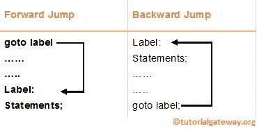
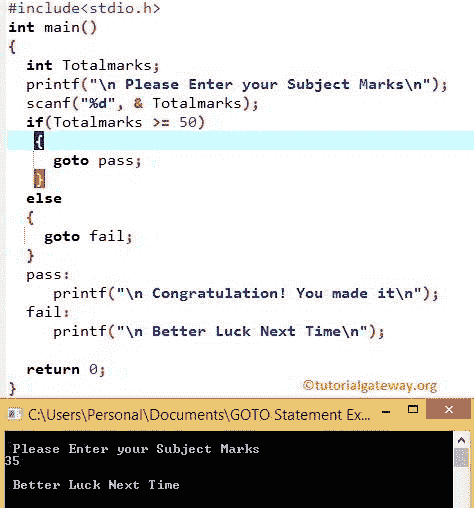

# C 语言`goto`函数语句

> 原文：<https://www.tutorialgateway.org/goto-statement-in-c/>

C 语言中的`goto`语句对于改变程序的流程很有用。当编译器到达`goto`语句时，它将无条件地(向前和向后)跳转到其中指定的位置(我们称之为标签)。

与中断和继续不同，C 语言中的`goto`语句不需要任何 If 条件来执行。

## 转到语句语法

C 语言中`goto`语句后指定的标签是我们放置代码块执行的位置。从下面的语法中，您可以理解我们可以将标签放在程序中的任何地方。不管你放在 goto 之前还是之后。



## C 示例中的`goto`语句

这个 c goto 程序允许用户输入他/她的个人科目分数。接下来，它将使用`goto`语句检查该人是通过还是失败。

```c
/* Goto Statement in C Programming example */

#include <stdio.h>

int main()
{
  int Totalmarks;

  printf(" \n Please Enter your Subject Marks \n ");
  scanf("%d", & Totalmarks);

  if(Totalmarks >= 50)
   {
     goto Pass;
   }
  else
     goto Fail;

  Pass:
     printf(" \n Congratulation! You made it\n");

  Fail:
     printf(" \n Better Luck Next Time\n"); 

 return 0;
}
```



在 c 程序的上述`goto`语句中，Pass 和 Fail 是我们使用的标签。首先，我们声明了整数变量 Totalmarks

在下一行，`Printf()`函数将要求用户输入他/她的总分。`scanf()`函数将用户指定的值存储在 Totalmarks 变量中

请参考 [C 语言](https://www.tutorialgateway.org/c-programming/)中的[中断](https://www.tutorialgateway.org/break-statement-in-c/)、[继续](https://www.tutorialgateway.org/continue-statement-in-c/)和[条件](https://www.tutorialgateway.org/if-statement-in-c/)条款。

在下一行，我们使用 C 中的 [If Else 检查用户输入的值是否大于等于 50。](https://www.tutorialgateway.org/if-else-statement-in-c/)

```c
if(Totalmarks >= 50)
   {
     goto Pass;
   }
  else
     goto Fail;
```

如果条件为真，If 块中的 C`goto`语句将把编译器带到 Pass 标签，并执行 Pass 标签中的代码块

```c
 printf(" \n Congratulation! You made it\n");
```

否则(如果条件为假)，则否则块中的代码将把编译器带到失败标签。接下来，它执行失败标签中的代码块。

```c
printf(" \n Better Luck Next Time\n");
```

注意:虽然所有的编程语言都支持`goto`语句。但是，避免使用它或者至少最大限度地减少使用量总是一个好的做法。与其用这个，我们可以用[断](https://www.tutorialgateway.org/break-statement-in-c/)[续](https://www.tutorialgateway.org/continue-statement-in-c/)等替代。