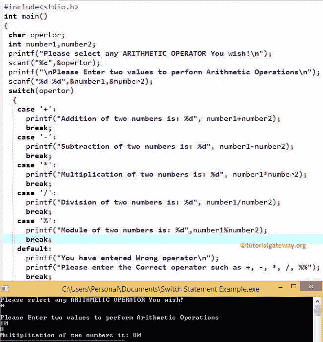

# 开关盒

> 原文:[https://www.tutorialgateway.org/switch-case-in-c/](https://www.tutorialgateway.org/switch-case-in-c/)

切换 C 中的情况:C 中的 If Else 允许我们在 TRUE 或 FALSE 之间进行选择，当有两个以上的选项时，我们使用嵌套的 If。比如说，如果我们有十个选择呢？，如果我们使用 Nested If，在这种情况下，编程逻辑将很难理解。

在 C 编程中，Else if 语句和 Switch 语句可以有效地处理这类问题。我们已经在之前的文章中讨论了 Else If 语句，所以，让我们在这里探讨一下 C 语言中的开关情况。

C 中开关盒的工作功能几乎与 if 条件相同。如前所述，Switch 语句可能有 n 种情况。因此，它将表达式值与 case 语句中分配的值进行比较。如果值表达式值和大小写值都匹配，那么将执行该大小写语句中的语句。为了更好地理解，让我们看看 C 编程中开关情况的语法

## C 语言中开关格的语法

C 开关语句的基本语法如下:

```
Switch (expression) 
{
 Case Option 1:
    //Execute when the expression result match Option 1
    break;
 Case Option 2:
    //Execute these statements when the expression result match Option 2
    break;
 Case Option 3:
    //Execute when the expression result match Option 3
    break;
    ......
 Case Option N:
    //Execute when the result of expression match Option N
    break;
 Default:
    /*Execute when the result of expression Not matching with any Option */
    break;
}
```

表达式的值应该是整数或字符(我们可以把表达式写成 n/2。同样，但是结果应该是整数)。选项 1、选项 2……都是常数。

c 语言中的 Switch 语句允许我们添加一个默认语句。如果变量值与任何 case 语句都不匹配，将执行默认值中的代码。

从 switch 语句中得出一个 break case 是有用的。否则，条件中的所有语句都将执行。每当遇到[中断语句](https://www.tutorialgateway.org/break-statement-in-c/)时，执行流程会直接从开关中出来。

### C 语言中开关盒的流程图

它只接受整数或字符，否则 if 语句接受十进制值(2.3、3.5 等)。)也是。切换语句的流程图如下所示


## C 示例中的开关盒

该程序允许用户输入两个整数值。接下来，它还允许他们选择任何[算术运算符](https://www.tutorialgateway.org/arithmetic-operators-in-c/ "ARITHMETIC OPERATORS IN C")来执行算术运算。

```
#include<stdio.h>
int main()
{
 char opertor;
 int number1, number2;

 printf(" Please select any ARITHMETIC OPERATOR You wish!\n");
 scanf("%c",&opertor);

 printf("\n Please Enter two values to perform Arithmetic Operations\n");
 scanf("%d %d",&number1,&number2);

 switch (opertor)
 {
  case '+':
       printf("Addition of two numbers is: %d", number1 + number2);
       break;
  case '-':
       printf("Subtraction of two numbers is: %d", number1 - number2);
       break;
  case '*':
       printf("Multiplication of two numbers is: %d", number1 * number2);
       break;
  case '/':
       printf("Division of two numbers is: %d", number1/number2);
       break;
  case '%':
       printf("Module of two numbers is: %d",number1%number2);
       break;
  default:
       printf("You have entered Wrong operator\n");
       printf("Please enter the Correct operator such as +, -, *, /, %%");
       break;
 }
 return 0;
}
```

出于演示目的，让我们输入*运算符，然后输入 number1 = 10，number 2 =8。



输出 2:让我们输入错误的运算符来检查默认值。请参考 C[嵌套 If](https://www.tutorialgateway.org/nested-if-in-c/)[其他 If 语句](https://www.tutorialgateway.org/else-if-statement-in-c/)文章中的[其他 If。](https://www.tutorialgateway.org/if-else-statement-in-c/)

```
 Please select any ARITHMETIC OPERATOR You wish!
@

 Please Enter two values to perform Arithmetic Operations
3
4
You have entered Wrong operator
Please enter the Correct operator such as +, -, *, /, %
```